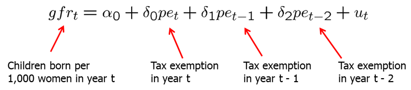
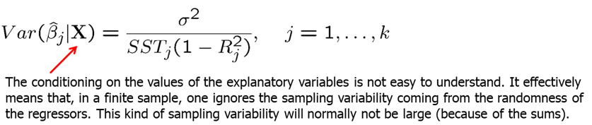
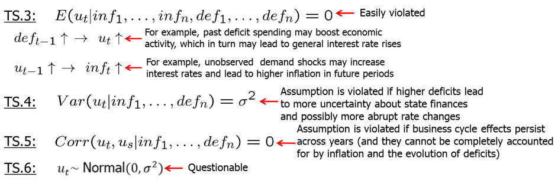

<style>
p.comment {
background-color: #e8e8e8;
padding: 10px;
border: 0px solid black;
margin-left: 25px;
border-radius: 5px;
}
</style>

##### Chapter 10: Basic Regression Analysis with Time Series Data

The obvious characteristic of time series data is that it is ordered with respect to time (temporal ordering). When using time series data, we need to keep in mind that the past may affect the future (but not vice versa). Thus, typically, we have serial correlation or non-independence of observations,

A sequence of random variables indexed by time is called a stochastic (random) process or a time series process. When we collect data, we obtain only one possible outcome or realization of the stochastic process. The sample size in time series data is the number of periods over which we observe the variables of interest.

We will write $_t$ for time period $t$ and $_{t-1}$ for lagged time period.

The simplest time series regression model is a static model. In static time series models, the current value of one variable is modeled as the result of the current values of explanatory variables. For example, Phillips curve which postulates a contemporaneous relationship between inflation and unemployment:

$$ inf_t = \beta_0 + \beta_1 unem_t +u_t $$

Another type of model in time series is the finite distributed lag model. In finite distributed lag models, the explanatory variables are allowed to influence the dependent variable with a time lag. This has very many useful applications. For example, the fertility rate may depend on the tax value of a child, but for biological and behavioral reasons, the effect may have a lag. If we allow for a finite number of lags, the model is called finite distributed (FDL) lag model. An example of FDL of order two is below:



Also, firms' behavior may change in response to a change in tax laws, however, it may take time for most firms to decide and implement the changes. 

In general, we can write FDL of order q like this:

$$ y_t = \alpha_0+\delta_0 z_t +\delta_1 z_{t-1}+...+\delta_q z_{t-q} + u_t $$

Let all z at all time periods be a constant, c, except $z_{t}=c+1$, error equal zero and assume only two lags. Then, we can write 


As you can see, the shock $z_t=c+1$, has an effect in later time periods. Deltas are usually called impact propensities or impact multipliers. The effect is normally biggest after a lag of one period. After that, the effect vanishes (if the initial shock was transitory). Graphically:


Long-run propensity (LRP) or long-run multiplier is the cumulative effect or the sum of the coefficients.

Assumption TS.1: Linear in Parameters
The stochastic process follows a linear model.

Assumption TS.2: No Perfect Collinearity
In the sample (and therefore in the underlying time series process), no independent variable is constant nor a perfect linear combination of the others.

Assumption TS.3: Zero Conditional Mean
The mean value of the unobserved factors is uncorrelated to the values of the explanatory variables in all periods.

Assumption TS.3 is often called strict exogeneity. Contemporaneous exogeneity (or simply exogeneity) is when the mean of the error term is uncorrelated to the explanatory variables of the same period.


TS.3 rules out feedback from the dependent variable on future values of the explanatory variables; this is often questionable especially if explanatory variables "adjust" to past changes in the dependent variable. If the error term is related to past values of the explanatory variables, one should include these values as contemporaneous regressors.

Theorem 10.1: Unbiasedness of OLS
Under assumptions TS.1 through TS.3, OLS estimators are unbiased conditional on X.

$$ TS.1 - TS.2 \quad \rightarrow \quad E(\hat{\beta_j})=\beta_j, \quad j=0,1,..,k-1,k. $$

Assumption TS.4: Homoskedasticity
The volatility of errors must not be related to the explanatory variables in any of the periods.

Assumption TS.5: No Serial Correlation
Conditional on the explanatory variables, the unobserved factors must not be correlated over time.

Serial correlation is a potential problem fro regression with time series data. The assumption may easily be violated if, conditional on knowing the values of the independent variables, omitted factors are correlated over time. The assumption may also serve as substitute for the random sampling assumption if sampling a cross-section is not done completely randomly. In this case, given the values of the explanatory variables, errors have to be uncorrelated across cross-sectional units (e.g. states).

Theorem 10.2: OLS Sampling Variances
Under assumptions TS.1 through TS.5



Theorem 10.3: Unbiased Estimation of Error Variance

$$ TS.1 - TS.5 \quad \rightarrow \quad E(\hat{\sigma}^2)=\sigma^2$$

Theorem 10.4: Gauss-Markov Theorem
Under assumptions TS.1 through TS.5, the OLS estimators have the minimal variance of all linear unbiased estimators of the regression coefficients.

Assumption TS.6: Normality


Theorem 10.5: Normal Sampling Distributions
Under assumptions TS.1 - TS.6, the OLS estimators have the usual normal distribution (conditional on $x$). The usual F and t-tests are valid. In other words, everything we have learned about estimation and inference for cross-sectional regression directly applies to time series regressions with assumptions TS.1 through TS.6.

Now, let's look back at the inflation-unemployment trade-off example. Philips curve suggests a conemporaneous relationship between unemployment and inflation.

```{r, message=FALSE, warning=FALSE, cache=TRUE}
data(phillips,package='wooldridge')
attach(phillips)
reg1=lm(inf~unem)
summary(reg1)
```

Our $\beta_1$ estimate is 0.5 indicating a positive relationship statistically significant at 10% level. This does not mean that there is no trade-off. We need to check if the assumptions are satisfied.

**TS.1**: The error term contains factors such as monetary shocks, income/demand shocks, oil price shocks, supply shocks, or exchange rate shocks.
**TS.2**: A linear relationship might be restrictive, but it should be a good approximation. Perfect collinearity is not a problem as long as unemployment varies over time. 


Let's say now we are interested in measuring the effects of inflation and budget deficits on interest rates. In R, execute the following commands.
```{r, message=FALSE, warning=FALSE, cache=TRUE}
data(intdef,package='wooldridge')
attach(intdef)
reg2=lm(i3~inf+def)
summary(reg2)
```

Again, it is a good idea to check whether our assumptions are satisfied.
**TS.1**: The error term represents other factors that determine interest rates in general, e.g. business cycle effects.
**TS.2**: A linear relationship might be restrictive, but it should be a good approximation. Perfect collinearity will rarely be a problem in practice. 



Time series regressions are not limited to level-level functional form. We can also use logs, squared terms and use dummies.

Let's look at the determinants of Puerto Rican employment. Castillo-Freeman and Freeman (1992) studied a similar model:

$$ log(prepop_t) = \beta_0 + \beta_1*log(mincov_t) + \beta_2*log(usgnp_t) + u_t $$
where $prepop_t$ = employment rate in Puerto Rico during year t, $mincov_t$ = importance of the minimum wage relative to average wages during year t, $usgnp_t$ = real US gross national product in year t.

In R, use the following commands.
```{r, message=FALSE, warning=FALSE, cache=TRUE}
data(prminwge, package='wooldridge')
attach(prminwge)
reg3=lm(log(prepop)~log(mincov)+log(usgnp))
summary(reg3)
```

The estimated elasticity of $prepop$ with respect to $mincov$ is -0.154 and stantistically significant at 5\% which is what we expected: an increase in minimum wage decreases employment. However, now we need to account for the time trend.

What we measured above with $\beta_1$ and $\beta_2$ are called short-run elasticities. If we added additional lagged independent variables and summed them all up for the same variable, we would have a long-run elasticity - a percentage change in dependent variable after n periods given 1\% change in independent variable.

We also sometimes include binary variables in time series regressions. We usually call these type of analyses an event study. The goal is to see whether a particular event influences some outcome. We can have, for example, a dummy for WW2 years to account for differences during the wartime; in this case all years of WW2, the dummy variable equals to one, all other years - 0. Similarly, we could look at, for example, introduction of a new technology; in that case, we could let the dummy equal one starting the year the new technology was adopted and zero all the years leading up to it.

Time trend is a tendency to move in some specific way over time. We need to account for that to make sure we do not find two factors which are both trending up, for example, to be associated. Linear time trend is the simplest form of time trend which resembles a straight line. In some cases, exponential trend is a better fit for data.

If trending variables are regressed on each other, a spurious relationship may arise if the variables are driven by a common trend. In this case, it is important to include a trend in the regression.

Let's consider the per capita housing investment equation.
```{r, message=FALSE, warning=FALSE, cache=TRUE}
data(hseinv, package='wooldridge')
attach(hseinv)
reg5=lm(log(invpc)~log(price))
reg6=lm(log(invpc)~log(price)+t)
library(stargazer)
stargazer(reg5,reg6,type="text",keep.stat = c("n","rsq"))
```

We see that after we include time trend, the estimated coefficient for $log(price)$ changes sign and becomes insignificant. In original equation $(reg5)$, we found a spurious positive relationship between housing investment and house prices because they were both trending up.

Let's consider another example. See the equation predicting children birth over time below.

```{r, message=FALSE, warning=FALSE, cache=TRUE}
data(fertil3, package='wooldridge')
attach(fertil3)
reg3=lm(gfr~pe+ww2+pill)
reg4=lm(gfr~pe+ww2+pill+t+tsq)
summary(reg3)
pred1=predict(reg3)
pred2=predict(reg4)
plot(gfr~t)
lines(pred1,col=1)
lines(pred2,col=2)
```

Interpretation of the first model could be as follows: during World War II, the fertility rate was temporarily lower. It has been permanently lower since the introduction of the pill in 1963. However, after including quadratic time trend, we see that the pill has statistically insignificant effect.

The questions is: when should we include a trend in our analysis? If the dependent variable displays an obvious trending behavior we should consider including a trend. If both the dependent and some independent variables have trends we need to consider including time trend. If only some of the independent variables have trends; their effect on the dependent variable may only be visible after a trend has been subtracted (detrending).

Detrending (removing the trend) requires a few notes about the coefficients and goodness-of-fit statistic. It turns out that the OLS coefficients in a regression including a trend are the same as the coefficients in a regression without a trend but where all the variables have been detrended before the regression. This follows from the general interpretation of multiple regressions. Due to the trend, the variance of the dependent variable will be overstated. It is better to first detrend the dependent variable and then run the regression on all the independent variables (plus a trend if they are trending as well). The R-squared of this regression is a more adequate measure of fit.

Time series also often exhibits seasonality: the variable increases in certain quarters or months and decreases in others. Think for example about ice-cream production and sales: much more ice-cream is produced and sold in the warm weather (https://fred.stlouisfed.org/series/IPN31152N). To adjust for the seasonality, we can include a set of dummy variables to account for the seasonal changes.


**Homework Problems**

<p class="comment"> Computer Exercise C6.\
Use the data in **fertil3** for this exercise.\
1. Regress $gfrt$ on $t$ and $t^2$ and save the residuals. This gives a detrended $gfrt$, which you can call,  say, $gf_t$.\
2. Regress $gf_t$ on all of the variables in equation (10.35), including $t$ and $t^2$. Compare the R-squared with that from (10.35). What do you conclude?\
3. Reestimate equation (10.35) but add $t^3$ to the equation. Is this additional term statistically significant? 
</p>

<p class="comment"> Computer Exercise C7.\
Use the data set **consump** for this exercise.\
1. Estimate a simple regression model relating the growth in real per capita consumption (of nondurables and services) to the growth in real per capita disposable income. Use the change in the logarithms in both cases. Report the results in the usual form. Interpret the equation and discuss statistical significance.\
2. Add a lag of the growth in real per capita disposable income to the equation from part 1. What do you conclude about adjustment lags in consumption growth?\
3. Add the real interest rate to the equation in part 1. Does it affect consumption growth?
</p>

<p class="comment"> Computer Exercise C9.\
Use the data in **volat** for this exercise. The variable $rsp500$ is the monthly return on the Standard & Poor's 500 stock market index, at an annual rate. (This includes price changes as well as dividends.) The variable $i3$ is the return on three-month T-bills, and $pcip$ is the percentage change in industrial production; these are also at an annual rate.\
1. Consider the equation
$$rsp500_t = b0 + b1*pcip_t + b2*i3_t + u_t.$$
What signs do you think $\beta_1$ and $\beta_2$ should have?\
2. Estimate the previous equation by OLS, reporting the results in standard form. Interpret the signs and magnitudes of the coefficients.\
3. Which of the variables is statistically significant?\
4. Does your finding from part (iii) imply that the return on the S&P 500 is predictable? Explain.
</p>

**References**

Wooldridge, J. (2019). Introductory econometrics: a modern approach. Boston, MA: Cengage.

Heiss, F. (2016). Using R for introductory econometrics. Düsseldorf: Florian Heiss, CreateSpace.

---
