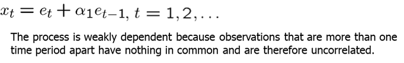
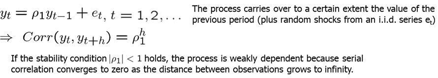
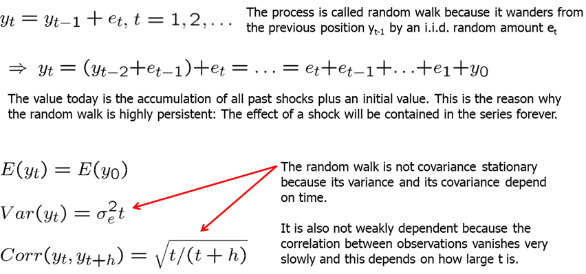
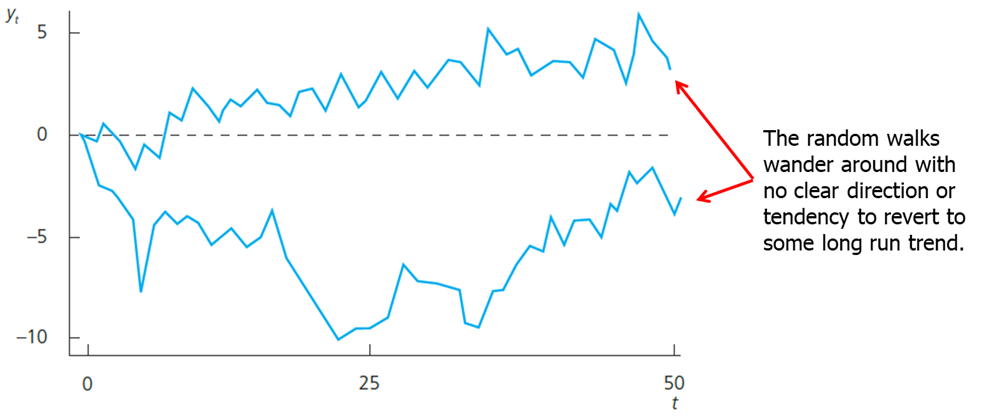
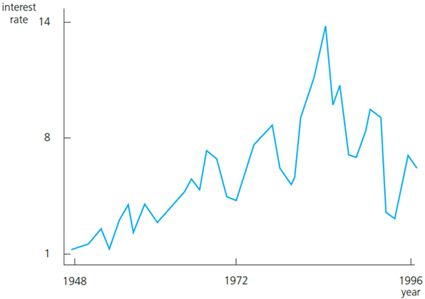
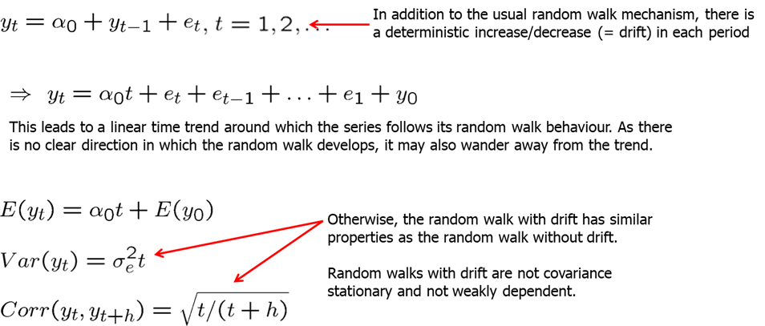
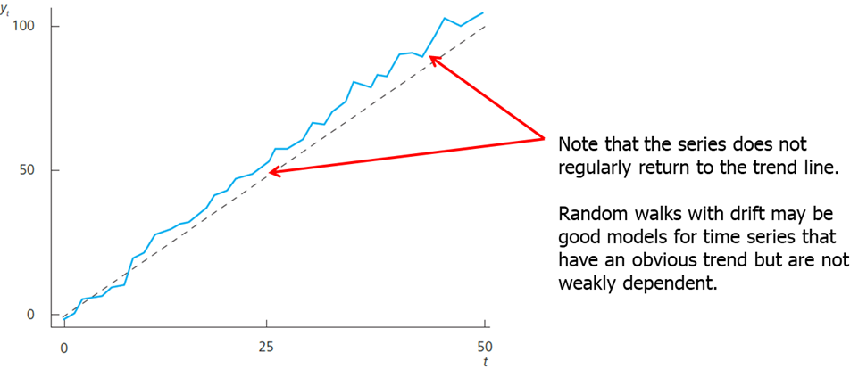
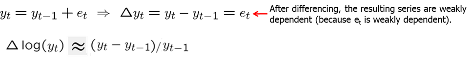
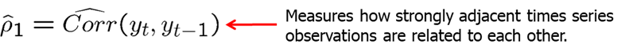

<style>
p.comment {
background-color: #e8e8e8;
padding: 10px;
border: 0px solid black;
margin-left: 25px;
border-radius: 5px;
}
</style>

##### Chapter 11: Further Issues in Using OLS with Time Series Data


Loosely speaking, a time series is **stationary** if its stochastic properties and its temporal dependence structure do not change over time. If we take any collection of random variables in the sequence and then shift that sequence ahead h time periods, the joint probability distribution must remain unchanged. More specifically, a stochastic process $\{xt: t = 1,2,...\}$ is stationary, if for every collection of indices $1 \leq t_1 \leq t_2 \leq ... \leq t_m $ the joint distribution of ($x_{1t}, x_{2t},...,x_{mt}$) is the same as that of ($x_{1,t+h}, x_{2,t+h}, ...,x_{m,t+h}$) for all integers $h \geq 1$.


A stochastic process that is not stationary is called a **nonstationary** process. It can often be very difficult to determine whether the data we collected were generated by a stationary process. However, is is easy to spot certain sequences that are not stationary, as, for example, a time series with a trend.


A stochastic process $\{x_t: t = 1,2,...\}$ is covariance stationary, if its expected value, its variance, and its covariance are constant over time:

$$
E(x_T)=\mu \quad\quad Var(x_t)=\sigma^2 \quad\quad Cov(x_t,x_{t+h})=f(h)
$$


Covariance stationarity focuses only on the first two moments of the stochastic process: the mean and the variance are constant across time, and the covariance between $x_t$ and $x_{t+h}$ depends only on the distance between the two terms, $h$.


If we want to understand a relationship between two or more variables using regression analysis, we need some sort of stability over time. If we allow the relationship between two variables to change arbitrarily in each time period, we cannot hope to learn much about how a change in one variable affects the other variable having access to only one time series realization. 

Loosely speaking, a stationary time series process $\{xt: t = 1,2,...\}$  is said to be weakly dependent if $x_{t}$ and $x_{t+h}$ are "almost independent" as $h$ grows to infinity (for all $t$).


An implication of weak dependence is that the correlation between xt and xt+h must converge to zero if h grows to infinity. For the LLN and the CLT to hold, the individual observations must not be too strongly related to each other; in particular their relation must become weaker (and this fast enough) the farther they are apart. Note that a series may be nonstationary but weakly dependent.


The simplest example of a weakly dependent time series is an independent, identically distributed (iid) sequence: a sequence that is independent is trivially weakly dependent. For example, a coin flip is iid.


A much more interesting case is the moving average process of order 1 usually written as MA(1). The current realization ($x_t$) depends on the current random iid shock $e_t$ and shock realized in the previous time period, $e_{t-1}$.





Another popular process is called autoregressive process of order 1 written as AR(1). The stability condition requires the absolute value of $\rho_1$ to be less than 1 (it is then called a stable AR(1) process).





A trending series is nonstationary, however, it can be weakly dependent. A series that is stationary about its time trend, as well as weakly dependent, is often called a trend-stationary process. Trend-stationary processes also satisfy assumption TS.1'.

- Assumption TS.1': Stochastic process follows a linear model, is stationary and weakly dependent.
- Assumption TS.2': No Perfect Collinearity
- Assumption TS.3': Zero Conditional Mean (explanatory variables are contemporaneosly exogenous)
- Assumption TS.4': Homoskedasticity (errors are contemporaneously homoskedastic)
- Assumption TS.5': No Serial Correlation


Theorem 11.1: Under TS.1' through TS.3', the OLS estimators are consistent: $\text{plim }\hat \beta_j  = \beta_j$ for $j=0, 1, 2, ...,k$.

Theorem 11.2: Under assumptions TS.1' - TS.5', the OLS estimators are asymptotically normally distributed. Further, the usual OLS standard errors, t-statistics,  F-statistics, and LM statistics are asymptotically valid.


Let's look at Efficient Markets Hypothesis (EMH) which states that current asset prices fully reflect all the available information and so it is impossible to consistently beat the market. Investor cannot gain an advantage because all the available information is already reflected in the current asset price. A simplification assumes in addition that only past returns are considered as relevant information to predict the return in week $t$. This implies that:
$$
E(return_t|return_{t-1},return_{t-2},return_{t-3},...)=E(return_t)
$$


A simple way to test the EMH is to specify an AR(1) model. Under the EMH, assumption TS.3' holds so that an OLS regression can be used to test whether this week's returns depend on last week's returns. You can run the following test yourself in R using the code below:


```{r, warning=FALSE, message=FALSE,echo=TRUE}
library(dynlm); library(stargazer)
data(nyse, package='wooldridge')
# Define time series (numbered 1,...,n)
tsdata = ts(nyse)
# Linear regression of models with lags:
reg1 = dynlm(return~L(return), data=tsdata) 
reg2 = dynlm(return~L(return)+L(return,2), data=tsdata) 
reg3 = dynlm(return~L(return)+L(return,2)+L(return,3), data=tsdata) 
# Pretty regression table
stargazer(reg1, reg2, reg3, type="text", keep.stat=c("n","rsq","adj.rsq","f"))
```


As you can see the standard error of the estimate of interest is large relative to the coefficient leading to a relative small t-statistic and a failure to reject the null hypothesis. While the results of this simple test suggest a small positive correlation, we fail to reject the efficient market hypothesis.


Unfortunately many economic time series violate weak dependence because they are highly persistent (= strongly dependent). In this case OLS methods are generally invalid (unless the CLM holds). In some cases transformations to weak dependence are possible.


A very simple but well studied case is the random walk. Random walk is such a process for which the value $y$ at time $t$ is obtained by starting at the previous value and adding a random shock. A random walk is a special case of a unit root process. Unit root processes are defined as a random walk, but et may be an arbitrary weakly dependent process. 


From an economic point of view it is important to know whether a time series is highly persistent. In highly persistent time series, shocks or policy changes have lasting/permanent effects, in weakly dependent processes their effects are transitory.






For example, an interest rate (by which we usually mean the three-month T-bill) can be considered a random walk.





It is often the case that a highly persistent series also contains a clear trend. Such behavior is called a random walk with a drift.







Using time series with strong persistence of the type displayed by a unit root process in a regression equation can lead to very misleading results if the CLM assumptions are violated. Fortunately, simple transformations are available that render a unit-root process weakly dependent.


Weakly dependent processes are said to be integrated of order zero, or I(0). This means that nothing needs to be done with the series before using it in a regression analysis.


Unit root processes, such as random walk (with or without a drift), are said to be integrated of order one, or I(1). This means that the first difference of the series is weakly dependent (and often stationary). The first difference of a time series is the series of changes from one period to the next.





There are statistical tests (unit root tests) for testing whether a time series is I(1); these will be covered in later chapters. Alternatively, look at the sample first order autocorrelation:





If the sample first order autocorrelation is close to one, this suggests that the time series may be highly persistent (= contains a unit root). Alternatively, the series may have a deterministic trend. Both unit root and trend may be eliminated by differencing.


In previous chapter, we discussed that general fertility rate may depend on the value of the personal exemption that people with children receive. However, if we look at the first order autocorrelations, we will find that these are found to be very large suggesting unit root behavior (as the autocorrelation coefficients are very close to 1). It is therefore better to estimate the equation in first differences. This makes sense because if the equation holds in levels, it also has to hold in first differences. We can replicate the estimation using the code below.


```{r, warning=FALSE, message=FALSE,echo=TRUE}
library(dynlm); library(stargazer)
data(fertil3, package='wooldridge')
# Define Yearly time series beginning in 1913
tsdata <- ts(fertil3, start=1913)
# Linear regression of model with first differences:
res1 <- dynlm( d(gfr) ~ d(pe), data=tsdata)
# Linear regression of model with lagged differences:
res2 <- dynlm( d(gfr) ~ d(pe) + L(d(pe)) + L(d(pe),2), data=tsdata)
# Pretty regression table
stargazer(res1,res2,type="text")
```


In our final estimation, we see that even though contemporaneous and first lag estimates are insignificant (negative too), the second lag is positive and statistically significant indicating a lagged positive relationship. This makes a lot more sense than a contemporaneous relationship.
For the final example, we have the average hourly wage in the US and output per hour. We are interested in estimating the elasticity of hourly wage with respect to output per hour, so we start with a simple equation with a time trend (since both of the variables of interest have a clear upward trend):

$$
\log(hrwage) = \beta_0 + \beta_1*\log(outphr) + t + u
$$

Our findings (see below), indicate unreasonably high elasticity. It would be difficult to believe that for 1% in increase in productivity, workers get paid 1.6% more. High autocorrelations suggest that both series have unit roots so we reestimate the equation in first differences. Note that time trend is no longer needed.

$$
\Delta \log(hrwage) = \beta_0 + \beta_1*\Delta \log(outphr) + u
$$

We see that now the elasticity is found to be around 0.8 which means that for 10% increase in worker's productivity (output per hour), workers' hourly salary increases by 8%. R-squared shows that the growth in output explains about 35% of the growth in real wages.


```{r, warning=FALSE, message=FALSE,echo=TRUE}
data(earns, package='wooldridge')
tsdata = ts(earns)
attach(earns)
plot(hrwage)
plot(outphr)
#simple log-log regression
reg1=lm(lhrwage~loutphr+t, data=tsdata)
summary(reg1)
#detrended or first-differenced regression
reg2=dynlm( d(lhrwage) ~ d(loutphr), data=tsdata)
summary(reg2)
```


A model is said to be dynamically complete if enough lagged variables have been included as explanatory variables so that further lags do not help to explain the dependent variable:

$$
E(y_t|x_t,y_{t-1},x_{t-1},y_{t-2},...)=E(y_t|x_t)
$$


Dynamic completeness implies absence of serial correlation. If further lags actually belong in the regression, their omission will cause serial correlation (if the variables are serially correlated). One can easily test for dynamic completeness. If lags cannot be excluded, this suggests there is serial correlation.


A set of explanatory variables is said to be sequentially exogenous if "enough" lagged explanatory variables have been included:

$$
E(u_t|x_t,x_{t-1},...)=E(u_t)=0, \quad t=1,2,...
$$


Sequential exogeneity is weaker than strict exogeneity. Sequential exogeneity is equivalent to dynamic completeness if the explanatory variables contain a lagged dependent variable.


Should all regression models be dynamically complete? Not necessarily: If sequential exogeneity holds, causal effects will be correctly estimated; absence of serial correlation is not crucial.


**Homework Problems**


<p class="comment"> Computer Exercise C1.\
Use data set **hseinv** from package **wooldridge** for this exercise.\
1. Find the first order autocorrelation in $\log(invpc)$. Now, find the autocorrelation after linearly detrending $\log(invpc)$. Do the same for $\log(price)$. Which of the two series may have a unit root? \
2. Based on your findings in part 1, estimate the equation: 
$ \log(invpc_t)=\beta_0 + \beta_1 \Delta \log (price_t)+\beta_2t+u_t$ and report the results in standard form. Interpret the coefficient b1 and determine whether it is statistically significant. \
3. Linearly detrend $\log(invpc_t)$ and use the detrended version as the dependent variable in the regression from part 2 (see Section 10-5). What happens to R-squared? \
4. Now use $\Delta \log(invpc_t)$ as the dependent variable. How do your results change from part 2? Is the time trend still significant? Why or why not?
</p>

<p class="comment"> Computer Exercise C3.\
Use data set **nyse** from package **wooldridge** for this exercise.\
1. In Example 11.4, it may be that the expected value of the return at time t, given past returns, is a quadratic function of returnt21. To check this possibility, use the data in NYSE to estimate
$ return_t =\beta_0 +\beta_1 return_{t-1} + \beta_2 return^2_{t-1} + u_t$ and report the results in standard form. \
2. State and test the null hypothesis that $E(return_t|return_{t-1})$ does not depend on $return_{t-1}$. (Hint: There are two restrictions to test here.) What do you conclude? \
3. Drop $return_{t-1}^2$ from the model, but add the interaction term $return_{t-1}*return_{t-2}$. Now test the efficient markets hypothesis. \
4. What do you conclude about predicting weekly stock returns based on past stock returns?
</p>


**References**

Wooldridge, J. (2019). Introductory econometrics: a modern approach. Boston, MA: Cengage.

Heiss, F. (2016). Using R for introductory econometrics. Düsseldorf: Florian Heiss, CreateSpace.

---
