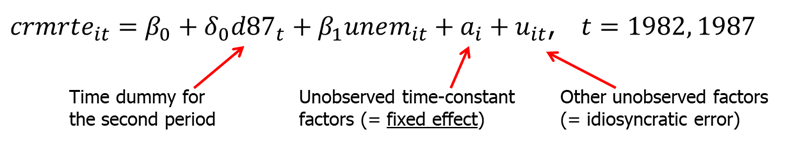
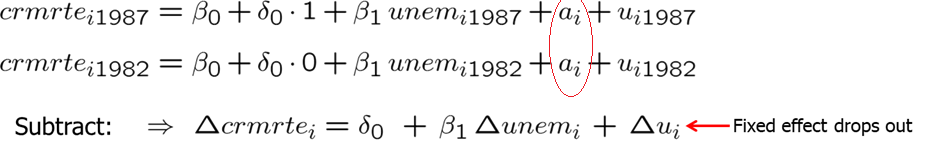

<style>
p.comment {
background-color: #e8e8e8;
padding: 10px;
border: 0px solid black;
margin-left: 25px;
border-radius: 5px;
}
</style>

##### Chapter 13: Pooling Cross Sections across Time: Simple Panel Data Methods


More and more research uses data sets that have both cross sectional and time series dimensions. Such data has some important advantages over purely cross sectional or time series data.


We will consider two types of data sets: independently pooled cross section and panel data. 


Independently pooled cross section is obtained by sampling randomly from a large population at different points in time. For example, every year, we get a random sample of workers in a country and ask them about their wages, education and so on. European Social Survey is such survey. In the participating countries, every two years a new sample is surveyed. Such data consists of independently sampled observations. It rules out correlation in the error terms across different observations. With such data, it is important to remember and account for the fact that distributions of wages, education, attitudes and other factors change over time.


A panel (or longitudinal) data set follows the same individuals, firms, cities, countries over time. For example, in Health and Retirement Study (HRS) of older Americans and Survey of Health, Ageing and Retirement in Europe (SHARE) of older Europeans, the same individuals are followed over the years and various data about them is collected. This gives us data on their consumption, income, assets, health and other variables in different years. Panel data is very useful as we are able to make sure that the some of the unobservables such as innate ability do not change since we follow the same person.


Let's start with independently pooled cross section. There are quite a few examples. Among them, Current Population Survey and European Social Survey. By pooling the random samples over time, we increase the sample size giving our analysis more precise estimators and test statistics with more power. Before pooling samples obtained in different points in time, one must make sure that at least some of the relationships between the dependent and independent variables must remain constant over time. Sometimes, the pattern of coefficients on the year dummy variables is itself an interest. For example, one may ask: "After controlling for state demographic and economic factors, what is the pattern of loan discrimination between 1940 and 1980?" This could be answered by using multiple regression analysis with year dummy variables.


Let's look at Example 13.1 in the textbook. In this example, we use General Social Survey for the given years to estimate a model explaining the total number of kids born to a woman. One could be interested in the fertility rate over time, after controlling for other observable factors.


```{r, warning=FALSE, message=FALSE,echo=TRUE}
library(wooldridge)
data(fertil1, package='wooldridge')
reg1=lm(kids~educ+age+I(age^2)+black+east+northcen+west
+farm+othrural+town+smcity+y74+y76+y78+y80+y82+y84, data=fertil1)
summary(reg1)
```
The coefficients on the year dummy show a drop in fertility rates in the early 80s. Other slopes are as predicted: educ is negatively related, age is positive but decreasing, etc. The model we estimated here assumes the effects to be constant over time. This may or may not be true. One should also check heteroskedasticity in the error term and may use heteroskedasticity-robust standard errors.


Let's look at another example: changes in return to education and gender wage gap. $\beta_7$ (in reg2a) measures the $log(wage)$ differential. If nothing changed from 1978 to 1985 to the gender wage gap, we expect to see $\beta_8$ (in reg2a) not significantly different from 0.


```{r, warning=FALSE, message=FALSE,echo=TRUE}
data(cps78_85, package='wooldridge')
reg2a = lm(lwage ~ y85 + educ + educ*y85 + exper + I(exper^2) + union + female + female*y85, data=cps78_85)
#You can similarly use a shorter notation as shown below.
reg2b = lm(lwage ~ y85*(educ+female) +exper+ I(exper^2) + union, data=cps78_85) 
summary(reg2a)
```
Running the above equation yields the following result: the gender wage gap in 1975 is estimated to be around 31\% (statistically significant at 5\%). However, it seems to have fallen in the following years around 8.5 percentage points (also statistically significant at 5\% level).


In the example above we interacted some variables with a time dummy variable to be estimate how the effects of a variable changed over time. Note that if you interact all variables with the time dummy, it is the same as running two separate equations, one for one sample in time period 1 and one in time period 2. See the code for each regression on each of these samples separately below.


```{r, warning=FALSE, message=FALSE,echo=TRUE}
data(cps78_85, package='wooldridge')
reg2c = lm(lwage ~ y85 + y85*(educ + exper + I(exper^2) + union + female), data=cps78_85)
summary(reg2c)

reg2d = lm(lwage ~ educ + exper + I(exper^2) + union + female, data=cps78_85[which(cps78_85$y85==0),])

reg2e = lm(lwage ~ educ + exper + I(exper^2) + union + female, data=cps78_85[which(cps78_85$y85==1),])

summary(reg2d)
summary(reg2e)
```
As you can see, for the year 1985 (reg2e), the intercept is 0.5802548 which is exactly the same as the intercept in the regression reg2c for the observations in the year 1985: 0.4582570+0.1219978.

Pooled cross sections can be useful in evaluating the effects of a certain event or policy. With data before and after the event (or policy), one is able to infer about the impact of that event.


Example 13.3
```{r, warning=FALSE, message=FALSE,echo=TRUE}
data(kielmc, package='wooldridge')
# Separate regressions for 1978 and 1981: report coeeficients only
coef( lm(rprice~nearinc, data=kielmc, subset=(year==1978)) )
coef( lm(rprice~nearinc, data=kielmc, subset=(year==1981)) )

# Joint regression including an interaction term 
library(lmtest)
coeftest( lm(rprice~nearinc*y81, data=kielmc) )

RegA=lm((rprice)~nearinc*y81, data=kielmc)
RegB=lm((rprice)~nearinc*y81 + age +I(age^2), data=kielmc)
RegC=lm((rprice)~nearinc*y81+age+I(age^2)+log(intst)+log(land)+log(area)+rooms+baths, data=kielmc)
library(stargazer)
stargazer(RegA,RegB,RegC, type="text")

#Using log(price)
summary( lm(log(price)~nearinc*y81, data=kielmc) )
```


In economics and other social sciences, a natural experiment (quasi-experiment) occurs when some exogenous event (for example, a change in government policy) changes the environment in which individuals, firms, cities operate. There is a control group which is not affected by the policy change and the treatment group which is thought to be affected by the policy change. Note that in a true experiment, the two groups are randomly chosen. In natural experiments, the assignment of treatment to individuals or cities is not random thus we need to control for differences between the two groups. To control for systemic differences between the control and treatment groups in a natural experiment, we need at least two years of data, one before and one after the policy change. Thus, we can break down our sample into four groups: (1) control group before the policy change, (2) control group after the policy change, (3) treatment group before the policy change, (4) treatment group after the policy change.


We can specify the following equation:
$$
y=\beta_0+\delta_0(after)+\beta_1(treated)+\delta_1(after)(treated)+(other\_factors)
$$
where $treated$ equals 1 if the observed unit is in the treatment group, and $after$ equals 1 for all observations in the second time period. Here $\hat \delta_1$ compares the outcomes of two groups before and after the policy change.
$$
\hat \delta_1=(\bar y_{1,treated}-\bar y_{1,control})-(\bar y_{0,treated}-\bar y_{0,control})
$$


In the above equation, our interest lies in $\delta_1$. We call delta1 the difference-in-difference estimator. In essence it shows the difference between the change treatment group and the change in the control group. Compare the difference in outcomes of the units that are affected by the policy change (= treatment group) and those who are not affected (= control group) before and after the policy was enacted. If the change in the treatment group was found to be significantly larger than the change in the control group and no other external factors changed across the two time periods, we have found a good estimator of the causal impact of the program. 


For example, the level of unemployment benefits is cut but only for group A (= treatment group). Group A normally has longer unemployment duration than group B (= control group). If the difference in unemployment duration between group A and group B becomes smaller after the reform, reducing unemployment benefits reduces unemployment duration for those affected.


Keep in mind that difference-in-difference only works if the difference in outcomes between the two groups is not changed by other factors than the policy change (e.g. there must be no differential trends).


Example 13.4
```{r, warning=FALSE, message=FALSE,echo=TRUE}
data(injury, package='wooldridge')
reg4=lm(log(durat)~afchnge + highearn + afchnge*highearn, data=injury)
summary(reg4)
```


It is often a good idea to expand a simple DD (difference-in-difference) methodology by obtaining multiple treatment and control groups as well as more time periods. We can easily create a general framework for policy analysis by allowing a general pattern of interventions, where some units are never treated, others get treated at various time periods.

Now suppose you have panel data instead of pooled cross section. This means that you have data on the same individuals/firms/cities over a few periods of time. 

Example. Assume your job is to find the effect of unemployment on city crime rate. Assume that no other explanatory variables are available except crime rate and unemployment. Will it be possible to estimate the causal effect of unemployment on crime?
Let $i$ denote the unit (city) and $t$ denote time period. We can now write an example fixed effects model explaining the crime rate:




The dummy variable $d87_t$ equals 1 for the year 1987 and 0 for the year 1982. Variable $a_i$ is referred to as a fixed effect (since it is fixed -> no $t$ subscript). In this case, it represents the city unobserved effect, such as geographical features, demographic features (assuming they do not change over short period of time) and so on. How crime rates are reported may also be in $a_i$. The error $u_{it}$ is often called the idiosyncratic error or time varying error because it represents factors that change over time.


If we simply pool the data and run an OLS regression, we will run into a big problem. Since $a_i$ will be in the error term, and we know that those factors in $a_i$ are most likely correlated with unemployment, we will get biased estimators. The resulting bias in pooled OLS is sometimes called heterogeneity bias but really it is simply a bias due to omitting a time-constant variable.


To run a pooled OLS, use the following:
```{r, warning=FALSE, message=FALSE,echo=TRUE}
data(crime2, package='wooldridge')
reg5=lm(crmrte~d87+unem, data=crime2)
summary(reg5)
```
We find that the resulting sign on the estimate of unemp is in the right direction but the significance is very low. Using pooled OLS does not solve omitted variable problem. Thus, we should do something more sophisticated. In the crime equation, we want to allow the unmeasured city factors in $a_i$ that affect the crime rate also to be correlated with the unemployment rate. Since a_i does not change over time, we can difference the data across two years. This would look as follows:





The resulting equation is called the first-differenced equation. It is just like a cross-sectional equation before but each variables is differenced over time. The unobserved effect, $a_i$, does not appear in the equation because it has been differenced away. The intercept in the final equation is also constant over time (what we wanted). Before estimating, we should ask if the OLS assumptions are satisfied, mainly is the exogeneity assumption satisfied or is the change in u uncorrelated with the change in unemployment. For example, suppose that law enforcement effort (which is in $u$) increases more in cities where unemployment rate decreases. This would violate the exogeneity assumption because change in u would be negatively correlated with change in unemployment. Including more factors into the regression equation, allows us to partly overcome this problem. One also must have some variation in independent variables.


We can now estimate our model using the following code:
```{r, warning=FALSE, message=FALSE,echo=TRUE}
data(crime2, package='wooldridge')
reg6=lm(ccrmrte~cunem, data=crime2)
summary(reg6)
```
The above results point to a positive statistically significant relationship between unemployment and crime rate. It shows that elimination of the time-constant effects (by differencing) was very important. Also, if we look at the intercept, we see that even if the change in unemployment is zero, we predict an increase in the crime rate. We call this a secular upward trend in crime rates in that period. 


Example 13.5
```{r, warning=FALSE, message=FALSE,echo=TRUE}
data(slp75_81,package='wooldridge')
attach(slp75_81)
regE5=lm(cslpnap~+ctotwrk+ceduc+cmarr+cyngkid+cgdhlth)
summary(regE5)
```


Example 13.6
```{r, warning=FALSE, message=FALSE,echo=TRUE}
data(crime3,package='wooldridge')
attach(crime3)
regE6=lm(clcrime~d78+clrprc1+clrprc2)
summary(regE6)
```


When dealing with panel data, a researcher should carefully store the data so that different units and time periods are easily linked. One way to do it is to have for each unit two entries in the data set: one for time period 1, another for time period 2. Then the second unit follows with an entry for each time period. This easily allows to use the data both for panel study and for pooled cross sectional analysis.


Unit          | Time Period   | Wage          | Married       | Child   
------------- | ------------- | ------------- | ------------- | -------------
1             | 1             |      ...      |      ...      |      ...      
1             | 2             |      ...      |      ...      |      ...      
2             | 1             |      ...      |      ...      |      ...      
2             | 2             |      ...      |      ...      |      ...      
3             | 1             |      ...      |      ...      |      ...      
3             | 2             |      ...      |      ...      |      ...      


Another approach is to store the data with separate columns for each observed independent variable values in each time period creating only one entry for each unit.


Unit          | Wage_1        | Wage_2        | Married_1     | Married_2    | Child_1       | Child_2    
------------- | ------------- | ------------- | ------------- | -------------| ------------- | -------------
1             | ...           |      ...      |      ...      |      ...     |      ...      |      ...     
2             | ...           |      ...      |      ...      |      ...     |      ...      |      ...     
3             | ...           |      ...      |      ...      |      ...     |      ...      |      ...     
4             | ...           |      ...      |      ...      |      ...     |      ...      |      ...     
5             | ...           |      ...      |      ...      |      ...     |      ...      |      ...     
6             | ...           |      ...      |      ...      |      ...     |      ...      |      ...     


Panel data sets are very useful for policy analysis, in particular, program evaluation. A sample of individuals, firms, cities, is obtained in the first period. Some of these take part in the program (treatment group) and others do not (control group). 


For example, let's assume we are assigned to evaluate the effect of Michigan job training program on worker productivity of manufacturing firms in 1987 and 1988.
$$
scrap_{it}=\beta_0 + \delta_0*y88_t + \beta_1*grant_{it} + a_i + u_{it}, \quad     t=(1,2) \text{ or } (1987,1988)
$$
$scrap_{it}$ is the scrap rate of the firm i in period $t$,
$grant_{it}$ is the dummy variable equal one if firm $i$ in period $t$ received the job training grant,
$y88_t$ is the dummy variable for observations in 1988,
$a_i$ is the unobserved firm effect that is time invariant.


The problem lies in the fact that $a_i$ may be systemically related to whether a firm gets a grant. Since grants are typically not assigned randomly some kind of firms may be preferred to others. To eliminate this problem and producing biased and inconsistent estimators, we can use first differencing. This yields the following:
$$
\Delta scrap_i = \delta_0 + \beta_1*\Delta grant_{i} + \Delta u_{i}
$$


We will simply regress the change in scrap rate on the change in grant indicator. We have removed the unobserved firm characteristics from the regression eliminating the main problem. We can also use log(scrap_it) for the dependent variable to estimate the percentage effect. After differencing, the model is:
$$
\Delta \log (scrap_i) = \delta_0 + \beta_1*\Delta grant_{i} + \Delta u_{i}
$$


Estimating the above two equations yields the following results. Check out the R code to replicate the analysis.

Example 13.7
```{r, warning=FALSE, message=FALSE,echo=TRUE}
data(traffic1,package='wooldridge')
attach(traffic1)
regE7=lm(cdthrte~copen+cadmn)
summary(regE7)
```


As we use differencing with two time periods, we can use the same technique with more than two periods. For example, you obtain 10 individuals' data (N=10) in 3 different time periods (T=3). The general unobserved effects model is:
$$
y_{it} = \delta_1 + \delta2*d2_t + \delta3*d3_t + \beta_1*x_{it1} + \beta_2*x_{it2} + ... + \beta_k*x_{itk} + a_i + u_{it} 
$$


The total number of observations is N*T because each individual is observed T times. The key assumption is that the idiosyncratic errors are uncorrelated with the explanatory variable in each time period:
$$
Cov(x_{itj}, u_{is}) = 0  \quad   \text{ for all, t,s, and j}
$$
Omitted variables or measurement bias are very likely to violate this assumption.


As previously, we can eliminate the $a_i$ by differencing adjacent periods. In the three period case, we subtract time period one from time period two, and next we subtract time period two from time period three. This gives us two observed changes (for t = 2 and 3):
$$
\Delta y_{it} = \delta_2*d2_t + \delta3*\Delta d3_t + \beta_1*\Delta x_{it1} + \beta_2*\Delta x_{it2} + ... +\ \beta_k*\Delta x_{itk} + \Delta u_{it}
$$

We do not have a differenced equation for t=1 because there is no observation in the year prior to t=1. The above differenced equation represents two time periods for each individual in the sample. If the equation satisfies the classical linear model assumptions, then pooled OLS gives unbiased estimators, and the usual t and F statistics are valid of hypotheses testing. The important requirement for OLS is that $\Delta u_{it}$ is uncorrelated with $\Delta x_{itj}$ for all j and t = 2 and 3. 


As you can notice, in the differenced equation above the intercept is not present (as it was differenced away). For the purpose of computing the R-squared, we can use a simple transformation by reworking the time dummies to obtain the following equation:
$$
\Delta y_{it} = \alpha_0 + \alpha_1*d3_t + \beta_1*\Delta x_{it1} + \beta_2*\Delta x_{it2} + ... + \beta_k*\Delta x_{itk} + \Delta u_{it}
$$

If we have the same T time periods for each of N cross-sectional units, we say that the data set is a balanced panel: we have the same time periods for all individuals, firms or cities.


If the researcher detects serial correlation ($\Delta u_{i,t}$ and $\Delta u_{i,t-1}$ have a specific relationship), it is possible to adjust the standard errors to allow for unrestricted forms of serial correlation and heteroskedasticity. If there is no serial correlation in the errors, the usual methods for dealing with heteroskedasticity are valid. We can use Breusch-Pagan and White tests for heteroskedasticity and simply use the usual heteroskedasticity-robust standard errors.


Often, we are interested in slope coefficients have changed over time. We can easily carry out such tests by interacting the explanatory variables of interest with time-period dummies. Suppose you observe 3 years of data on a random sample of workers in 2000, 2002 and 2004, and specify the following model:
$$
log(wage_{it}) = \beta_0 + \delta_1*d02_t + \delta_2*d04_t + \beta_1*female_i + \gamma_1*d02_t*female_i + \gamma_2*d04_t*female_i + ... + a_i + u_{it}
$$


In this case, first differencing will eliminate the intercept for the year 2000 ($\beta_0$), and the gender wage gap for 2000 ($\beta_1*female_i$). However, the change in $d02_t*female_i$ is $\Delta (d02_t)*female_i$ does not disappear thus we are able to estimate how the wage gap has changed in 2002 and, similarly, 2004 relative to 2000.


Example 13.9
```{r, warning=FALSE, message=FALSE,echo=TRUE}
library(plm);library(lmtest)
data(crime4, package='wooldridge')

crime4.p <- pdata.frame(crime4, index=c("county","year") )
pdim(crime4.p)

# manually calculate first differences of crime rate:
crime4.p$dcrmrte <- diff(crime4.p$crmrte)

# Display selected variables for observations 1-9:
crime4.p[1:9, c("county","year","crmrte","dcrmrte")]

# Estimate FD model:
coeftest(plm(log(crmrte)~d83+d84+d85+d86+d87+lprbarr+lprbconv+lprbpris+lavgsen
                        +lpolpc,data=crime4.p, model="fd") )
```


We have discussed that differencing allows us to eliminate the constant unobserved effects which is extremely useful in policy analysis. However, there are a few things we need to keep in mind: (1) we need sufficient variation in the explanatory variables over time, (2) first-differenced estimation can also be subject to serious biases (due to failure of strict exogeneity assumption), (3) having measurement error in explanatory variables may result in potentially sizable bias.


**Homework Problems**


<p class="comment"> Problem 5.\
Suppose that we want to estimate the effect of several variables on annual saving and that we have a panel data set on individuals collected on January 31, 1990, and January 31, 1992. If we include a year dummy for 1992 and use first differencing, can we also include age in the original model? Explain.
</p>

<p class="comment"> Computer Exercise C1.\
Use data set **fertil1** from package **wooldridge** for this exercise.\
1. In the equation estimated in Example 13.1, test whether living environment at age 16 has an effect on fertility. (The base group is large city.) Report the value of the F statistic and the p-value. \
2. Test whether region of the country at age 16 (South is the base group) has an effect on fertility. \
3. Let $u$ be the error term in the population equation. Suppose you think that the variance of $u$ changes over time (but not with educ, age, and so on). A model that captures this is
$u^2 = \gamma_0 + \gamma_1*y74 + \gamma_2*y76 + ... + \gamma_6*y84 + v$.
Using this model, test for heteroskedasticity in $u$. (Hint: Your F test should have 6 and 1,122 degrees of freedom.) \
4. Add the interaction terms $y74*educ, y76*educ, ..., y84*educ$ to the model estimated in Table 13.1. Explain what these terms represent. Are they jointly significant?
</p>

<p class="comment"> Computer Exercise C3.\
Use data set **kielmc** from package **wooldridge** for this exercise.\
1. The variable $dist$ is the distance from each home to the incinerator site, in feet. Consider the model:
$log(price) = b_0 + d_0*y81 + b_1*log(dist) + d_1*y81*log(dist) + u.$
If building the incinerator reduces the value of homes closer to the site, what is the sign of $d_1$? What does it mean if $b_1 > 0$? \
2. Estimate the model from part (1) and report the results in the usual form. Interpret the coefficient on $y81*log(dist)$. What do you conclude? \
3. Add $age$, $age^2$, $rooms$, $baths$, $log(intst)$, $log(land)$, and $log(area)$ to the equation. Now, what do you conclude about the effect of the incinerator on housing values? \
4. Why is the coefficient on $log(dist)$ positive and statistically significant in part (2) but not in part (3)? What does this say about the controls used in part (3)?
</p>

<p class="comment"> Computer Exercise C5.\
Use data set **rental** from package **wooldridge** for this exercise. The data for the years 1980 and 1990 include rental prices and other variables for college towns. The idea is to see whether a stronger presence of students affects rental rates. The unobserved effects model is $log(rent_{it}) = b0 + d0*y90_t + b1*log(pop_{it}) + b2*log(avginc_{it}) + b3*pctstu_{it} + a_i + u_{it}$, where $pop$ is city population, $avginc$ is average income, and $pctstu$ is student population as a percentage of city population (during the school year). \
1. Estimate the equation by pooled OLS and report the results in standard form. What do you make of the estimate on the 1990 dummy variable? What do you get for $b_3$? \
2. Are the standard errors you report in part (1) valid? Explain. \
3. Now, difference the equation and estimate by OLS. Compare your estimate of $b_3$ with that from part (2). Does the relative size of the student population appear to affect rental prices? \
4. Obtain the heteroskedasticity-robust standard errors for the first-differenced equation in part (3). Does this change your conclusions?
</p>


**References**

Wooldridge, J. (2019). Introductory econometrics: a modern approach. Boston, MA: Cengage.

Heiss, F. (2016). Using R for introductory econometrics. Düsseldorf: Florian Heiss, CreateSpace.

---
