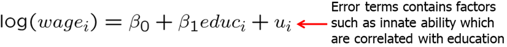
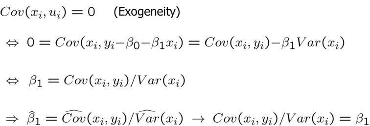
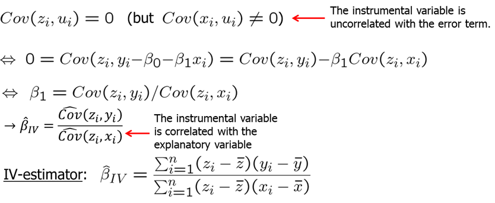
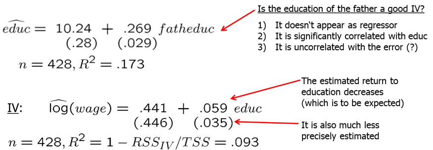
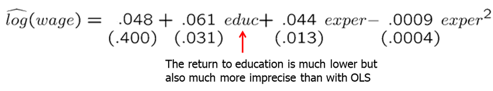
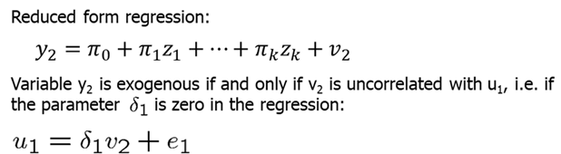

<style>
p.comment {
background-color: #e8e8e8;
padding: 10px;
border: 0px solid black;
margin-left: 25px;
border-radius: 5px;
}
</style>

##### Chapter 15: Instrumental Variables Estimation and Two-Stage Least Squares

The problem of endogeneity occurs too often in economic research. In some cases, one or more of your important variables are not observed; in other cases, they may not be well measured. These issues may lead you to the issue of endogeneity - the error term is correlated with your observed explanatory variables.

We should remember the simple solutions we suggested earlier:

1. We may ignore the variable that may cause endogeneity. However, this leads to biased and inconsistent estimators.
2. We can try to find a suitable proxy variable for the unobserved variable. This is much harder than it may seem.
3. We can also assume that the omitted variable does not change over time which means we can use fixed effects or first-differencing.

In this chapter, we will learn another very popular technique to deal with endogeneity. This method is known as the Instrumental Variables (IV) method or IV method.

Let's consider a simple regression model. We expect education to have a positive effect on wages. However, if there are some variables that are correlated with education but we do not include them in the regression, we create endogeneity problem.



To see why, think about natural ability or talent. A person who may have more ability, may also end up acquiring more education. By not including ability in the regression, we prescribe all the effects of ability to education. In other words, we may significantly overestimate the returns to education.

It turns out that we can still use the above equation given that we can find an instrumental variable. Instrumental variable is such that:

1. It does not appear in the regression.
2. It is highly correlated with the endogenous variable.
3. It is uncorrelated with the error term.

Remember that in a simple OLS, we assume that X is uncorrelated with the error term and we know that OLS results are consistent as long as exogeneity holds.



However, now assume that $x$ and $u$ are correlated (have a nonzero covariance). In presence of endogeneity, we need additional information. To be more specific, we need an observable variable $z$ which is uncorrelated with U but sufficiently correlated with $x$.



This variable $z$ is called the instrumental variable or instrument for variable $x$. The above requirement basically states that variable $z$ must be exogenous in the regression model. It should have no partial effect on Y after controlling for other relevant variables including the endogenous variable. Moreover, variable $z$ must be sufficiently correlated with the endogenous variable $x$. Variable $z$ must be relevant in explaining variation in $x$.

Let's consider an example. Suppose you are interested in estimating a causal relationship between skipping class and final exam score. You select the final exam score as a dependent variable ($y$) and number of classes skipped in a semester as the independent variable ($x$). In this kind of regression, we would be worried that highly motivated and highly able students who find the class easier may miss fewer classes. Thus, without an IV we would overestimate the effect of skipping classes on final exam score. A good IV must not have a direct effect on final exam score and is not correlated with student ability and motivation but is correlated with number of classes skipped. One may consider that the distance between student's apartment and university may be a good IV. It is likely not correlated with student's ability or motivation, has no direct effect on final exam score. However, distance may be correlated with these factors. A good analysis is due here. Secondly, is it correlated enough with number of classes skipped? This can be easily checked.

Consider another example: you are measuring the returns to education. Running a simple OLS regression with $log(wage)$ as the dependent variable and education as the independent will most likely overstate the returns to education because individuals with higher ability/talent choose to get more education and earn more. Thus, when we estimate the returns to education, in a simple model, we combine the effects of both ability and education into one and thus overstate the true returns to education holding ability/talent constant. To correct this problem, we need a good IV. It must be uncorrelated with U or ability which is in U since we did not account for it explicitly but must be correlated with education.


Let's consider this example in R. You write down a simple log-level regression model.

```{r, warning=FALSE, message=FALSE}
library(AER)
library(stargazer)
data(mroz, package='wooldridge')
attach(mroz)
reg1=lm(log(wage) ~ educ)
summary(reg1)
reg2a=lm(educ ~ fatheduc)
summary(reg2a)
reg2b= ivreg(log(wage) ~ educ | fatheduc)
stargazer(reg1,reg2b, type="text")
```

Estimate of $\beta_1$ implies that return for another year of education is almost 11%. Really high! However, we are afraid that education is correlated with other factors in U such as ability and that we overstated the returns to education. One possible IV can be father's education. It does not need to go to the model itself and is (possibly) not related with person's ability (thus uncorrelated with U). It is likely correlated with education of the person of interest (daughter). IV estimate for education is significantly smaller which is what we expected.



Usually, it is very difficult to find good instrumental variables. Previous researches have used these IVs for education:

- The number of siblings.
    + No wage determinant
    + Correlated with education because of resource constraints in hh
    + Uncorrelated with innate ability
- College proximity when 16 years old
    + No wage determinant
    + Correlated with education because more education if lived near college
    + Uncorrelated with error (?)
- Month of Birth
    + No wage determinant
    + Correlated with education because of compulsory school attendance laws
    + Uncorrelated with error

If one of the two conditions (strong correlation between $x$ and $z$, and exogeneity of $z$) are not met, IV estimator can have large asymptotic bias.


So far, we only looked at simple or univariate regression models but IV estimation is analogous in the multiple regression models.

Now we will go through the two Stage Least Squares (2SLS or TSLS) estimation. It can be used when we have more than one exogenous variable that can be used as an IV for $y_2$ (the endogenous variable in the structural equation).

Consider a linear model with many explanatory variables of which one is endogenous (it is correlated with $u$).


Having identified the endogenous variable (assume that the endogenous variable is $y_2$) and all exogenous variables ($z_1$ to $z_{k-1}$), we need to think of a good instrumental variable. It must be such that meets the three IV conditions:

1. Does not appear in regression equation
2. Is uncorrelated with error term
3. Is partially correlated with endogenous explanatory variable

Assume that variable zk meets the above conditions.

1. In the first stage, we run a reduced form regression. The endogenous explanatory variable ($y_2$) is predicted only using the exogenous explanatory variables ($z_1$ to $z_{k-1}$) and the IV ($z_k$).


2. In the second stage, in the OLS regression model we use the $\hat{y_2} predicted in the first stage instead of the original endogenous variable y2. 


All variables in the second stage regression are exogenous because $y_2$ was replaced by a prediction based on only exogenous information. By using the prediction based on exogenous information, $y_2$ is purged of its endogenous part (the part that is related to the error term).

The standard errors from the OLS second stage regression are wrong. However, it is not difficult to compute correct standard errors. If there is one endogenous variable and one instrument then 2SLS = IV. The 2SLS estimation can also be used if there is more than one endogenous variable and at least as many instruments.

Let's assume we are interested in measuring returns to education and we have two instrumental variables (father's education and mother's education). For the first stage, we regress education on all exogenous variables including the two IVs.




To work this example out in R, use the following R code:

```{r, warning=FALSE, message=FALSE}
data(mroz, package='wooldridge')
sample <- subset(mroz, !is.na(wage))
regOLS=lm(log(wage)~educ+exper+expersq, data=sample)
#summary(regOLS)
#2SLS manually
reg_1stage=lm(educ~exper+expersq+fatheduc+motheduc, data=sample)
summary(reg_1stage)
fitted_educ=reg_1stage$fitted.values
reg_2stage=lm(log(wage)~fitted_educ+exper+expersq, data=sample)
#summary(reg_2stage)
#alternatively
Quick2SLS=ivreg(log(wage)~educ+exper+expersq | motheduc+fatheduc+exper+expersq , data=sample)
stargazer(regOLS,reg_2stage,Quick2SLS,type="text",keep.stat=c("n","rsq"))
```

Obtained 2SLS estimates may have very large standard errors if multicollinearity is present. 

For example, consider college proximity as an IV for education in estimating the returns to education. Regressing $log(wage)$ on $educ$, $exper$, $expersq$, $black$, $smsa$, $south$ and other controls and then using college proximity as IV you get that education does help explain $log(wage)$ even though the standard error for the IV estimate is many times larger.

```{r, warning=FALSE, message=FALSE, cache=TRUE}
library(AER);library(stargazer);
data(card, package='wooldridge')
# OLS
ols<-lm(log(wage)~educ+exper+I(exper^2)+black+smsa+south+smsa66+reg662+ reg663+reg664+reg665+reg666+reg667+reg668+reg669, data=card)
# IV estimation
iv <-ivreg(log(wage)~educ+exper+I(exper^2)+black+smsa+south+smsa66+ reg662+reg663+reg664+reg665+reg666+reg667+reg668+reg669 | nearc4+exper+I(exper^2)+black+smsa+south+smsa66+ reg662+reg663+reg664+reg665+reg666+reg667+reg668+reg669 , data=card)
# Pretty regression table of selected coefficients
stargazer(ols,iv,type="text", keep=c("ed","near","exp","bl"),keep.stat=c("n","rsq"))
```

Regressing educ on all other exogenous variables (except $nearc4$) indicates presence of multicollinearity with R-squared of 0.48. 

Another important issue in 2SLS is weak instruments. Weak instruments are those IVs that have small correlation with the endogenous variable. This can lead to very large inconsistency and bias. The quick rule or rule of thumb is to see if the F-statistic of the proposed IVs in the first-stage regression is at least 10. See an example below.

```{r, warning=FALSE, message=FALSE, cache=TRUE}
reg_1stage=lm(educ~exper+expersq+fatheduc+motheduc, data=sample)
linearHypothesis(reg_1stage, c("motheduc=0","fatheduc=0"))
```

A few other notes on 2SLS/IV:

- If a second measurement of the mismeasured variable is available, this can be used as an instrumental variable for the mismeasured variable.
- Under assumptions completely analogous to OLS, but conditioning on $z_i$ rather than on $x_i$, 2SLS/IV is consistent and asymptotically normal.
- 2SLS/IV is typically much less precise because there is more multicollinearity and less explanatory variation in the second stage regression.
- Corrections for heteroskedasticity/serial correlation analogous to OLS.
- 2SLS/IV easily extends to time series and panel data situations.

Lastly, one does not want to use 2SLS due to large standard errors unless at least one variable is endogenous. Thus, one needs to check if any of the variables are endogenous. One can do a simple procedure to check for endogeneity.


Let's assume that you suspect $y_2$ to be endogenous while $z_1$ to $z_{k-1}$ are exogenous. First, you regress $y_2$ on all exogenous variables (even those that do not appear in the main regression). We collect the residuals ($v_2$) from the reduced form regression.



Finally, we run a test equation which is just like the original OLS regression but with residuals from the reduced form regression included as explanatory variable. If we find that $\delta_1$ is significantly different from zero (reject the null), then we conclude that $y_2$ is endogenous since $u_1$ and $v_2$ are correlated.


Let's look at a few examples. Earlier we looked at the return to education for working women. To check whether educ is indeed endogenous, we will use the residuals from the first stage regression in the second stage. Try the following code:

```{r, warning=FALSE, message=FALSE, cache=TRUE}
data(mroz, package='wooldridge')
sample <- subset(mroz, !is.na(wage))
regOLS=lm(log(wage)~educ+exper+expersq, data=sample)
stage1=lm(educ~exper+I(exper^2)+motheduc+fatheduc, data=sample)
stage2=lm(log(wage)~educ+exper+I(exper^2)+resid(stage1), data=sample)
coeftest(stage2)
```

We find that t-value for the residuals from the first stage regression is 1.67 which indicates moderate evidence of positive correlation between $u_1$ and $v_2$.


**Homework Problems**

<p class="comment"> Computer Exercise C1.\
Use the data in **wage2** for this exercise.\
1. In Example 15.2, if sibs is used as an instrument for educ, the IV estimate of the return to education is 0.122. To convince yourself that using sibs as an IV for educ is not the same as just plugging sibs in for educ and running an OLS regression, run the regression of log(wage) on sibs and explain your findings.\
2. The variable brthord is birth order (brthord is one for a first-born child, two for a second-born child, and so on). Explain why educ and brthord might be negatively correlated. Regress educ on brthord to determine whether there is a statistically significant negative correlation.\
3. Use brthord as an IV for educ in equation (15.1). Report and interpret the results.\
4. Now, suppose that we include number of siblings as an explanatory variable in the wage equation; this controls for family background, to some extent:
$$log(wage) = b0 + b1*educ + b2*sibs + u.$$
Suppose that we want to use brthord as an IV for educ, assuming that sibs is exogenous. The reduced form for educ is
$$educ = p0 + p1*sibs + p2*brthord + v.$$
State and test the identification assumption.\
5. Estimate the equation from part 4 using brthord as an IV for educ (and sibs as its own IV). Comment on the standard errors for estimates of educ and sibs.\
6. Using the fitted values from part 4, educ, compute the correlation between educ and sibs. Use this result to explain your findings from part 5.
</p>

<p class="comment"> Computer Exercise C4.\
Use the data in INTDEF for this exercise. A simple equation relating the three-month T-bill rate to the
inflation rate (constructed from the Consumer Price Index) is
$$i3_t = b0 + b1*inf_t + u_t$$
1. Estimate this equation by OLS, omitting the first time period for later comparisons. Report the results in the usual form. \
2. Some economists feel that the Consumer Price Index mismeasures the true rate of inflation, so that the OLS from part 1 suffers from measurement error bias. Reestimate the equation from part 1, using $inf_{t-1}$ as an IV for $inf_t$. How does the IV estimate of $b1$ compare with the OLS estimate?
3. Now, first difference the equation:
$$\Delta i3_t = b0 + b1*\Delta inf_t + \Delta u_t.$$
Estimate this by OLS and compare the estimate of b1 with the previous estimates.\
4. Can you use $\Delta inf_{t-1}$ as an IV for $\Delta inf_t$ in the differenced equation in part 3? Explain.
(Hint: Are $\Delta inf_t$ and $\Delta inf_{t-1}$ sufficiently correlated?)
</p>

<p class="comment"> Computer Exercise C6.\
Use the data in **murder** for this exercise. The variable $mrdrte$ is the murder rate, that is, the number of murders per 100,000 people. The variable $exec$ is the total number of prisoners executed for the current and prior two years; $unem$ is the state unemployment rate.\
1. How many states executed at least one prisoner in 1991, 1992, or 1993? Which state had the most executions?\
2. Using the two years 1990 and 1993, do a pooled regression of $mrdrte$ on $d93$, $exec$, and $unem$. What do you make of the coefficient on $exec$?\
3. Using the changes from 1990 to 1993 only (for a total of 51 observations), estimate the equation
$$ \Delta mrdrte = d0 + b1*\Delta exec + b2*\Delta unem + \Delta u $$
by OLS and report the results in the usual form. Now, does capital punishment appear to have a deterrent effect?\
4. The change in executions may be at least partly related to changes in the expected murder rate, so that $\Delta exec$ is correlated with $\Delta u$ in part (iii). It might be reasonable to assume that $\Delta exec_{-1}$ is uncorrelated with $\Delta u$. (After all, $\Delta exec_{-1}$ depends on executions that occurred three or more years ago.) Regress $\Delta exec$ on $\Delta exec_{-1}$ to see if they are sufficiently correlated; interpret the coefficient on $\Delta exec_{-1}$.
5. Reestimate the equation from part 3, using $\Delta exec_{-1}$ as an IV for $\Delta exec$. Assume that $\Delta unem$ is exogenous. How do your conclusions change from part 3?
</p>

**References**

Wooldridge, J. (2019). Introductory econometrics: a modern approach. Boston, MA: Cengage.

Heiss, F. (2016). Using R for introductory econometrics. Düsseldorf: Florian Heiss, CreateSpace.

---
