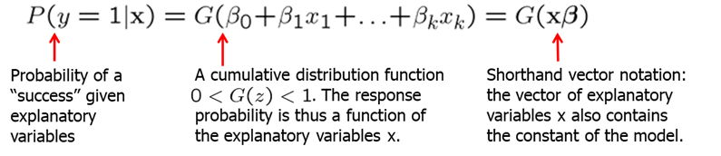
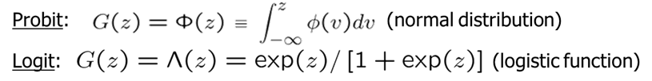
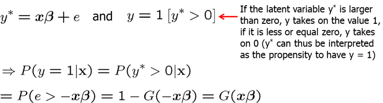
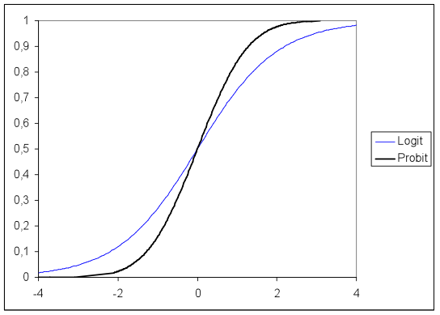
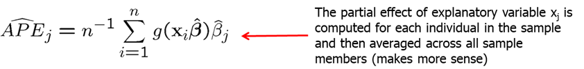
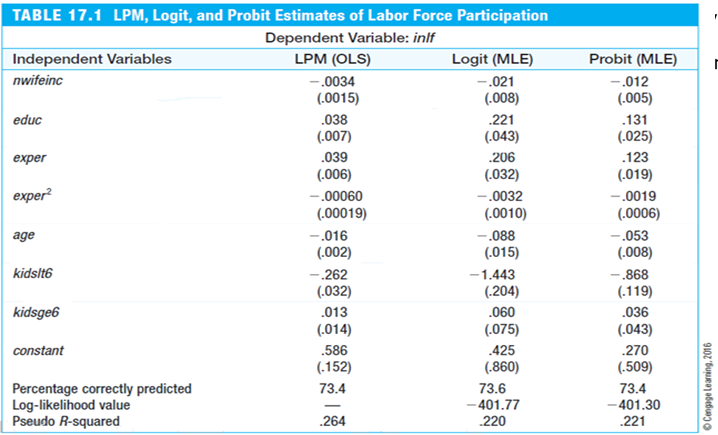
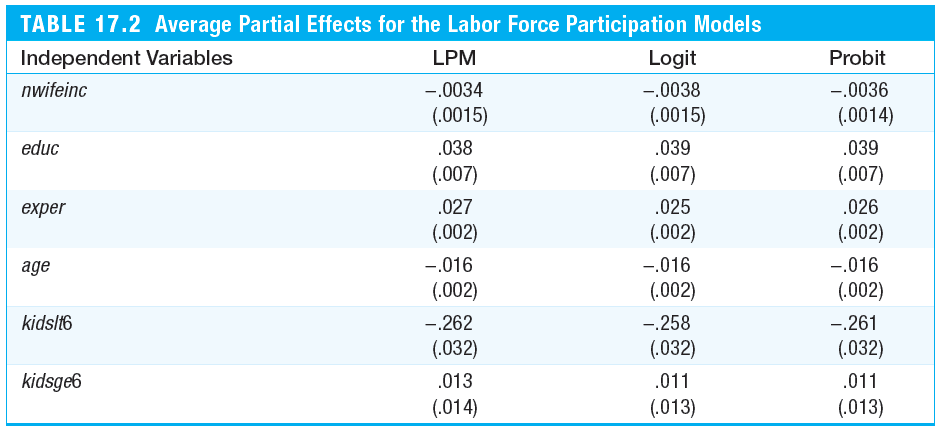

<style>
p.comment {
background-color: #e8e8e8;
padding: 10px;
border: 0px solid black;
margin-left: 25px;
border-radius: 5px;
}
</style>

##### Chapter 17: Limited Dependent Variable Models

In economics, often we deal with dependent variables (y) which are limited. These limited dependent variables are restricted in the following ways:

- Binary vavariables whose range riables, e.g. employed/not employed
- Nonnegative variables, e.g. wages, prices, interest rates
- Nonnegative variables with excess zeros, e.g. labor supply
- Count variables, e.g. the number of arrests in a year
- Censored variables, e.g. unemployment durations

In chapter 7, we discussed Linear Probability Model (LPM) for binary variables. However, it often gave predictions outside of the unit interval (probability of an event may be given as a negative number or larger than 1). Moreover, in LPM, the partial effects of explanatory variables are constant.

These limitations can be overcome by using more sophisticated nonlinear binary response models.  In such models, the response probability is a nonlinear function (G) of explanatory variables.



The two most popular nonlinear functions used for this purpose are the logit and the probit. In the logit model, the function $G$ is a logistic function. In the probit model, the function $G$ is the standard normal cumulative distribution function (or $CDF$), expressed as an integral.



Logit and probit models can be derived from an underlying latent variable model. Let $y^*$ be an unobserved, or latent, variable. 



After graphing, we see that the logit and the probit functions are very similar.



We can also see the nonlinearity of these functions, which mean that the partial effects are nonlinear and thus depend on the level of x (see how the slope changes).

To estimate the LPM, we normally use the ordinary least squares (OLS) but due to nonlinearity of probit and logit models, OLS is not applicable. Instead, we will turn to the Maximum Likelihood Estimation (MLE). By maximizing the log-likelihood function we obtain the maximum likelihood estimators which are consistent, asymptotically normal, and asymptotically efficient if the distributional assumptions hold. The usual t-tests and confidence intervals can be used to test hypothesis. However, to test multiple hypotheses, we can either use Wald test, Likelihood ratio test or Lagrange multiplier. To test the goodness-of-fit for logit and probit models, one can either use the percent correctly predicted, pseudo R-squared or correlation based measures. Pseudo R-squared is usually reported by most econometric software.

The difficult is reporting the partial effects of variables of interest. The issue is that they are not constant but depend on the level. Normally, average partial effects are reported.



Let's look at an example. Using LPM, Logit and Probit models we are trying to estimate the probability of a woman participating in the labor force. Run the code below to try it out yourself.

```{r, message=FALSE, warning=FALSE, eval=FALSE}
library(car); library(lmtest) # for robust SE
data(mroz, package='wooldridge')

# Estimate linear probability model
linprob <- lm(inlf~nwifeinc+educ+exper+I(exper^2)+age+kidslt6+kidsge6,data=mroz)
# Regression table with heteroscedasticity-robust SE and t tests:
coeftest(linprob,vcov=hccm)

# Estimate logit model
logitres<-glm(inlf~nwifeinc+educ+exper+I(exper^2)+age+kidslt6+kidsge6,
family=binomial(link=logit),data=mroz)
# Summary of results:
summary(logitres)
# Log likelihood value:
logLik(logitres) 
# McFadden's pseudo R2:
1 - logitres$deviance/logitres$null.deviance

# Estimate probit model
probitres<-glm(inlf~nwifeinc+educ+exper+I(exper^2)+age+kidslt6+kidsge6,
family=binomial(link=probit),data=mroz)
# Summary of results:
summary(probitres)
# Log likelihood value:
logLik(probitres) 
# McFadden's pseudo R2:
1 - probitres$deviance/probitres$null.deviance
```

The results are reported in the table below. We can see that estimates are similar: signs of the coefficients are the same across all models and the same variables are statistically significant.



However, the actual magnitudes of the coefficients are not directly comparable. To be able to compare the magnitudes, we will compute the average partial effects. To do that, use the code below:

```{r, message=FALSE, warning=FALSE, eval=FALSE}
########## Calculation of linear index at individual values:
xb.log <- predict(logitres)
xb.prob<- predict(probitres)
# APE factors = average(g(xb))
factor.log <- mean( dlogis(xb.log) )
factor.prob<- mean( dnorm(xb.prob) )
cbind(factor.log,factor.prob)
########## average partial effects = beta*factor:
APE.lin <- coef(linprob) * 1
APE.log <- coef(logitres) * factor.log
APE.prob<- coef(probitres) * factor.prob
########## Table of APEs
cbind(APE.lin, APE.log, APE.prob)
```



We see that the average partial effects are very similar across all three of these models. The biggest difference between the LPM and the logit and probit, is that LPM assumes constant marginal effects while logit and probit imply diminishing magnitudes of the partial effects. Note that in the LPM model, it also accounts of nonlinear experience effects.

If we are interested to see the predictions for the "extreme" women or women with the minimum and maximum values for each variable, we see that LPM predicts values outside of [0,1] interval while logit and probit stay within the unit interval. Try the code below to test it yourself.

In many economic contexts, decision problems are such that either a positive amount or a zero amount is chosen (e.g. demand for alcohol, taxes paid, hours worked). A linear regression model may be inadequate in such cases as predictions may be negative and effects of explanatory variables are linear. The Tobit model addresses this issue. See the textbook about Tobit, Poisson, Censored, Truncated regression models.


**Homework Problems**

<p class="comment"> Computer Exercise C2.\
Use the data in **loanapp** for this exercise (see also Computer Exercise C8 in Chapter 7).\
1. Estimate a probit model of approve on white. Find the estimated probability of loan approval for both whites and nonwhites. How do these compare with the linear probability estimates?\
2. Now, add the variables hrat, obrat, loanprc, unem, male, married, dep, sch, cosign, chist, pubrec, mortlat1, mortlat2, and vr to the probit model. Is there statistically significant evidence of discrimination against nonwhites?\
3. Estimate the model from part 2 by logit. Compare the coefficient on white to the probit estimate.
</p>


**References**

Wooldridge, J. (2019). Introductory econometrics: a modern approach. Boston, MA: Cengage.

Heiss, F. (2016). Using R for introductory econometrics. Düsseldorf: Florian Heiss,CreateSpace.

---
