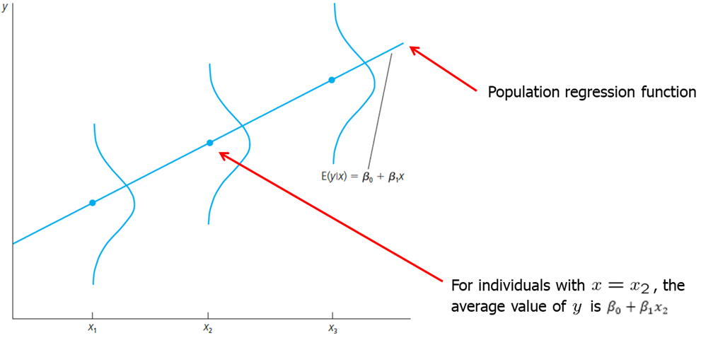
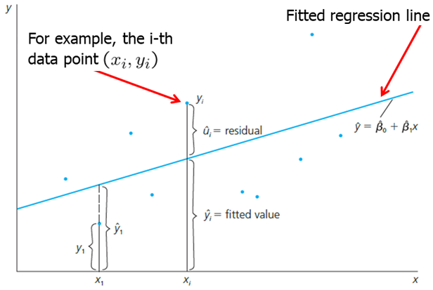

```{r setup, include=FALSE}
knitr::opts_chunk$set(echo = TRUE)
```

<style>
p.comment {
background-color: #e8e8e8;
padding: 10px;
border: 0px solid black;
margin-left: 25px;
border-radius: 5px;
}
</style>


##### Chapter 2: The Simple Regression Model

Simple regression model is used to study the relationship between two variables. It is limited as an empirical tool, however, it is a good idea to first study and interpret a simple regression model before heading into studying multiple regression models.

Econometric analysis usually begins with us observing some X and Y variables that represent some population and we are interested in "explaining variable Y in terms of X" or "studying how Y varies with changes in X". However, before we write anything down, we need to think about these three questions: (1) how do we allow for other factors (other than X) to affect Y; (2) what is the functional form of the relationship between X and Y; (3) how are we sure that ceteris paribus is captured when estimating relationship between X and Y?

The standard simple (or bivariate) linear regression model is as follows:

<center>  </center>

In the above equation, Y is called dependent, explained, response, predicted variable or regressand. X is the independent variable, also known as explanatory, control, predictor variable or regressor. U is the error term, also called the disturbance. In our simple regression analysis, all other factors that affect Y are treated as unobserved and are, effectively, in U. Beta_0 is called the intercept and beta_1 is the slope parameter. Usually, beta_1 is the main focus of attention.

$$ \frac{\Delta y}{\Delta x} = \beta_1 \quad \quad \text{as long as} \quad \quad \frac{\Delta u}{\Delta x} = 0 $$

$\beta_1$ shows by how much does the dependent variable ($y$) change if independent variable is increased by one unit? This interpretation is only true only when all other things remain equal when the independent variable is increased by one unit. As this usually does not hold, simple linear regression model is rarely applicable in practice. 

As you look at $\beta_1$, you probably see what the linear relationship means. It implies that one unit change in X has the same effect on Y, regardless of the initial value of $x$. If we studied the returns to education, this would mean that the change from no to one year of education has the same effect on your wage as the change from eleven to twelve years of education. The true relationship is likely not linear. This is not a big issue as we can allow for non-linear relationships.

More important issue comes when we look at the ceteris paribus assumption. Causal inference can be drawn only when the explanatory variable does not contain any information about the mean of the unobserved factors (in $u$). $E(u|x)=E(u)$ states that the average value of $u$ is the same independent of the value of $x$. We can say that $u$ is mean independent of $x$. Since we have the intercept that can be adjusted, we can simply make $E(u)=0$. Thus, we have zero conditional mean assumption: $E(u|x)=0$.

$E(y|x)$ is called the population regression function (PRF). It is derived by taking the original regression equation and taking expectations conditional on $x$. $\beta_0 + \beta_1 x$ is called the systemic part of $y$ and $u$ is called the unsystematic part.

$$ E(y|x) = E(\beta_0 +\beta_1 x +u |x) = \beta_0 +\beta_1 x + E(u|x) = \beta_0 +\beta_1 x$$

Visually, we can express the population regression function (PRF) as follows.

<center>  </center>

Let's look at some examples.

First example: the returns to education.
$$ wage = \beta_0 + \beta_1 educ + u$$
This model relates the person's wage (wage) to observed education (educ) and other unobserved factors (u). If the wage is measured in dollars per hour and educ is the acquired years of education, then beta_1 measures the change in hourly wage given an additional year in education, holding all other factors (in u) constant. Let's consider how well the assumptions of the model are held. Linearity assumption implies that change from no to one year of education has the same effect on your wage as the change from eleven to twelve years of education. In fact, we may expect increasing or decreasing returns to education. The linear assumption is likely not realistic in this case. Ceteris paribus assumption implies education is mean independent of other factors such as innate ability or talent. However, this is almost certainly not true. Individuals with higher natural abilities or talent are much more likely to obtain more years of education. In other words, do you expect and individual who did not finish high school and someone with a masters degree have the same natural ability. While it is certainly true for some, it is probably not true for majority. Violation of cateris paribus assumption means that we cannot infer causality: using this simple model we cannot state that education causes an increase in wage holding all other constant.


Second example: fertilizer effect on crop yield.
$$ yield = \beta_0 + \beta_1 fertilizer + u$$
If you are a farmer, you most likely want to know the effect of fertilizer on yield, holding all other factors constant. The coefficient of beta_1 measures the effect of fertilizer on yield, holding all else constant. While linearity assumption is likely not realistic, one can do an experiment by dividing one larger field and applying different amounts of fertilizer. In that case, all other factors (such as rainfall, sunshine, land quality, etc)  will indeed be constant.

How do we derive ordinary least squares estimates $\beta_0$ and $\beta_1$? To do that, we need data which is a random sample. Estimates are denoted by a hat symbol above beta coefficient. I skip the math in here, but you need to be familiar with the general idea of method of moments approach. The OLS estimators are:

$$ \hat{\beta}_1=\frac{\sum_{i=1}^2(x_i -\bar x)(y_i - \bar y)}{\sum_{i=1}^2 (x_i -\bar x)^2} \\
\hat{\beta}_0=\bar y - \hat \beta_1 \bar x $$

$\beta_1$ can also be written as sample correlation times the sample standard deviation of y divided by the sample standard deviation of $x$.

$$ \hat{\beta}_1=\hat\rho_{xy}\big(\frac{\hat\sigma_y}{\hat\sigma_x}\big) $$

These estimates of $\beta_0$ and $\beta_1$ are called the ordinary least squares (OLS) estimates. The name "ordinary least squares" comes from the fact that these estimates minimize the sum of squared residuals. 

$$ \text{Fitted or predicted values: }\hat y_i = \hat\beta_0 + \hat\beta_1 x_i  $$
$$ \text{Deviations from the regression line (residuals): }\hat u_i =  y_i - \hat y_i  $$
$$ \text{OLS: } \min \sum_{i=1}^n \hat u_i^2 \quad \rightarrow \quad \hat\beta_0, \hat\beta_1  $$

When we estimate the values for $\beta_0$ and $\beta_1$, we can plot the OLS regression line in the scatterplot of $x$ and $y$ values. This line is sometimes called sample regression function (SRF) because it is estimated version of the population regression function (PRF). Each fitted value ($\hat{y}_i$) is on this OLS regression line.

<center>  </center>

In the figure above, we see that the fitted Y value is higher than actual Y value for X1. The residual is the difference between the two; in this case, it is negative. For some later Xi, we see that the observed Y value is greater than the fitted. The residual thus is positive. In short, we found such beta_0 and beta_1 that the residuals are as small as can be, or that the line fitted best fits the observed data. We see that in some cases the line overpredicts and in other cases - underpredicts Y.

It is important to remember that given some value of $x$, we only predict Y using the OLS regression line. We do not know what the true PRF is or how close our estimated regression line is to the true PRF. Using a different sample, we may get a different OLS regression line ($\beta_0$ and $\beta_1$) which may or may not be closer to PRF.

<center>  </center>

Since most econometricians are painstakingly familiar with OLS, for brevity, we just say we regress Y on X without actually writing out the full econometric model.

Some properties of OLS statistics:

1. The sum and the sample average of the OLS residuals is zero.
2. The sample covariance between the regressors and the OLS residuals is zero.
3. The sample averages of y and x lie on the OLS regression line.

We can decompose every Yi observation into a fitted value and a residual. Let's define the total sum of squares (SST), the explained sum of squares (SSE) and the residual sum of squares (SSR) as follows:

$$ SST= \sum_{i=1}^n (y_i-\bar y)^2 \\
SSE = \sum_{i=1}^n (\hat y_i-\bar y)^2 \\
SSR= \sum_{i=1}^n (\hat u_i)^2 $$

We can also measure how well our estimated OLS regression line fits the data using the SST, SSE and SSR definitions. R-squared of the regression (also known as the coefficient of determination) is defined as the explained sum of squares divided by the total sum of squares.

$$ SST= SSE + SSR $$

$$ R^2 \equiv \frac{SSE}{SST}=1-\frac{SSR}{SST} $$

It is interpreted as the fraction of the sample variation in y that is explained by x. R-squared is always between 0 and 1. In social sciences, low R-squares are not uncommon. It is important to note that low R-square does not deem the regression useless. The most important is to focus on how well the underlying assumptions are satisfied.

Let's look at some examples. First example: CEO Salary and Return on Equity.
$$ salary = \beta_0 + \beta_1 roe + u $$
We postulate that CEO are paid more who bring more returns to the owners. In other words, salary depends on the return that the shareholders get. We can also say that we expect beta_1 to be greater than 0. We can write it down as follows:

In this example, we have observed annual CEO salary, and the average return on equity (ROE) for the CEO's firm for the three previous years with one meaning 1 percentage point.
We run one of the two following codes in R to estimate the OLS coefficients:
```{r, message=FALSE, warning=FALSE, cache=TRUE}
#############
##### R #####
#############
#install.packages("wooldridge") #Make sure you install the package once.
data(ceosal1, package='wooldridge') #Call the data from the package.
# OLS regression
reg1=lm( salary ~ roe, data=ceosal1 ) #Run the regression using lm command
cov1=cov(ceosal1$roe,ceosal1$salary) #Covariance between roe and salary
var1=var(ceosal1$roe) #Variance of roe
mean1=mean(ceosal1$salary) #Mean of salary
mean2=mean(ceosal1$roe) #Mean of roe
b1hat = cov(ceosal1$roe,ceosal1$salary)/var(ceosal1$roe)  # manual calculation of beta_1 estimator
b0hat = mean(ceosal1$salary) - b1hat*mean(ceosal1$roe)  # manual calculation of beta_0 estimator
print(reg1); print(paste("beta0=", b0hat)); print(paste("beta1=", b1hat))
```

```{python, eval=FALSE}
##############
### PYTHON ###
##############
import wooldridge as woo
import numpy as np
ceosal1 = woo.dataWoo('ceosal1')
x = ceosal1['roe']
y = ceosal1['salary']
# ingredients to the OLS formulas:
cov_xy = np.cov(x, y)[1, 0]  # access 2. row and 1. column of covariance matrix
var_x = np.var(x, ddof=1)
x_bar = np.mean(x)
y_bar = np.mean(y)
# manual calculation of OLS coefficients:
b1 = cov_xy / var_x
b0 = y_bar - b1 * x_bar
print(f'b1: {b1}\n')
print(f'b0: {b0}\n')
```

We get the following OLS regression line.
$$\widehat{salary} = 963.19 + 18.50 roe$$

How do we read our results? If $roe=0$, then we predict the CEO salary is \$963,191. With every single percentage point increase in $ro$, the predicted salary increases by \$18,501. For example, if $roe=30$, then the predicted salary equals 963,191+18,501*(30)=\$1,518,221.

Second example: Return on Education in 1976.
$$wage = \beta_0 + \beta_1 educ + u$$
We expect that an individual with more education will have a higher wage, all else held constant. We write down a simple bivariate linear model:

Write the following R code to estimate $\beta_0$ and $\beta_1$.
```{r, message=FALSE, warning=FALSE, cache=TRUE}
#############
##### R #####
#############
data(wage1, package='wooldridge')
# OLS regression:
reg1=lm(wage ~ educ, data=wage1)
plot(wage1$educ,wage1$wage)
abline(lm(wage1$wage~wage1$educ))
summary(reg1)
```

```{python, eval=FALSE}
##############
### PYTHON ###
##############
import wooldridge as woo
import statsmodels.formula.api as smf
wage1 = woo.dataWoo('wage1')
reg = smf.ols(formula='wage ~ educ', data=wage1)
results = reg.fit()
b = results.params
print(f'b: \n{b}\n')
```

We have to be cautious here because this equation predicts a person with no education to have a wage of negative 90 cents an hour (which is ridiculous, of course). The equation predicts poorly due to very few observations of individuals with very little education. With every year in education we predict the wage to increase by 54 cents per hour which is equivalent to \$2.16 today. That is a very large effect. It is very likely that the true effect is smaller and it is likely not linear.

Keep in mind the units. It is important to keep track of the units of measurement to be able to read the results of the regression correctly.

Another important aspect is the functional form of the econometric model. So far we looked at a simple linear relationship. However, we can also look at various other relationships. First, we will take the natural log of the dependent variable. The interpretation changes! Now, the dependent variable will change by a constant percentage when independent variable increases by 1 unit. 

This can be especially helpful with the returns on education equation. Let's look back at the original model but this time let's use the natural log of wage. The model looks like this:

$$ log(wage) = \beta_0 + \beta_1 educ +u $$

$$ \beta_1 = \frac{\Delta log(wage)}{\Delta educ} = \frac{\frac{\Delta wage}{wage}}{\Delta educ} $$

In our new model, $\beta_1$ indicates by how many percent does the wage increase if the years of education are increased by one year. $\beta_1 * 100$ is often called semi-elasticity of $y$ with respect to $x$.

We can run the following code in R to get the OLS estimates and make new plots:
```{r, message=FALSE, warning=FALSE, cache=TRUE}
#############
##### R #####
#############
data(wage1, package='wooldridge')
#OLS Regression
reg1=lm(log(wage) ~ educ, data=wage1)
summary(reg1)
#Plot 1
plot(log(wage)~educ, data=wage1)
abline(reg1)
#Plot 2
plot(wage~educ, data=wage1)
a0=1/length(fitted(reg1)) * sum(exp(reg1$residuals))
points(exp(reg1$fitted.values)*a0~wage1$educ,col="green",lwd=5)
```

```{python, eval=FALSE}
##############
### PYTHON ###
##############
import numpy as np
import wooldridge as woo
import statsmodels.formula.api as smf
wage1 = woo.dataWoo('wage1')
# estimate log-level model:
reg = smf.ols(formula='np.log(wage) ~ educ', data=wage1)
results = reg.fit()
b = results.params
print(f'b: \n{b}\n')
```

We find that the wage increases by 8.3\% with an additional year of education, else held constant.

It is always useful to create plots. It helps you better understand the data and they help communicate the results. If we take log wages and education and plot them, we can directly plot the fitted values of the OLS regression (see the first figure (Plot 1)). However, we are not used to thinking in terms of log wages so it is better to convert back to the usual units - dollars. In Plot 2, we can visually observe the non-linear relationship between wage and education. This seems to be a much better fit than the simple linear model done earlier.

Log-log model is another popular model in which both the left hand side (LHS) and right hand side (RHS) variables are converted to their natural logarithms. It is called a constant elasticity model. In this model, beta_1 is called the elasticity of $y$ with respect to $x$.

Let's look at a different example in which CEO salary and sales are expected to be related. We expect the firm with more sales to pay more to the CEO. In other words, CEO of company with more sales is expected to be compensated more. We can formulate the model as:

$$ log(salary) = \beta_0 + \beta_1 log(sales) + u $$

The interpretation is now different. $\beta_1$ coefficient now indicates by how many percent the salary is predicted to increase if sales increase by 1\%.

$$ \beta_1 = \frac{\Delta log(salary)}{\Delta log(sales)} = \frac{\frac{\Delta salary}{salary}}{\frac{\Delta sales}{sales}} $$

We can run the following code in R:
```{r, message=FALSE, warning=FALSE, cache=TRUE}
#############
##### R #####
#############
data(ceosal1, package='wooldridge')
# Estimate log-log model
reg1=lm( log(salary) ~ log(sales), data=ceosal1 )
summary(reg1)
plot(log(salary) ~ log(sales), data=ceosal1) #plot 1
abline(reg1)
plot(salary~log(sales), data=ceosal1) #plot 2
points(exp(reg1$fitted.values)~log(ceosal1$sales),col="green",lwd=4)
plot(salary~sales, data=ceosal1) #plot 3
a0=1/length(fitted(reg1)) * sum(exp(reg1$residuals))
points(exp(reg1$fitted.values)*a0~ceosal1$sales,col="green",lwd=4)
```

```{python, eval=FALSE}
##############
### PYTHON ###
##############
import numpy as np
import wooldridge as woo
import statsmodels.formula.api as smf
ceosal1 = woo.dataWoo('ceosal1')
# estimate log-log model:
reg = smf.ols(formula='np.log(salary) ~ np.log(sales)', data=ceosal1)
results = reg.fit()
b = results.params
print(f'b: \n{b}\n')
```

Regression results are as follows. Estimated $\beta_0$ coefficient is 4.822 and estimated $\beta_1$ coefficient is 0.257. This can be interpreted as follows: for 10\% increase in sales, CEO salary is expected to be higher by 2.57\%.

If a new random sample is taken, we would get different values for the estimated coefficients $\beta_0$ and $\beta_1$. The question is what the estimators will estimate on average and how large will their variability be in repeated samples. OLS regression estimates "well" (we will discuss what that means below), we need to make a few assumptions. We call them Gauss-Markov assumptions for simple regression.

- SLR.1: The relationship between $x$ and $y$ is linear. (Linear in Parameters)
- SLR.2: We have a random sample following population model. (Random Sampling)
- SLR.3: The sample outcomes on $x$, are not all the same value. (Sample Variation)
- SLR.4: The error $u$ has a zero conditional mean. $E(u|x)=0$. (Zero Conditional Mean)
- SLR.5: The error $u$ has the same variance given any value of $x$. (Homoskedasticity)

Given the first four assumptions (SLR.1 through SLR.4), we can show that OLS estimates are unbiased. In other words, it means that if we take many samples from the same population, on average, the estimated coefficients will be equal to the values that characterize the true/actual/real relationship between $y$ and $x$ in the population.

Theorem 2.1: Unbiasedness of OLS
$$ SLR.1-SLR.4 \quad \rightarrow \quad E(\hat{\beta_0})=\beta_0, \quad E(\hat{\beta_1})= \beta_1$$

Valid computation the variance for OLS estimators is essential when we want to know the confidence intervals and test hypotheses. However, if we have heteroskedasticity, the standard computation of variance of $\beta_0$ and $\beta_1$ is invalid. The error terms is said to exhibit heteroskedasticity when variance of U depends on $x$: $Var(u|x)$. In other words, $u$ exhibits a nonconstant variance across levels of $x$.

Theorem 2.2: Variances of the OLS estimators

$$ Var(\hat{\beta}_1) = \frac{\sigma^2}{\sum_{i=1}^n{(x_i-\bar{x})^2}} = \frac{\sigma^2}{SST_x} $$
$$ Var(\hat{\beta}_0) = \frac{\sigma^2 n^{-1} \sum_{i=1}^n{x_i^2}}{\sum_{i=1}^n{(x_i-\bar{x})^2}} = \frac{\sigma^2 n^{-1} \sum_{i=1}^n{x_i^2}}{SST_x} $$

A note on the difference between errors and residuals. Errors show up in the equation containing the population parameters. The residuals show up in the estimated equation. While the errors are unknown, the residuals can be computed.

The variance of $u$ does not depend on $x$. That is equivalent to saying that the variance of $u$ with respect to $x$ is equal to the unconditional variance of $u$.

$$ Var(u_i|x_i)=\sigma^2=Var(u_i) $$

One can estimate the variance of the errors by calculating the variance of the residuals in the sample; unfortunately this estimate would be biased.

$$ \hat{\sigma^2} = \frac{1}{n} \sum_{i=1}^n\hat{u}_i^2 $$

An unbiased estimate of the error of the variance can be obtained by subtracting the number of the estimated regression coefficients from the number of observations.

$$ \hat{\sigma^2} = \frac{1}{n-2} \sum_{i=1}^n\hat{u}_i^2 $$

The estimated standard deviations of the regression coefficients are called "standard errors." They measure how precisely the regression coefficients are estimated. Standard errors of the regression coefficients are computed as follows. 

$$ se(\widehat{\beta_1})=\sqrt{\widehat{Var}(\widehat{\beta_1})}=\sqrt{\hat{\sigma}^2/SST_x} $$
$$ se(\widehat{\beta_0})=\sqrt{\widehat{Var}(\widehat{\beta_0})}=\sqrt{\hat{\sigma}^2 n^{-1} \sum x_i^2 /SST_x} $$

Theorem 2.3: Unbiasedness of the error variance

$$ SLR.1-SLR.5 \quad \rightarrow \quad E(\widehat{\sigma^2})=\sigma^2 $$

Regression through the origin is a technique that imposes $\beta_0$ to equal 0. In other words, it is a model without an intercept. This technique can be easily implemented in R using the code below. In Excel, you can check off if you want a model without intercept.
```{r, message=FALSE, warning=FALSE, cache=TRUE}
#############
##### R #####
#############
# Standard OLS regression
reg1 <- lm(wage ~ educ, data = wage1)
# Adding the 0 term tells the lm() to fit the line through the origin
reg2 <- lm(wage ~ 0 + educ, data = wage1)
summary(reg1)
summary(reg2)
```

```{python, eval=FALSE}
##############
### PYTHON ###
##############
import wooldridge as woo
import statsmodels.formula.api as smf
ceosal1 = woo.dataWoo('ceosal1')
# usual OLS regression:
reg1 = smf.ols(formula='salary ~ roe', data=ceosal1)
results1 = reg1.fit()
b_1 = results1.params
print(f'b_1: \n{b_1}\n')
# regression without intercept (through origin):
reg2 = smf.ols(formula='salary ~ 0 + roe', data=ceosal1)
results2 = reg2.fit()
b_2 = results2.params
print(f'b_2: \n{b_2}\n')
```

So far we have dealt with variables that are quantitative or variables that are measurable such as years of education, wage, salary, age and similar. There are however many qualitative variables. There are two types: binary (dummy) variables and ordinal variables. Dummy variables can only take values of 0 or 1. Usually, 1 indicates that the individual belongs to some group and 0 that the individual does not. For example, white or not white, foreign-born or not, has a car or not. Ordinal variables group individuals into groups where the order matters. For example, how much education one has completed: 0: none, 1: primary school, 2: secondary school, 3: some college, 4: bachelors degree or more.

For now, we will deal with binary (dummy) variables in a simple regression model. Suppose variable x can take either value equal to 0 or 1.  Let's assume the same simple linear regression model. Since x=0 or x=1, whenever X=0, it does not matter what the value of $\beta_1$, is so the only variable that is left is $\beta_0$. Whenever $x=1$, $y = \beta_0 + \beta_1$. See below.

$$ y = \beta_0 +\beta_1 x + u $$
$$ E(y|x=0) = \beta_0, \quad \quad E(y|x=1) = \beta_0 + \beta_1 x $$

In other words, $\beta_1$ finds the expected difference of the mean when $x=1$, and when $x=0$.

$$ \beta_1 = E(y|x=1) - E(y|x=0)$$

Let's look at a simple example. We expect that wage is greater among white Americans than nonwhite for a number of reasons which we will discuss in later chapters. In R, write the following code:
```{r, message=FALSE, warning=FALSE, cache=TRUE}
#############
##### R #####
#############
data(wage1, package='wooldridge')
mean(wage1$nonwhite)
summary(wage1$wage)
reg1=lm(wage~nonwhite, data=wage1)
summary(reg1)
```

```{python, eval=FALSE}
##############
### PYTHON ###
##############
import wooldridge as woo
import statsmodels.formula.api as smf
wage1 = woo.dataWoo('wage1')
reg = smf.ols(formula='wage ~ nonwhite', data=wage1)
results = reg.fit()
b = results.params
print(b)
```

We see that wages of nonwhite people in the US are, indeed, predicted to be lower by 47 cents per hour. However, the result is not statistically significant. In the next chapter, we will see what are the possible reasons for that.

Similarly, we could have look at the relationship between wage and gender which we will do in the next chapter.

Now, we can look at the final topic in this chapter: counterfactual outcomes, causality and policy analysis. We are usually interested in the causal effect: what effect does increase in $x$ have on the outcome of Y? With dummy variables, we can see what effect does an exposure to something affect some outcome. The control group is the ones that are not exposed or do not get the treatment, and the treatment group is the one that is subject to some intervention.

We define the treatment or causal effect as the difference between the observed $y$ value with treatment and without treatment: $\tau=te=y(1)-y(0)$. We normally estimate the average treatment effect (ATE), also known as average causal effect (ACE). We define ATE as the expected difference between outcome with and without treatment: $$E(\tau)=E[y(1)-y(0)]=E[y(1)]-E[y(0)]$$.

For each observed unit $i$, let $x_i$ be participation status. If $x=0$, then $y_i=y_i(0)$, if $x=1$, then $y_i=y_i(1)$.

$$ y_i=(1-x_i)y_i(0)+x_i y_i (1) $$

After a few simple substitutions, we arrive at the equation below.

$$ y_i=\alpha_0+\tau x_i +u_i(0) \quad \text{assuming} \quad y_i(0)=\alpha_0+u_i(0) \text{ and } y_i=y_i(0)+\tau x_i$$

We can estimate this equation. Regressing $y$ on $x$ will give us an estimate of the (constant) treatment effect. As long as we have random assignment, OLS will yield an unbiased estimator for the treatment effect tau.

Random assignment is the hallmark of the random controlled trial (RCT). It is heavily used in determining the causal effects in medical interventions. In RCTs, subjects are randomly assigned into treatment and control groups such that there are no systematic differences between the two groups other than the treatment. However, in practice, in economics, randomized control trials (RCTs) are expensive to implement and may raise ethical issues. Though RCTs are often not feasible in economics, it is useful to think about the kind of experiment you would run if random assignment was a possibility. This helps in identifying the potential impediments to random assignment (that we could conceivable control for in a multivariate regression).

Let's examine a simple example in which men with poor labor market histories were assigned to control (no job training) and treatment (job training) groups.

In R and Pythong, write the following code:
```{r, message=FALSE, warning=FALSE, cache=TRUE}
#############
##### R #####
#############
data(jtrain2, package='wooldridge')
reg1=lm(re78 ~ train, data=jtrain2)
summary(reg1)
```

```{python, eval=FALSE}
##############
### PYTHON ###
##############
import wooldridge as woo
import statsmodels.formula.api as smf
jtrain2 = woo.dataWoo('jtrain2')
reg = smf.ols(formula='re78 ~ train', data=jtrain2)
results = reg.fit()
b = results.params
print(b)
```

Regressing the real earnings in 1978 measured in thousands of dollars on whether the individual was participated in the job training gives us the following results:
$$ \widehat{\beta}_0=4.55, \quad \widehat{\beta}_1=1.79 $$
$re78$ are real earnings in 1978 measured in thousands of dollars. This means that real earnings are predicted to be 1.79 thousand dollars higher for an individual who received training. 

The R-squared is very low because job training participation explains less than 2% of the variation in real earnings which is not surprising as education, experience and other factors help determine the real wage. 

**Homework Problems**

<p class="comment"> Problem 3.\
The following two variables contain the ACT scores and the GPA (grade point average) for eight college students.
$$
GPA = c(2.8, 3.4, 3.0, 3.5, 3.6, 3.0, 2.7, 3.7) \\
ACT = c(21, 24, 26, 27, 29, 25, 25, 30)
$$
Grade point average is based on a four-point scale and has been rounded to one digit after the decimal. \
1. Estimate the relationship between GPA and ACT using OLS; that is, obtain the intercept and slope estimates in the equation $GPA = \beta_0 + \beta_1 * ACT$.\
Comment on the direction of the relationship. Does the intercept have a useful interpretation
here? Explain. How much higher is the GPA predicted to be if the ACT score is increased by five points? \
2. Compute the fitted values and residuals for each observation, and verify that the residuals (approximately) sum to zero.\
3. What is the predicted value of $GPA$ when $ACT=20$?\
4. How much of the variation in $GPA$ for these eight students is explained by $ACT$? Explain.
</p>
<p class="comment">
Problem 7.\
Consider the savings function $sav = \beta_0 + \beta_1*inc + u, \text{ where } u= e \sqrt{inc}$ with $e$ as a random variable with $E(e)=0$ and $Var(e)=\sigma^2$ . Assume that $e$ is independent of $inc$.\
1. Show that $E(u|inc)=0$, so that the key zero conditional mean assumption (Assumption SLR.4) is satisfied.\ [Hint: If $e$ is independent of $inc$, then $E(e|inc)=E(e)$.]\
2. Show that $Var(u|inc)=(\sigma^2_e)*(inc)$, so that the homoskedasticity Assumption SLR.5 is violated. In particular, the variance of $sav$ increases with $inc$.\ [Hint: $Var(e|inc)=Var(e)$, if $e$ and $inc$ are independent.]\
3. Provide a discussion that supports the assumption that the variance of savings increases with family income.
</p>
<p class="comment">
Computer Exercise C5.\
For the population of firms in the chemical industry, let $rd$ denote annual expenditures on research and development, and let $sales$ denote annual sales (both are in millions of dollars).\
1. Write down a model (not an estimated equation) that implies a constant elasticity between $rd$ and $sales$. Which parameter is the elasticity?\
2. Now, estimate the model using the data in **rdchem**. Write out the estimated equation in the usual form. What is the estimated elasticity of $rd$ with respect to $sales$? Explain in words what this elasticity means.
</p>
<p class="comment">
Computer Exercise C6.\
We used the data in **meap93** for Example 2.12. Now we want to explore the relationship between the math pass rate ($math10$) and spending per student ($expend$).\
1. Do you think each additional dollar spent has the same effect on the pass rate, or does a diminishing effect seem more appropriate? Explain.\
2. Assume a population model\: $math10 = \beta_0 + \beta_1 * log(expend) + u$. Argue that $\beta_1/10$ is the percentage point change in $math10$ given a 10\% increase in $expend$.\
3. Use the data in **meap93** to estimate the model from part 2. Report the estimated equation in the usual way, including the sample size and R-squared.\
4. How big is the estimated spending effect? Namely, if spending increases by 10%, what is the estimated percentage point increase in $math10$?\
5. One might worry that regression analysis can produce fitted values for $math10$ that are greater than 100. Why is this not much of a worry in this data set?
</p>
<p class="comment">
Computer Exercise C11.\
Use the data in **gpa1** to answer these questions. It is a sample of Michigan State University undergraduates from the mid-1990s, and includes current college GPA ($colGPA$), and a binary variable indicating whether the student owned a personal computer ($PC$).\
1. How many students are in the sample? Find the average and the highest college GPAs.\
2. How many students owned their own PC?\
3. Estimate the simple regression equation\: $colGPA = \beta_0 + \beta_1*PC + u$. Report your estimates for $\beta_0$ and $\beta_1$. Interpret these estimates, including a discussion of the magnitudes.\
4. What is the R-squared from the regression? What do you make of its magnitude?\
5. Does your finding in part 3 imply that owning a $PC$ has a causal effect on $colGPA$? Explain.
</p>

**References**

Wooldridge, J. (2019). Introductory econometrics: a modern approach. Boston, MA: Cengage.

Ramanathan, R. (2002). Introductory econometrics with applications. Fort Worth: Harcourt College Publishers.

Heiss, F. (2016). Using R for introductory econometrics. Dusseldorf: Florian Heiss, CreateSpace.

---
