<style>
p.comment {
background-color: #e8e8e8;
padding: 10px;
border: 0px solid black;
margin-left: 25px;
border-radius: 5px;
}
</style>

##### Chapter 3: The Multiple Regression Analysis: Estimation

Multiple regression analysis is more amenable to ceteris paribus assumption because it allows us to explicitly control for many factors that simultaneously affect the dependent variable. Adding more relevant variables, can increase the explained variation of the dependent variable and help us build better models for predicting the dependent variable.

Multiple regression model is the most widely used vehicle for empirical analysis in economics and other social sciences. Similarly, OLS is the most popular method used in estimating the parameters of the multiple regression model.

A multiple regression model explain the dependent variable $y$ in terms of multiple independent variables $x_1$, $x_2$, $x_3$ and so on.

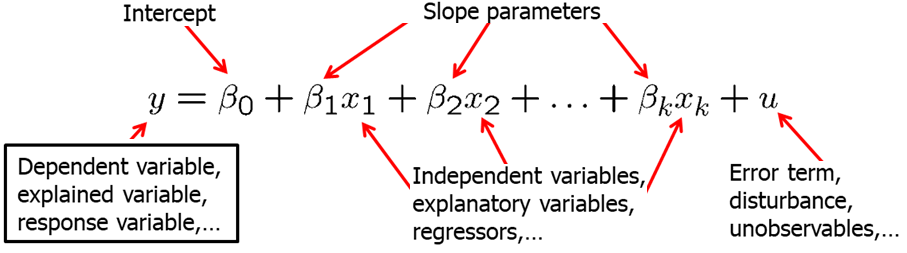

sually, we will use Y for the dependent variable, beta_0 for the intercept and $\beta_1, \beta_2, \beta_3$ and so on for the independent variables. The usual notation of the error term (or disturbance) is $u$.

Incorporating additional explanatory (independent) variables allows us to explicitly hold more variables fixed that otherwise would have been in U. This allows us to more accurately measure the effects that we are interested in. Additionally, it also allows us to use more flexible functional forms.

In the model with two independent variables, the key assumption about how U is related to $x_1$ and $x_2$ is:
$$E(u|x_1,x_2)=0$$

It means that, for any values of $x_1$ and $x_2$ in the population, the average of the unobserved factors is equal to zero.

In models with more than two independent variables, zero conditional mean assumption requires:
$$E(u|x_1,x_2,x_3,x_4,...,x_k)=0$$

If key variables which are correlated with one of the independent variable are omitted, we will have a big problem: our results will be biased. In other words, we will either underpredict or overpredict the effect of the independent variable on the dependent variable. 

For example, in our previous wage and education model we can now include additional independent variables such as experience, gender among other. Let's assume we decide to include additional independent variable (regressor) - experience. The question is what effect does $\beta_1$ and $\beta_2$ now measure? $\beta_1$ now measures the effect of education explicitly holding experience fixed. Similarly, $\beta_2$ measures the effect of experience on wages explicitly holding education fixed. See the model below.

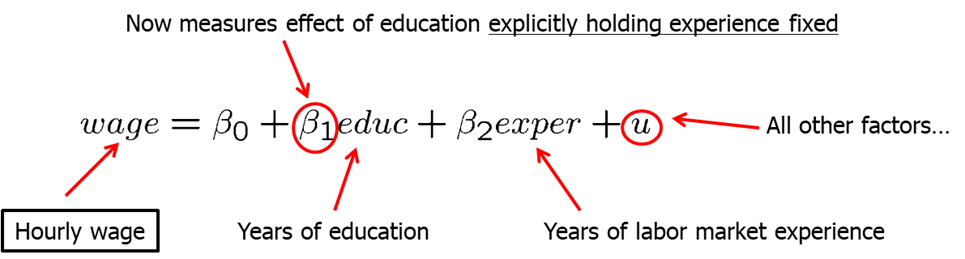

In this model, in the error term we have all other factors. One of them is likely to be the innate ability or talent. We need this average natural ability levels to be the same across all combinations of education and experience in the working population. If this is not true (and it is likely not), then our estimates will be biased.

Let's look at another example. Average standardized test score of school is expected to be positively affected by per student spending at that school. It is important to include average family income of students at that school because it is likely to be correlated with per student spending. If we omitted average income, then it would appear in $u$. This would lead to biased estimate of the effect of spending on average test scores. In a simple regression model, effect of per student spending would partly include the effect of family income on test scores. See the model below.


As mentioned before, multiple regression analysis also allows us to use more flexible functional forms, For example, we may hypothesize that family consumption is explained by a quadratic function of family income. See the model below.


Here, the zero conditional mean assumption can be written as: $E(u|inc,inc^2)=0$. However, when we know $inc, inc^2$ is automatically known so it becomes redundant. We can simply write:
$$E(u|inc,inc^2)=E(u|inc)=0.$$

In models like with the quadratic functions or with cross-products (we will learn more about these later), we need to be extra careful when interpreting the coefficients. Change in income now will not have a linear effect on consumption. The change in consumption depends on how much income family has already.

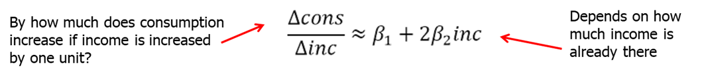

Let's look at another example. Here, we have a natural logarithm of CEO salary as a dependent variable. As independent variables we have a natural logarithm of sales, and a quadratic function of CEO tenure with the firm. Model assumes a constant elasticity relationship between CEO salary and the sales of his or her firm. Model assumes a quadratic relationship between CEO salary and his or her tenure with the fir. As you can see, we allow the salary and CEO tenure to be related non-linearly but the model is linear in parameters. See the model below.


When thinking of the betas, remember that we are holding all other independent variables constant. So for example, if we look at $\beta_1$, it measures the elasticity of salary with respect to sales explicitly holding CEO tenure fixed.

How do we obtain the estimates for $\beta_0, \beta_1$ and the rest? We again use the ordinary least squares (OLS) which chooses the estimates to minimize the sum of squared residuals. This minimization problem is solved using multivariate calculus.


As in the simple regression analysis, we will derive the OLS regression line or the sample regression function (SRF). $\hat{\beta_0}$ will be called the OLS intercept and the rest of the beta estimates will be called OLS slope estimates.

We will still say that we run an OLS regression of $y$ on $x_1, x_2, x_3...$ We will always include the intercept in the analysis unless specified otherwise.

The estimates of beta, have partial effects, or ceteris paribus, interpretations. The multiple linear regression model manages to hold the values of other explanatory variables fixed even if, in reality, they are correlated with the explanatory variable under consideration. However, we assume that unobserved factors do not change if the explanatory variables are changed which may or may not be true.

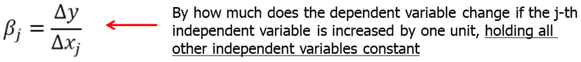

Let's do a few examples.

First, let's look at the determinants of the college GPA. We are interested to find the effects of high school GPA and ACT score on the college GPA. In R, write the following code:
```{r, message=FALSE, warning=FALSE, cache=TRUE}
#############
##### R #####
#############
data(gpa1, package='wooldridge')
reg1=lm(colGPA ~ hsGPA+ACT, data=gpa1)
summary(reg1)
```

```{python, eval=FALSE}
##############
### PYTHON ###
##############
import wooldridge as woo
import statsmodels.formula.api as smf
gpa1 = woo.dataWoo('gpa1')
reg = smf.ols(formula='colGPA ~ hsGPA + ACT', data=gpa1)
results = reg.fit()
print(f'results.summary(): \n{results.summary()}\n')
```

The intercept of 1.29 indicates that college GPA is predicted to be 1.29 if hsGPA and ACT are both set to equal zero. Since it is impossible to attend college and have a zero high school GPA or zero ACT score, the intercept itself is not meaningful. The first slope coefficient of 0.453 means that holding the ACT score constant, another point in hsGPA increases colGPA by 0.453. Similarly, holding high school GPA constant, one point increase in ACT score increases college GPA by 0.0094. The magnitude of the effects is significantly different. We can see that high school GPA is strongly associated with college GPA even after we control ACT score. However, after we control for high school GPA, ACT score is not a strong predictor of college GPA.

Second, let's look at hourly wage equation. In this example, we regress log(wage) on education, experience and tenure. In R, write the following code:
```{r, message=FALSE, warning=FALSE, cache=TRUE}
#############
##### R #####
#############
data(wage1, package='wooldridge')
reg1= lm(log(wage) ~ educ+exper+tenure, data=wage1) 
```

```{python, eval=FALSE}
##############
### PYTHON ###
##############
import wooldridge as woo
import numpy as np
import statsmodels.formula.api as smf
wage1 = woo.dataWoo('wage1')
reg = smf.ols(formula='np.log(wage) ~ educ + exper + tenure', data=wage1)
results = reg.fit()
print(f'results.summary(): \n{results.summary()}\n')
```

We see that all of the partial effects are positive. Since we use the log(wage), the coefficient of 0.092 means that, holding experience and tenure fixed, another year of education is predicted to increase the log(wage) by 0.092 which translates to 9.2% increase in wage.

It is often a good idea to present the results visually. Let's try to a few pieces of simple R code to see how our results may look visually. In R, write the following code:

```{r, message=FALSE, warning=FALSE, cache=TRUE}
#############
##### R #####
#############
data(wage1, package='wooldridge')
plot(wage~educ, data=wage1)
x=0:18
a0=1/length(fitted(reg1)) * sum(exp(reg1$residuals))
reg1coeff=reg1$coefficients
yfit1=exp(reg1coeff[1]+reg1coeff[2]*x+reg1coeff[3]*1+reg1coeff[4]*1)
points(yfit1*a0~x,col="green",lwd=5)
yfit35=exp(reg1coeff[1]+reg1coeff[2]*x+reg1coeff[3]*35+reg1coeff[4]*1)
points(yfit35*a0~x,col="blue",lwd=5); yfit35-yfit1
```

This figure shows the predicted wages of an individual with 1 (green line) and with 35 years (blue line) of experience given 1 year of tenure at the current firm. Since we used log(wage), an additional year of education increases the wage by the same percentage, given the experience and tenure fixed. In other words, the relationship between wages and education is non-linear.

Using the above estimated equation, we varied experience (between 1 and 35) and held tenure fixed. Then, we were able to see the differing effects of education for someone with more and less experience. However, we can also vary tenure. For example, we could have compared education effects on wages for someone with many years of experience and long tenure against some with little experience and no tenure.

As we saw above, multiple regression analysis allows us to keep other variables fixed while working with non laboratory controlled environments.

We showed that the predicted values fit perfectly in the data, however, the predicted values do not equal the actual observed values. Taking the difference between the observed value and the predicted value is the residual $\hat u$. Other properties of OLS fitted values and residuals: (1) deviations from the regression line sum up to zero; (2) covariance between deviations and regressors are zero; (3) sample averages of Y and of the regressors lie on the regression line.

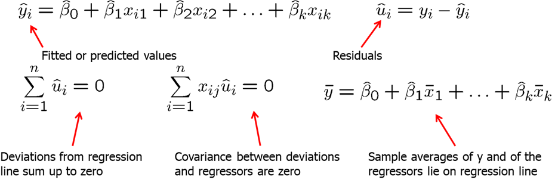

Not surprisingly, simple and multiple linear regressions are related. One can show that the estimated coefficient of an explanatory variable in a multiple regression can be obtained in two steps:

1. Regress the explanatory variable on all other explanatory variables
2. Regress Y on the residuals from the first regression

```{r, message=FALSE, warning=FALSE, cache=TRUE}
#############
##### R #####
#############
reg2=lm(wage~educ+exper, data=wage1)
step1=lm(educ~exper, data=wage1)
step2=lm(wage1$wage~step1$residuals)
summary(reg2); summary(step2) # we see that coefficient for education is 0.64427 in both
```

```{python, eval=FALSE}
##############
### PYTHON ###
##############
import wooldridge as woo
import statsmodels.formula.api as smf
wage1 = woo.dataWoo('wage1')
reg1 = smf.ols(formula='wage ~ educ + exper', data=wage1).fit()
step1 = smf.ols(formula='educ ~ exper', data=wage1).fit()
resid_step1=step1.resid
step2 = smf.ols(formula='wage ~ resid_step1', data=wage1).fit()
print(reg1.summary())
print(step2.summary())
```

This use of residuals to obtain the beta estimate is called "partialling out" of the effects. Why does this procedure work? The residuals from the first regression is the part of the explanatory variable that is uncorrelated with the other explanatory variables. The slope coefficient of the second regression therefore represents the isolated effect of the explanatory variable on the dependent variable. In econometrics, the general partialling out result is usually called the Frisch-Waugh theorem.

Normally, including additional regressors (independent variables) into your model will affect the OLS estimates on the independent variable of interest. There are two cases, however, when the estimate of the independent variable of interest will not change when adding another explanatory variable:

1. The partial effect of additional independent variable on Y is zero in the sample.
2. The independent variable of interest and the additional independent variable are uncorrelated in the sample.

We define the total sum of squares (SST), the explained sum of squares (SSE) and the residual sum of squares (SSR) as in the simple regression. The total sum of squares can be separated into the explained and the residual sum of squares: $SST=SSE+SSR$. The goodness-of-fit is defined by R-squared just as in the simple regression:


For example, an R-squared = 0.2 means that the total variation in the independent variables explains 20% of variation in the dependent variable. R-squared usually increases as we increase the number of explanatory variables. Even adding unrelated independent variables will likely increase the R-squared. When we include additional independent variables, we need to make sure there are no missing values. If there are missing values and the number of observations in an equation with more independent variables is less, we cannot directly compare R-squared. If there are no missing variables, addition of more independent variables will always increase R-squared making R-squared not a good tool in helping to decide whether to include a particular variable.

Just like in simple linear regression, we can run a multiple linear regression through the origin. It simply restricts the beta_0 to be equal to 0. In R, for the wage example, we would write

```{r, message=FALSE, warning=FALSE, cache=TRUE}
#############
##### R #####
#############
reg1=lm(log(wage)~0+educ+exper+tenure, data=wage1)
summary(reg1)
```

```{python, eval=FALSE}
##############
### PYTHON ###
##############
import wooldridge as woo
import numpy as np
import statsmodels.formula.api as smf
wage1 = woo.dataWoo('wage1')
reg1 = smf.ols(formula='np.log(wage) ~ 0 + educ + exper + tenure', data=wage1).fit()
print(reg1.summary())
```

One serious drawback is that if the true $\beta_0$ in the population is not 0, then all our OLS estimators of the slope parameters will be biased.

Let's work through some examples.

CRIME1 data set contains data on arrests in 1986 and other information on 2,725 men born in either 1960 or 1961 in California. We are interested in finding what affects the number of arrests. Suppose, we are especially interested to see if we should include avgsen (average sentence in prior convictions). Let's consider the two linear models\:

$$ narr86=\beta_0 + \beta_1pcnv  + \beta_3ptime86 + \beta_4qemp86 + u $$

$$ narr86=\beta_0 + \beta_1pcnv + \beta_2avgsen + \beta_3ptime86 + \beta_4qemp86 + u $$

To run this model in R, execute the following commands:
```{r, message=FALSE, warning=FALSE, cache=TRUE}
#############
##### R #####
#############
data(crime1, package='wooldridge')
reg1=lm(narr86 ~ pcnv+ptime86+qemp86,data=crime1)
reg2=lm(narr86 ~ pcnv+avgsen+ptime86+qemp86, data=crime1)
summary(reg1)
summary(reg2)
```

```{python, eval=FALSE}
##############
### PYTHON ###
##############
import wooldridge as woo
import statsmodels.formula.api as smf
crime1 = woo.dataWoo('crime1')
reg1 = smf.ols(formula='narr86 ~ pcnv+ptime86+qemp86', data=crime1).fit()
reg2 = smf.ols(formula='narr86 ~ pcnv+ptime86+qemp86+qemp86', data=crime1).fit()
print(reg1.summary())
print(reg2.summary())
```

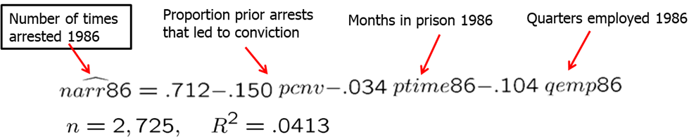


Each of the OLS slope coefficients have the expected sign in the first regression. Let's look at what happens when we include avgsen into the second regression. First, the R-squared increases but only by a very small magnitude. This, however, does not mean that adding avgsen is useless. Addition of the variables needs to be based on economic theory and the regression model needs to be such makes sure that the ceteris paribus assumption holds. Note, the coefficient of avgsen is the opposite than what we would expect. It suggests that longer average sentence length increases criminal activity. This would require us to examine the data and the assumptions closely before proceeding further.

The second example is dealing with participation in 401(k) pension plans. We expect that the greater the firm contribution match rate, the more likely people will participate in the pension plan. We also expect the higher the age of the pension plan, the more exposure and participation in the pension plan be. Let's consider the following model:
$$prate = beta_0 + beta_1*mrate + beta_2*age$$
In R, we can write and execute the following code:
```{r, message=FALSE, warning=FALSE, cache=TRUE}
#############
##### R #####
#############
data(k401k, package='wooldridge')
summary( lm(prate ~ mrate+age, data=k401k) )
```

```{python, eval=FALSE}
##############
### PYTHON ###
##############
import wooldridge as woo
import statsmodels.formula.api as smf
k401k= woo.dataWoo('401k')
reg1 = smf.ols(formula='prate ~ mrate+age', data=k401k).fit()
print(reg1.summary())
```

The results are as follows:       
$$ prate = 80.12 + 5.52*mrate + 0.243*age $$

We see that both of the signs are as expected. Also note that the variation in the matching rate and the age of the pension plan explain 9.225\% of the variation in the pension plan participation. If you plot the variables, you will see that there is likely a nonlinear effect. Alternative forms of the model may be considered.

Now we will discuss the five assumptions under which the OLS estimators are unbiased for the population parameters. These assumptions collectively are known as Gauss-Markov assumptions.

- MLR.1: Relationship between Y and Xs is linear. (Linear in Parameters)
- MLR.2: We have a random sample following population model. (Random Sampling)
- MLR.3: None of the independent  variables is constant and there are no exact linear relationships between the independent variables. (No Perfect Collinearity)
- MLR.4: The error has an expected value of zero given any values of the independent variables. (Zero Conditional Mean)
- MLR.5: The error U has the same variance given any value of the explanatory variables. (Homoskedasticity)

Multiple Linear Regression assumption 1 (MLR.1) states that the population (or true) relationship between the dependent and the independent variables is linear.

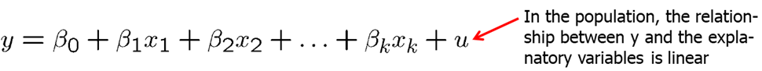

Assumption MLR.2 states that our data is a random sample drawn from the population.


MLR.3 requires that in the samples there is at least some variation in each of the independent variables. If there is an independent variable that is a constant, it does not help predict the variation of $y$ as it does not vary. We can also think of them as being collinear with the intercept. The assumption MLR.3 also does not allow exact linear relationships among the independent variables. If an explanatory variable is a perfect linear combination of other explanatory variables it is superfluous and may be eliminated. Imperfect correlation between independent variables is allowed.

MLR.4 states that the expected value of U given any independent variable $x$ is 0. In other words, explanatory variables must not contain any information about the mean of the unobserved factors. In a multiple regression model, the zero conditional mean assumption is much more likely to hold because fewer things end up in the error. Remember that in the simple linear regression we only had one explanatory variable while all others ended up in $u$. In multiple linear regression, we are able to control for many more factors explicitly and less factors end up in $u$.


MLR.5 states that the value of the explanatory variables contains no information about the variance of the unobserved factors. It is usually extremely difficult to justify this assumption.


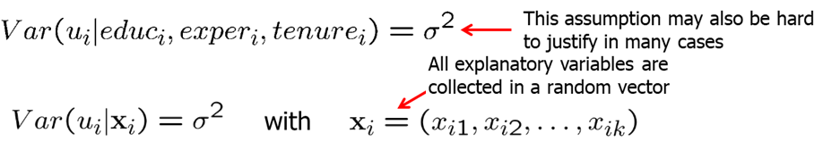

**Theorem 3.1: Unbiasedness of OLS**
Under Assumptions MLR.1 through MLR.4, the OLS estimators are unbiased estimators of the population parameters.

**Theorem 3.2: Sampling variances of the OLS slope estimators**
Under assumptions MLR.1 through MLR.5, conditional on the sample values of the independent variables, variance of the OLS estimates is defined as follows.

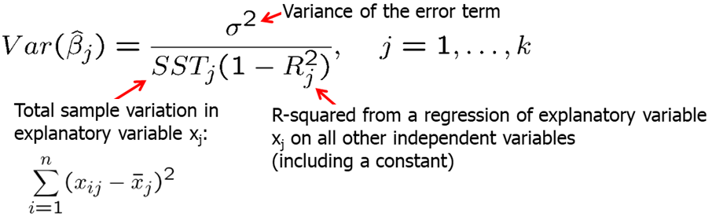

The size of the variance of the OLS estimator is important, as a larger variance means a less precise estimator, larger confidence intervals, and less accurate hypotheses tests as we will see in the next chapter.

Including irrelevant variables in a regression model is sometimes called overspecification of the model. It is not a big problem as we will simply estimate a very low slope coefficient, however, inclusion of irrelevant variables increases sampling variance and leads to slightly less precise estimators and less accurate hypotheses tests.

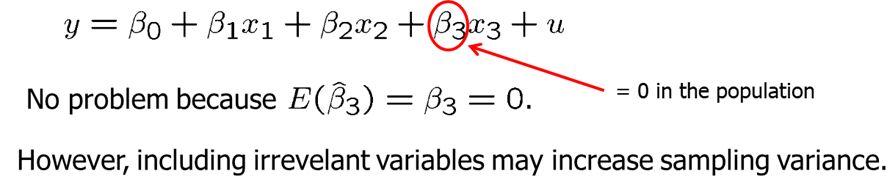

Omitting relevant variables, however, is a problem. Excluding a relevant variable is sometimes called underspecifying a model. Now, we will see what omitting a relevant variable (or misspecifying a model) may cause. Imagine that the true model contains both $x_1$ and $x_2$. However, we estimate the model without $x_2$. In other words, $x_2$ is omitted.

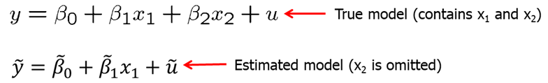

Let's assume that X1 and X2 are linearly related. Plugging in the relationship equation for X2 in the true model, we can derive the bias in the estimated intercept, slope coefficient for X1 and the error term.


We see that omitting a relevant variable causes all estimated coefficients to be biased. For example, let's look at the wage equation. We simply regress wage on education while omitting ability. If ability and education is related (and it probably is), we will tend to overestimate the return to education.


Direction of the bias depends on how the omitted variable is correlated with the independent variables.

Some components of OLS variances.

1. The error variance:
    - A high error variance increases the sampling variance because there is more "noise" in the equation.
    - A large error variance doesn't necessarily make estimates imprecise.
    - The error variance does not decrease with sample size.
2. The total sample variation in the explanatory variable:
    - More sample variation leads to more precise estimates.
    - Total sample variation automatically increases with the sample size.
    - Increasing the sample size is thus a way to get more precise estimates.
3. Linear relationships among the independent variables:
    - Regress $x_j$ on all other independent variables (including  constant). The R-squared of this regression will be the higher when $x_j$ can be better explained by the other independent variables.
    - The sampling variance of the slope estimator for $x_j$ will be higher when $x_j$ can be better explained by the other independent variables.
    - Under perfect multicollinearity, the variance of the slope estimator will approach infinity.

Multicollinearity is high but not perfect correlation between two or more independent variables. If we high multicollinearity, it means that one of the variation of one independent variable can be explained by variation in other independent variables. In some cases, it may be a good idea to drop some independent variables to reduce multicollinearity. However, that may cause omitted variable bias. In other cases, it may be a good idea to lump some independent variables together into one variable when individual effects cannot be disentangled. Also, not that only the sampling variance of the variables involved in multicollinearity will be inflated. The estimates of other effects may be very precise. Also, note that multicollinearity is not a violation of MLR.3 in the strict sense.

Multicollinearity may be detected through "variance inflation factors." As a rule of thumb, the variance of the inflation factor should not be larger than 10.


We prefer smaller VIF, however, we usually do not have an option. If economic theory suggests that a certain variable needs to be included to infer causality, then we cannot simply drop highly correlated independent variables. However, we should be aware that multicollinearity is a problem and address this issue. The decision whether to include a particular variable in a regression can be made by analyzing the trade-off between bias and variance. It may be the case that the likely omitted variable bias in the misspecified model is overcompensated by a smaller variance.

If the additional variable is not relevant, it does not create bias, but only increases variance. We do not want a higher variance as it affects the inference and the hypotheses testing, so we should omit irrelevant independent variables. However, if the additional independent variable is relevant but highly correlated with other independent variables, we need to be cautious. Excluding this variable increases the bias but decreases the variance; including it decreases the bias but increases the variance.


The unbiased estimator of the error variance in the general multiple regression case is:

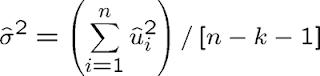

An unbiased estimate of the error variance can be obtained by subtracting the number of estimated regression coefficients from the number of observations. The number of observations minus the number of estimated parameters is also called the degrees of freedom. The n estimated squared residuals in the sum are not completely independent but related through the k+1 equations that define the first order conditions of the minimization problem..

**Theorem 3.3: Unbiased estimator of $\sigma^2$**

Under the Gauss-Markov assumptions MLR.1 through MLR.5, $E(\hat \sigma^2)=\sigma^2$

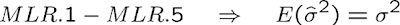

Standard error of the regression (SER) is the positive square root of the variance. SER is an estimator of the standard deviation of the error term. To construct confidence intervals and conduct tests, we will need to estimate the standard deviation of $\hat{\beta_j}$ which is just he square root of the variance. However, since sigma is unknown, we will replace it with sigma estimator. That is called the standard error.


Note that these formulas are only valid when assumptions MLR.1 through MLR.5 hold.

**Theorem 3.4: Gauss-Markov Theorem**
Under assumptions MLR.1 through MLR.5, the OLS estimators are the best linear unbiased estimators (BLUEs). 

Best implies the lowest variance. Linear means that we can express the OLS estimator as a linear function of the data on the dependent variable. The importance of the Gauss-Markov theorem is that, when the standard assumptions hold, none of the alternative estimators will be better than OLS estimators. However, if one of the assumption fails, either the estimator will be biased (if zero condition mean assumption fails) or not the smallest variance (if heteroskedasticity is present).


Now, let's look at some examples. First, we will consider two examples with perfect multicollinearity.

In a small sample, two variables may be accidentally exact multiple of each other even though they may not be in the population. In that case it is impossible to disentagle their separate effects.

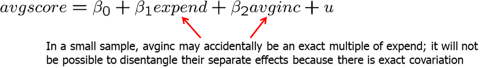

In cases, when we have two groups, for example, male and female, young and old, Democrat and Republican, we only can include one group into the regression. If $shareA + shareB = 1$, then we can either run a regression using shareA, or shareB. Including both will cause perfect multicollinearity. If you chose to include both in R, Stata or most other statistical software, it would automatically drop one of the variables from the regression.


Now, let's consider how one needs to consider the regression model in terms of the assumptions. If a key variable that is related to other independent variables is omitted, zero conditional mean assumption fails. Consider the example below. Average school spending per student (expend) is likely highly correlated with average income in the area. Regressing avgscore on expend only would likely lead to an overestimated slope for expend.


In econometrics, sometimes we are purely interested in pure prediction exercise where we hope to predict outcome Y given a set of observed variables $x_1, x_2, x_3...$ For example, a college admission's officer may want to predict the success of the applicant measured, for example, by college GPA based on the information available at the time of application. Similarly, a firm may want to predict the productiveness of its prospective employee and so on. We can assume the linear function. The best prediction of y will be its conditional expectation.

$$ E(y|x_1,...,x_k)= \beta_0 + \beta_1 x_1 + ... + \beta_k x_k \quad \text{with} \quad E(u|x_1,...,x_k)=0$$ 

Efficient markets theory states that a single variable acts as a "sufficient statistic" for predicting the outcome variable, $y$ . Once we know this sufficient statistic which we will call $w$, then additional information is not useful in predicting $y$.

$$ \text{If} \quad Y(y|w,x_1,...,x_k)=E(y|w), \quad \text{then } w \text{ is a sufficient statistic.}$$

As an example, consider the sports betting market. The gambling markets produce a point spread, W=spread, which is determined prior to the game. The actual score differential in the game is $y=scorediff$. This implies we can test the gambling market efficiency as follows:
$$E(scorediff|spread,x1,x2,...,xk) = E(scorediff|spread) $$

Incidentally, we may think of something that is not incorporated into the spread. However, most tests of the efficiency of the gambling markets show that, except for short aberrations, the market is remarkably efficient.

We can also use multiple linear regression to measure how an economic agent trades off one variable for another. Consider regressing salary on pension compensation and other controls. 


Another common application of multiple linear regression analysis is to test for differences among groups - often, groups of people - once we account for other factors. For example, we can test whether there are differences in wage differences among white ad non-white, or men and female. Differences in outcomes between groups can be evaluated with dummy variables.

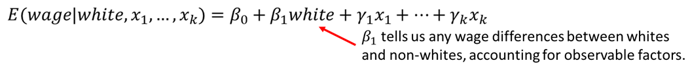

Lastly, economists use multiple linear regression to estimate the causal effects of policy interventions. For example:

- Do job training programs increase labor earnings?
- Do school choice program improve student outcomes?
- Does legalizing marijuana increase crime rates?

With multiple regression, we can get closer to random assignment by conditioning on observables. $w$ is a binary variable taking the value of 1 if the treatment was received and 0 if no treatment. We can then estimate the average treatment effect of the policy as show below.

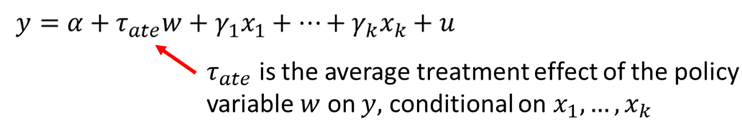

Inclusion of the x variables allows us to control for any reasons why there may not be random assignment. For example, if $y$ is earnings and w is participation in a job training program, then the variables in $x$ would include all of those variables that are likely to be related to both earnings and participation in job training.


**Homework Problems**

<p class="comment"> Problem 1.\
Using the data in **gpa2** on 4,137 college students, the following equation was estimated
by OLS: $$colgpa = 1.392-0.0135*hsperc + 0.00148*sat; \\ n=4,137; \quad  R^2=0.273$$
where colgpa is measured on a four-point scale, hsperc is the percentile in the high school graduating class (defined so that, for example, hsperc = 5 means the top 5% of the class), and sat is the combined math and verbal scores on the student achievement test.\
1. Why does it make sense for the coefficient on hsperc to be negative?\
2. What is the predicted college GPA when hsperc=20 and sat=1,050?\
3. Suppose that two high school graduates, A and B, graduated in the same percentile from high school, but Student A's SAT score was 140 points higher (about one standard deviation in the sample). What is the predicted difference in college GPA for these two students? Is the difference large?\
4. Holding hsperc fixed, what difference in SAT scores leads to a predicted colgpa difference of .50, or one-half of a grade point? Comment on your answer.\
5. Provide R code to replicate the results?
</p>

<p class="comment"> Computer Exercise C1.\
A problem of interest to health officials (and others) is to determine the effects of smoking during pregnancy on infant health. One measure of infant health is birth weight; a birth weight that is too low can put an infant at risk for contracting various illnesses. Since factors other than cigarette smoking that affect birth weight are likely to be correlated with smoking, we should take those factors into account. For example, higher income generally results in access to better prenatal care, as well as better nutrition for the mother. An equation that recognizes this is $$ bwght = \beta_0 + \beta_1 * cigs + \beta_2 * faminc + u $$
1. What is the most likely sign for $\beta_2$?\
2. Do you think cigs and faminc are likely to be correlated? Explain why the correlation might be positive or negative.\
3. Now, estimate the equation with and without faminc, using the data in **bwght**. Report the results in equation form, including the sample size and R-squared. Discuss your results, focusing on whether adding faminc substantially changes the estimated effect of cigs on bwght.
</p>

<p class="comment"> Computer Exercise C2.\
Use the data in **hprice1** to estimate the model
$$price = \beta_0 + \beta_1*sqrft + \beta_2*bdrms + u$$
where price is the house price measured in thousands of dollars.\
1. Write out the results in equation form.\
2. What is the estimated increase in price for a house with one more bedroom, holding square footage constant?\
3. What is the estimated increase in price for a house with an additional bedroom that is 140 square feet in size? Compare this to your answer in part 2.\
4. What percentage of the variation in price is explained by square footage and number of bedrooms?\
5. The first house in the sample has sqrft=2,438 and bdrms=4. Find the predicted selling price for this house from the OLS regression line.\
6. The actual selling price of the first house in the sample was $300,000 (so price=300). Find the residual for this house. Does it suggest that the buyer underpaid or overpaid for the house?
</p>

<p class="comment"> Computer Exercise C8.\
Use the data in **discrim** to answer this question. These are zip code-level data on prices for various items at fast-food restaurants, along with characteristics of the zip code population, in New Jersey and Pennsylvania. The idea is to see whether fast-food restaurants charge higher prices in areas with a larger concentration of blacks.\
1. Find the average values of prpblck and income in the sample, along with their
standard deviations. What are the units of measurement of $prpblck$ and $income$?\
2. Consider a model to explain the price of soda, $psoda$, in terms of the proportion of
the population that is black and median income\:
$$psoda = \beta_0 + \beta_1*prpblck + \beta_2*income + u$$
Estimate this model by OLS and report the results in equation form, including the
sample size and R-squared. (Do not use scientific notation when reporting the estimates.)
Interpret the coefficient on prpblck. Do you think it is economically large?\
3. Compare the estimate from part 2 with the simple regression estimate from $psoda$ on $prpblck$. Is the discrimination effect larger or smaller when you control for income?\
4. A model with a constant price elasticity with respect to income may be more
appropriate. Report estimates of the model\:
$$log(psoda) = \beta_0 + \beta_1 * prpblck + \beta_2 * log(income) + u$$
If $prpblck$ increases by .20 (20 percentage points), what is the estimated percentage change in $psoda$? (Hint: The answer is 2.xx, where you fill in the "xx.")\
5. Now add the variable prppov to the regression in part 4. What happens to the OLS estimator of $prpblck?$\
6. Find the correlation between $log(income)$ and $prppov$. Is it roughly what you expected?\
7. Evaluate the following statement: "Because $log(income)$ and $prppov$ are so highly correlated, they have no business being in the same regression."
</p>

<p class="comment"> Computer Exercise C10.\
Use the data in **htv** to answer this question. The data set includes information on wages, education, parents' education, and several other variables for 1,230 working men in 1991.\
1. What is the range of the educ variable in the sample? What percentage of men completed 12th grade but no higher grade? Do the men or their parents have, on average, higher levels of education?\
2. Estimate the regression model\:
$$educ = \beta_0 + \beta_1*motheduc + \beta_2*fatheduc + u$$
by OLS and report the results in the usual form. How much sample variation in educ is explained by parents' education? Interpret the coefficient on motheduc.\
3. Add the variable $abil$ (a measure of cognitive ability) to the regression from part 2, and report the results in equation form. Does "ability" help to explain variations in education, even after controlling for parents' education? Explain.\
4. Now estimate an equation where abil appears in quadratic form\:
$$educ = \beta_0 + \beta_1*motheduc + \beta_2*fatheduc + \beta_3*abil + \beta_4*abil^2 + u$$
Using the estimates of $\beta_3$ and $\beta_4$ , use calculus to find the value of $abil$, call it ${abil}^*$, where $educ$ is minimized. (The other coefficients and values of parents' education variables have no effect; we are holding parents' education fixed.) Notice that $abil$ is measured so that negative values are permissible. You might also verify that the second derivative is positive so that you do indeed have a minimum.\
5. Argue that only a small fraction of men in the sample have "ability" less than the value calculated in part 4. Why is this important?\
6. Use the estimates in part 4 to graph the relationship between the predicted education and $abil$. Let $motheduc$ and $fatheduc$ have their average values in the sample, 12.18 and 12.45, respectively.
</p>

**References**

Wooldridge, J. (2019). Introductory econometrics: a modern approach. Boston, MA: Cengage.

Heiss, F. (2016). Using R for introductory econometrics. Dusseldorf: Florian Heiss, CreateSpace.

---
