<style>
p.comment {
background-color: #e8e8e8;
padding: 10px;
border: 0px solid black;
margin-left: 25px;
border-radius: 5px;
}
</style>

##### Chapter 4: The Multiple Regression Analysis: Inference

After learning the basics of the multiple linear regression, we now turn to testing hypotheses and building confidence intervals. Remember, that The OLS estimators are random variables. We know their expected values and variances. However, in order to perform statistical inference, we need to know the full sampling distribution of the estimated beta_j  which can have virtually any shape. To derive the distribution, we need additional assumptions about the distribution of errors.

- MLR.6: The population error U is independent of the explanatory variables $x_1, x_2,... x_k$ and is normally distributed with zero mean and variance $\sigma^2$. ((Normality assumption))

The error term is the sum of "many" different unobserved factors. Sums of many independent random factors are normally distributed according to central limit theorem (CLT). However, there are some weaknesses of this assumption: the factors in U can have very heterogeneous distributions; the factors in U are not necessarily independent of each other. 

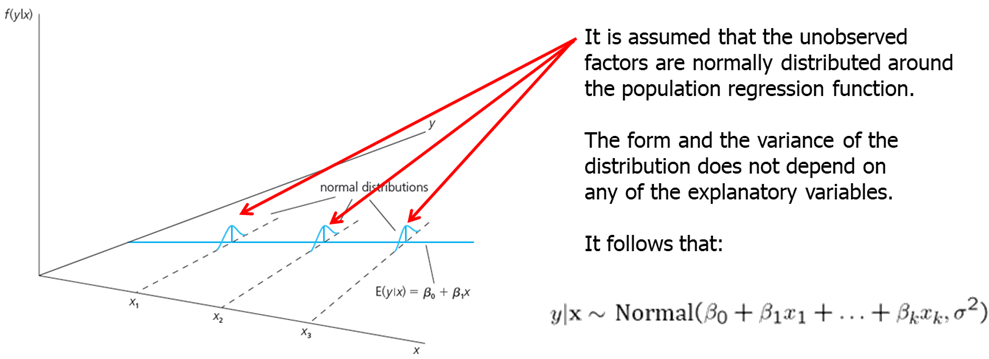

The normality of the error term is an empirical question. In most cases, normality is questionable or impossible by definition. For example:

- Wages (nonnegative; also: minimum wage)
- Number of arrests (takes on a small number of integer values)
- Unemployment (indicator variable, takes on only 1 or 0)

However, the error distribution should be at least close to normal. In some cases, normality can be achieved through transformations  of the dependent variable. Under normality, OLS is the best (even nonlinear) unbiased estimator. For the purposes of statistical inference, the assumption of normality can be replaced by a large sample size.

- MLR.1 through MLR.5 are called Gauss-Markov assumptions.
- MLR.1 through MLR.6 are called classical linear model (CLM) assumptions. 

Theorem 4.1: Normal Sampling Distributions
Under the CLM assumptions conditional on the sample values of the independent variables, the estimators are normally distributed around the true parameters and the standardized estimators follows standard normal distribution.

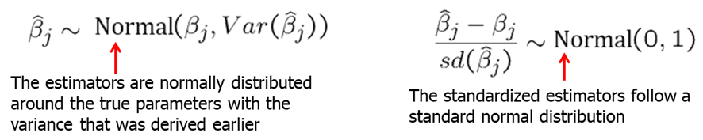

**Theorem 4.2: t Distributions for the Standardized Estimators**
Under the CLM assumptions, if standardization is done using the standard error, the normal distribution can be replaced by a t-distribution with df=n-k-1.


It is important because it allows use to test hypotheses involving the $\beta_j$. In most cases, we are interested in testing the null hypothesis. For example, if you are estimated the wage equation (example: $log(wage) = \beta_0 +\beta_1* education+ \beta_2*experience +\beta_3 *tenure$), $H_0: \beta_2=0$ means that once we account for education and tenure, the number of years in the workforce (experience) has no effect on hourly wage.

The statistic used to test the hypotheses is called the t-statistic or the t-ratio of the estimated $\beta_j$.


Our goal is to define a rejection rule so that if it is true, $H_0$ is rejected only with a small probability (which we call significance level, usually, 5\%).

It is important to keep in mind that we are testing hypotheses about the population parameters and not about the sample estimates.

To determine a rule for rejecting $H_0$, we need to define the relative alternative hypothesis. There are one-sided and two sided alternatives. First, let's examine the one-sided alternative. Let's consider one-sided alternative hypothesis of the form $H_1: \beta_j>0$ (note that testing with $H_1: \beta_j<0$ is just the mirror image). To test the hypothesis, we need to decide on the significance level: the probability of rejecting $H_0$ when, in fact, it is true. Usually, a 5\% significant level is sufficiently large. We reject the null hypothesis in favor of the alternative hypothesis if the estimated coefficient is "too large" (i.e. larger than a critical value). We construct the critical value so that, if the null hypothesis is true, it is rejected in, for example, 5\% of the cases. In the given example below, this is the point of the t-distribution with 28 degrees of freedom that is exceeded in 5\% of the cases. We reject if t-statistic is greater than 1.701.

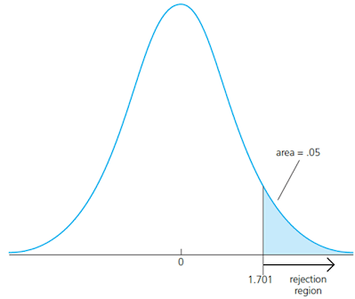

Let's consider the wage example that we already worked on in the last chapter. our regression model:
$$ log(wage)=\beta_0+\beta_1*educ+\beta_2*exper+\beta_3*tenure$$

```{r, message=FALSE, warning=FALSE, cache=TRUE, results='hide'}
data(wage1, package='wooldridge')
reg1=lm(log(wage) ~ educ+exper+tenure, data=wage1);
summary(reg1)
```

Our estimated slopes and standard errors are as shown below. Say, we are interested to test whether the return to experience, controlling for education and tenure, is zero in the population, against the alternative hypothesis that it is positive. 

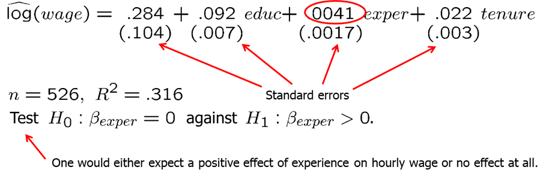


Having 522 degrees of freedom, we can compute the t-statistic at a chosen significance level (let's try 5\% and 1\%). Since we have so many degrees of freedom, we can use the standard normal distribution as well. From the summary of the regression (reg1), we see that the t-statistic for experience is 2.391 which is larger than either 1.6 or 2.3, so we can reject the null hypothesis and state that the partial effect of experience (holding education and tenure constant), even though not large, is strictly positive.

```{r, message=FALSE, warning=FALSE, cache=TRUE}
# CV for alpha=5% and 1% using the t distribution with 522 d.f.:
alpha <- c(0.05, 0.01);
qt(1-alpha, 522)
qnorm(1-alpha) # Critical values for alpha=5% and 1% using the normal approximation
```

Now, let's consider another example: how school size affects student performance. A claim is that, all else equal, students at smaller schools fare better than those at larger schools. We collect the data on student performance in mathematics in tenth-grade measured in percentage of students receiving a passing grade ($math10$), school size measured by student enrollment ($enroll$), average annual teacher compensation ($totcomp$) and number of staff per one student ($staff$). Here, teacher compensation is a measure of teacher quality and staff size is a rough measure of how much attention students receive.

We consider the following regression model:
$$math10=\beta_0+\beta_1*totcomp+\beta_2*staff+\beta_3*enroll$$
In R, we execute the following syntax to run the regression.

```{r, message=FALSE, warning=FALSE, cache=TRUE}
data("meap93", package='wooldridge')
reg1=lm(math10 ~ totcomp+staff+enroll, data=meap93);
summary(reg1)
```

The results are as shown below. As we mentioned, we are interested in the estimate of $\beta_3$. The null hypothesis is $H_0: \beta_3=0$ and alternative is $H_1: \beta_3<0$. The coefficient is negative which is what we expected. However, we want to know if it is statistically different from zero. We compute the t-statistic and compare it with the critical values at 5\% and 15\%. Since the t-statistic is -0.91 and both of the critical values are smaller, we fail to reject the null hypothesis and we state that student enrollment (or school size) is not statistically significant from zero. As you probably already noted, when you execute the regression and call the summary of the regression, the software computes and provides all of this information for you.


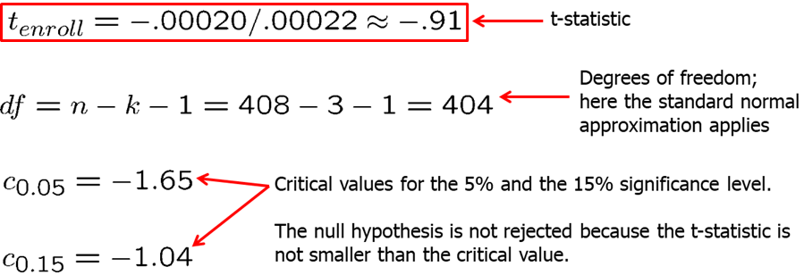

What if we consider an alternative functional form with all independent variables in natural logarithmic form (note that the interpretation of the estimated slopes changes):
$$math10=\beta_0+\beta_1*log(totcomp)+\beta_2*log(staff)+\beta_3*log(enroll)$$
In R, execute the following code:
```{r, message=FALSE, warning=FALSE, cache=TRUE}
data("meap93", package='wooldridge');
reg2=lm(math10 ~ log(totcomp)+log(staff)+log(enroll), data=meap93);
summary(reg2)
```

The results are shown below. We find that if enrollment is 10\% higher at a school, math10 is predicted to be 0.13 percentage points lower and this result is statistically significant at 5\% level. At 5\% significance level, we reject the null hypothesis that there is no effect if school size on student performance. Note that R-squared is slightly higher meaning that the variation in independent variables explain slightly more variation in the dependent variable in level-log model. 


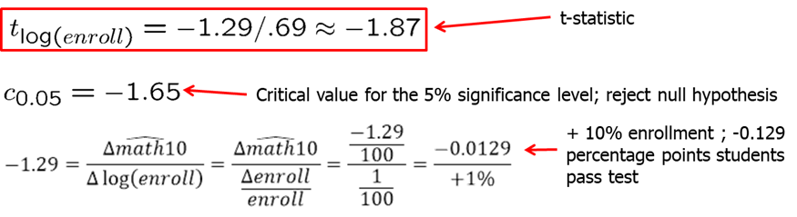

In many applications, it is common to test the null hypothesis against a two-sided alternative: $\beta_j$ is not equal to zero without specifying whether the effect is positive or negative. We reject the null hypothesis in favor of the alternative hypothesis if the absolute value of the estimated coefficient is too large. We construct the critical value so that, if the null hypothesis is true, it is rejected in, for example, 5\% of the cases. In the given example, these are the points of the t-distribution so that 5\% of the cases lie in the two tails. We reject if absolute value of t-statistic is less than -2.06 or greater than 2.06.

Let's consider the model explaining the college GPA (colGPA) with the average number of lectures missed per week (skipped), high school GPA (hsGPA), ACT score (ACT):
$$ colGPA=\beta_0+\beta_1*hsGPA+\beta_2*ACT+\beta_3*skipped $$

In R, we can execute the following code:

```{r, message=FALSE, warning=FALSE, cache=TRUE}
data(gpa1, package='wooldridge')
reg1 = lm(colGPA ~ hsGPA+ACT+skipped, data=gpa1);
sumres = summary(reg1);
# Manually confirm the formulas: Extract coefficients and SE
regtable = sumres$coefficients;
bhat = regtable[,1]
se   = regtable[,2]
# Reproduce t statistic
tstat = bhat / se 
# Reproduce p value
pval  = 2*pt(-abs(tstat),137)
```

The results are displayed below. We see that the coefficient on lectures missed per week is negative and is statistically significant at 1\% significance level while the positive effect of ACT is not significant at usually used significance levels.


What if you are interested to see if $\beta_j$ is equal to some constant other than zero. In that case, our null hypothesis and t-statistic is follows: 


Let's consider an example. We are interested in campus crime and enrollment. Instead of the usual null hypothesis, we will look if crime increases by one percent when enrollment increases by one percent. 

The regression model:
$$log(crime)=\beta_0+\beta_1*log(enroll)$$

```{r, message=FALSE, warning=FALSE, cache=TRUE}
data(campus, package='wooldridge');
reg1 = lm(log(crime) ~ log(enroll), data=campus);
summary(reg1)
```

Remember that log-log is a constant elasticity model: $\beta_1$ measures the percentage change in the dependent variable when independent variable increases by 1 percent. If we are interested in testing whether $\beta_1$ is significantly different from 1, null hypothesis can be stated as $H_0: \beta_1=1$ against $H_1: \beta_1>1$.  The results are show below. The regression summary indicates that the estimate is not exactly 1, but we now ask if it is significantly different from 1. Using the above formula, we find that t-statistic is larger than one-sided critical value at 5\% significance level, thus we reject the null hypothesis in favor of the alternative hypothesis.

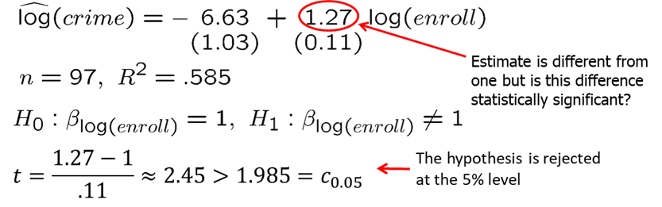

Let's consider another example. Now, we are looking to estimate a model relating the median housing price in a community (price) to amount of nitrogen oxide in the air (nox), weighted distance of the community to five employment centers (dist),  average number of rooms in the houses in the community (rooms), and the average student-teacher ratio of schools in the community (stratio).
The regression model:
$$log(price)=\beta_0+\beta_1*log(nox)+\beta_2*log(dist)+\beta_3*rooms+\beta_4*stratio$$

Run the following code in R.
```{r, message=FALSE, warning=FALSE, cache=TRUE}
data(hprice2, package='wooldridge');
reg1 = lm(log(price) ~ log(nox)+log(dist)+rooms+stratio, data=hprice2);
summary(reg1)
tstat1=(reg1$coefficients[2]+1)/reg1$coefficients[7]
```

Assume we wish to test the null hypothesis $H_0: \beta_1=-1$. Corresponding t-statistic for this test is 0.393 which is very small and definitely smaller than any critical value at any reasonable significance level. Thus, we fail to reject the null hypothesis. Controlling for the other factors we included, there is little evidence that the price elasticity regards to the amount of nitrogen in the air is different from -1.

You have probably already noticed the p-values that are presented in R when you execute the **summary(reg1)** command. This is extremely helpful in inference. If you keep assuming smaller and smaller significance level, there will be a point at which the null hypothesis cannot be rejected anymore. The reason is that, by lowering the significance level, one wants to avoid more and more to make the error of rejecting a correct H0. That smallest value at which the null hypothesis is still rejected, is called the p-value of the hypothesis test. A small p-value is evidence against the null hypothesis because one would reject the null hypothesis even at small significance levels. A large p-value is evidence in favor of the null hypothesis. P-values are more informative than tests at fixed significance levels.

The p-value is the significance level at which one is indifferent between rejecting and not rejecting the null hypothesis. In the two-sided case, the p-value is thus the probability that the t-distributed variable takes on a larger absolute value than the realized value of the test statistic, e.g. $P(|t|>1.85) = 2*(0.0359) = .0718$. From this, it is clear that a null hypothesis is rejected if and only if the corresponding p-value is smaller than the significance level. For example, for a significance level of 5\% the t-statistic would not lie in the rejection region.

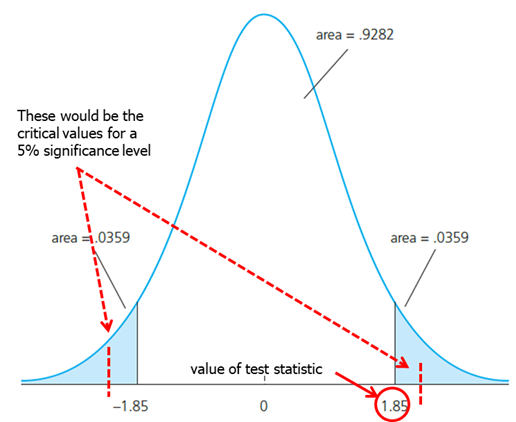

We have now learned how to test hypotheses. Don't forget, however, that the magnitude of the coefficient is also very important. The statistical significance of a variable is determined entirely by the t-statistic, whereas the economic or practical significance of a variable is related to the size and sign of the estimated slope coefficient. Some guideline for discussing economic and statistical significance:

- If a variable is statistically significant, discuss the magnitude of the coefficient to get an idea of its economic or practical importance.
- The fact that a coefficient is statistically significant does not necessarily mean it is economically or practically significant!
- If a variable is statistically and economically important but has the "wrong" sign, the regression model might be misspecified.
- If a variable is statistically insignificant at the usual levels (10\%, 5\%, or 1\%), one may think of dropping it from the regression.
- If the sample size is small, effects might be imprecisely estimated so that the case for dropping insignificant variables is less strong.

Now we will introduce the confidence intervals. Under the CLM assumptions, we can easily construct a confidence interval (CI) for the population parameter $\beta_j$. Confidence intervals are also called interval estimates because they provide a range of likely values for the population parameter instead of just a point estimate. Using Theorem 4.2, we can show that confidence interval for 95\% confidence level is:

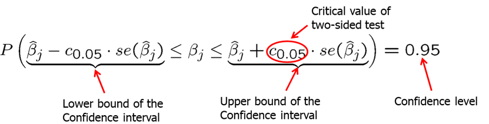

In repeated samples, the interval that is constructed in the above way will cover the population regression coefficient in 95% of the cases. If our value of the null hypothesis (for example, 0 in $H_0: \beta_j=0$) is not within the confidence interval, we reject the null hypothesis).

You should remember that the confidence interval is only as good as the underlying assumptions use to construct it. If you have omitted variable bias or heteroskedasticity, the estimated confidence interval will not be the real 95\% confidence interval.

In some cases, we are interested to test a single hypothesis involving more than one parameter but rather a linear combination of the parameters. For example, you may want to test whether the there is a statistical difference between the returns to education from years spent in a two-year college vs four year college. For this case, the t-statistic is built as shown below. The difference between the estimates is normalized by the estimated standard deviation of the difference. The null hypothesis would have to be rejected if the statistic is "too negative" to believe that the true difference between the parameters is equal to zero.


However, the standard error of the difference in parameters is impossible to compute with standard regression output.


There is an alternative method to test the whether there is a statistical difference between the years spent in junior college vs four-year college. If we simply run a regression with junior college as one independent variable and total years of college (both junior and four-year), we can estimate if there is a statistical different effect on wage. Our new null hypothesis is $H_0: \theta_1=0$ against $H_1: \theta_1<0$.

In R, execute the following code:
```{r, message=FALSE, warning=FALSE, cache=TRUE}
data(twoyear, package='wooldridge');
reg1 = lm(lwage ~ jc+univ+exper, data=twoyear);
summary(reg1)
```

The results are shown below. We compute the t-statistic to be -1.48, the confidence interval to be (-0.0237, 0.0003) and p-value to be 0.070. At 5% significance level, we fail to reject the null hypothesis.

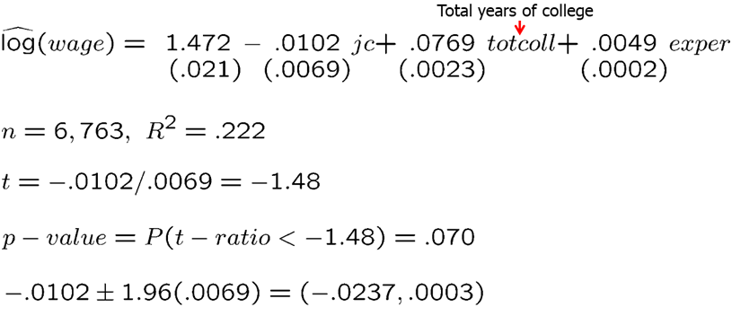

Frequently, we wish to test multiple hypotheses about the underlying parameters. To test whether a group of variables has no effect on the dependent variable, we use the F-test. It is often called a multiple hypotheses test or a joint hypotheses test, The null hypothesis constitutes exclusion restrictions. Let's look at baseball player salary example. You postulate the following (unrestricted) regression model for the house price in:
$$log(salary)=\beta_0+\beta_1*years+\beta_2*gamesyr+\beta_3*bavg+\beta_4*hrunsyr+\beta_5*rbinsyr$$

We want to test whether the performance measures (batting average, home runs per year, runs batter per year) have no effect on salary.

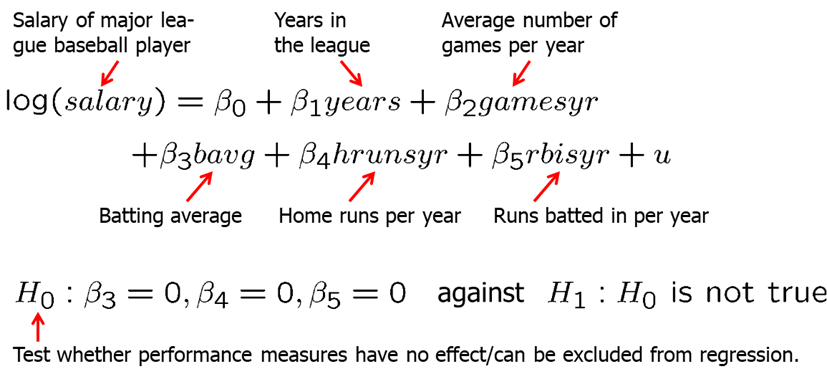

In R, execute the following commands:
```{r, message=FALSE, warning=FALSE, cache=TRUE}
data(mlb1, package='wooldridge')
reg1 = lm(log(salary)~ years+gamesyr+bavg+hrunsyr+rbisyr, data=mlb1);
reg1s = summary(reg1); reg1s
```

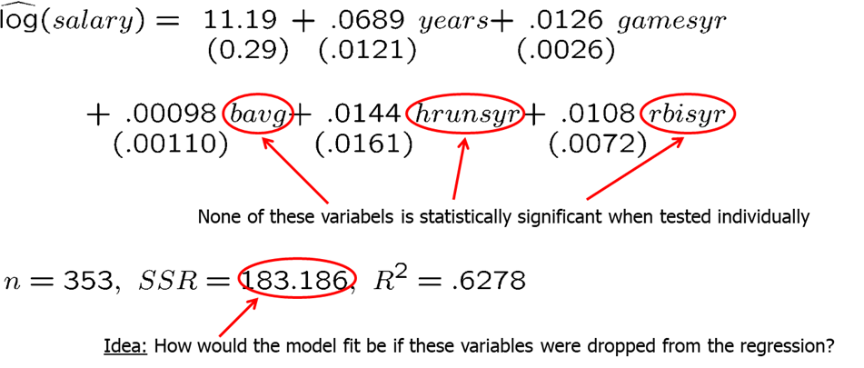

After we regress the original model, we then drop the variables and run the restricted model:
$$log(salary)=\beta_0+\beta_1*years+\beta_2*gamesyr$$

In R, execute the following commands:
```{r, message=FALSE, warning=FALSE, cache=TRUE}
data(mlb1, package='wooldridge')
reg2 = lm(log(salary)~ years+gamesyr, data=mlb1) 
reg2s=summary(reg2); reg2s
```


In R, we can simply run the following code to test the joint hypotheses:
```{r, message=FALSE, warning=FALSE, cache=TRUE}
library(car) #if youy have never used car package before, you need to first install the package by running: install.packages("car")
data(mlb1, package='wooldridge')
reg1 = lm(log(salary)~ years+gamesyr+bavg+hrunsyr+rbisyr, data=mlb1);
linearHypothesis(reg1, c("bavg=0","hrunsyr=0","rbisyr=0"))
```

We find that the F statistic is around 9.55 and the p-value is extremely low. Thus, we reject the null hypothesis. We can say that the three performance variables are jointly significant even though they are not significant when tested individually. There is likely high multicollinearity between these variables.

Finally, using the F-test we can test the overall significance of a regression. The null hypothesis states that the explanatory variables are equal to zero, or, in other words, are not useful in explaining the dependent variable.

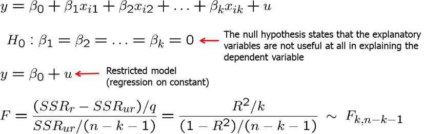

For example, we are interested if the house price assessments are rational, or in other words, if the house price assessments are accurate: is a 1\% in change in assessment associated with 1\% change in house value.


In R, execute the following:
```{r, message=FALSE, warning=FALSE, cache=TRUE}
data(hprice1, package='wooldridge')
reg1 = lm(log(price)~ log(assess)+log(lotsize)+log(sqrft)+bdrms, data=hprice1) 
reg1s = summary(reg1); reg1s
#To test the above hypothesis we use linearHypothesis command indicating the restrictions.
library(car)
linearHypothesis(reg1, c("log(assess)=1","log(lotsize)=0","log(sqrft)=0","bdrms=0"))
```

We find that F=0.67 and the p-value of 0.61. We fail to reject the null hypothesis. In other words, we do not find evidence against the hypothesis that the assessed values are rational.


**Homework Problems**

<p class="comment"> Computer Exercise C1.\
The following model can be used to study whether campaign expenditures affect election outcomes:
$$voteA = \beta_0 + \beta_1*log(expendA) + \beta_2*log(expendB) + \beta_3*prtystrA + u$$,
where $voteA$ is the percentage of the vote received by Candidate A, $expendA$ and $expendB$ are campaign expenditures by Candidates A and B, and $prtystrA$ is a measure of party strength for Candidate A (the percentage of the most recent presidential vote that went to A's party).
1. What is the interpretation of $\beta_1$?\
2. In terms of the parameters, state the null hypothesis that a 1\% increase in A's expenditures is offset by a 1\% increase in B's expenditures.\
3. Estimate the given model using the data in **vote1** and report the results in usual form. Do A's expenditures affect the outcome? What about B's expenditures? Can you use these results to test the hypothesis in part 2?\
4. Estimate a model that directly gives the t statistic for testing the hypothesis in part 2. What do you conclude? (Use a two-sided alternative.)
</p>

<p class="comment"> Computer Exercise C6.\
Use the data in **wage2** for this exercise.
1. Consider the standard wage equation:
$$log(wage) = \beta_0 + \beta_1*educ + \beta_2*exper + \beta_3*tenure + u$$
State the null hypothesis that another year of general workforce experience has the same effect on log(wage) as another year of tenure with the current employer.\
2. Test the null hypothesis in part 1 against a two-sided alternative, at the 5% significance level, by constructing a 95% confidence interval. What do you conclude?
</p>

<p class="comment"> Computer Exercise C9.\
Use the data in **discrim** to answer this question. (See also Computer Exercise C8 in Chapter 3.)
1. Use OLS to estimate the model
$$log(psoda) = \beta_0 + \beta_1*prpblck + \beta_2*log(income) + \beta_3*prppov + u$$
and report the results in the usual form. Is the estimated beta_1 statistically different from zero at the 5\% level against a two-sided alternative? What about at the 1\% level?\
2. What is the correlation between log(income) and prppov? Is each variable statistically significant in any case? Report the two-sided p-values.\
3. To the regression in part 1, add the variable log(hseval). Interpret its coefficient and report the two-sided p-value for H0: beta_(log(hseval)) = 0.\
4. In the regression in part 3, what happens to the individual statistical significance of log(income) and prppov? Are these variables jointly significant? (Compute a p-value.) What do you make of your answers?\
5. Given the results of the previous regressions, which one would you report as most reliable in determining whether the racial makeup of a zip code influences local fast-food prices?
</p>

**References**

Wooldridge, J. (2019). Introductory econometrics: a modern approach. Boston, MA: Cengage.

Heiss, F. (2016). Using R for introductory econometrics. Düsseldorf: Florian Heiss,CreateSpace.

---
