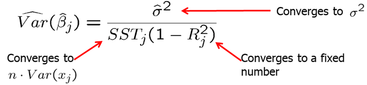

##### Chapter 5: Further Issues in Using OLS with Time Series Data

So far we focused on properties of OLS that holds for any sample. These were:

- Expected values/unbiasedness under MLR.1 - MLR.4
- Variance formulas under MLR.1 - MLR.5
- Gauss-Markov Theorem under MLR.1 - MLR.5
- Exact sampling distributions/tests under MLR.1 - MLR.6

In addition to these finite sample properties, it is important to know asymptotic properties or large sample properties of estimators and test statistics. One important finding is that even without the normality assumption (MLR.6), t and F statistics have approximately t and F distributions, at least in large sample sizes. 

Although unbiasedness of estimators cannot always be obtained, most economists agree that consistency is a minimal requirement for an estimator. Consistency means that the probability that the estimate is arbitrarily close to the true population value can become arbitrarily high by increasing sample size.

An estimator $\theta_n$ is considered consistent for a population parameter $\theta$ if  $$P(|\theta_n-\theta|<\epsilon)\rightarrow 1 \text{ for arbitrary } \epsilon>0 \text{ and } n\rightarrow \infty.$$ 

Alternatively, we could write:
$$\text{plim } \theta_n = \theta$$
The estimate converges in probability to the true population value.

Theorem 5.1: Consistency of OLS
Under assumptions MLR.1 through MLR.4, OLS estimator is consistent.
$$ MLR.1-MLR.4 \quad \rightarrow \quad \text{plim }\hat \beta_j=\beta_j, \quad j=0,1,...k $$
We can see that the slope estimate $\hat \beta_j$ is consistent when the explanatory variable is exogenous, i.e. uncorrelated with the error term ($Cov(x_k,u)=0$).
$$\text{plim }\hat \beta_j=\beta_j+Cov(x_k,u)/Var(x_k)$$

Assumption MLR.4': Zero Mean and Zero Correlation
For consistency of OLS, instead of MLR.4, we only need MLR.4' which is a weaker assumption. There is no omitted variable bias if the omitted variable is irrelevant or uncorrelated. It states that all explanatory variables must be uncorrelated wit hthe error term. This assumption is weaker than the zero conditional mean assumption MLR.4.
$$ E(u)=0$$
$$ Cov(x_j,u)=0$$

Consider the following true model.
$$ y=\beta_0+\beta_1 x_1 + \beta_2 x_2 + v \quad \leftarrow \quad \text{ true model }$$
Suppose the model is misspecified: $x_2$ is omitted.
$$ y=\beta_0+\beta_1 x_1 + u \quad \leftarrow \quad \text{ misspecified model }$$
The estimated $\hat \beta_1$ in the misspecified model can be written as:
$$ \text{plim } \hat \beta_1=\beta_1+Cov(x_1,u)/Var(x_1)=\beta_1+\beta_2 Cov(x_1,x_2)/Var(x_1)=\beta_1+\beta_2\delta_1 $$
There is no omitted variable bias ($\beta_2\delta_1$) if the omitted variable is irrelevant or uncorrelated with the included variable.

Consistency of an estimator is important but we also need the sampling distribution of the OLS estimators. Assumption MLR.6 basically states that the distribution of dependent variable given independent variables is normal. However, even when this assumption does not hold, if we have large enough sample size, OLS estimators satisfy asymptotic normality (due to Central Limit Theorem).

Theorem 5.2: Asymptotic Normality of OLS
Under assumptions MLR.1 through MLR.5, in large sample sizes, the standardized estimates are normally distributed.
$$ \frac{(\hat \beta_j - \beta_j)}{se(\hat \beta_j)} \stackrel{a}{\sim} \text{ Normal(0,1)} $$
In large sample sizes, the standardized estimates are normally distributed. Also, $\text{plim }\hat\sigma^2=\sigma^2$. What Theorem 5.2 says is that regardless of population distribution of $u$, the OLS estimators, when properly standardized, have approximate standard normal distributions. In large samples, the t-distribution is close to the Normal (0,1) distribution. As a consequence, t-tests are valid in large samples without MLR.6. The same is true for confidence intervals and F-tests. MLR.1 - MLR.5 are still necessary, especially, homoskedasticity.

When $u$ is not normally distributed, the square root of the estimated variance is sometimes called the asymptotic standard error, and t-statistics are called asymptotic t statistics.

The estimated variance of the OLS estimator is

We know that under Gauss-Markov assumptions, the OLS estimators are best linear unbiased. OLS is also asymptotically efficient among a certain class of estimators under Gauss-Markov assumptions. 

Theorem 5.3: Asymptotic Efficiency of OLS
Under Gauss-Markov assumptions, the OLS estimators have the smallest asymptotic variances.
$$\widehat{Var}(\hat \beta_j) \text{ shrinks at a rate } 1/n$$
$$se(\hat \beta_j) \text{ shrinks at a rate } \sqrt{1/n}$$

**Homework Problems**

 Computer Exercise C1.\
Use data set **wage1** from package **wooldridge** for this exercise.\
1. Estimate the equation $$ wage =\beta_0 +\beta_1(educ)+\beta_2(exper)+\beta_3(tenure)+u.$$ Save the residuals and plot a histogram. \
2. Repeat part 1, but with $log(wage)$ as the dependent variable. \
3. Would you say that Assumption MLR.6 is closer to being satisfied for the level-level model or the log-level model?

 Computer Exercise C2.\
Use data set **gpa2** from package **wooldridge** for this exercise.\
1. Using all 4,137 observations, estimate the equation $$ colgpa = \beta_0 + \beta_1(hsperc) + \beta_2(sat) + u $$ and report the results in standard form. \
2. Re-estimate the equation in part 1, using the first 2,070 observations. \
3. Find the ratio of the standard errors on $hsperc$ from parts 1 and 2. Compare this with the result from (5.10).

**References**

Wooldridge, J. (2019). Introductory econometrics: a modern approach. Boston, MA: Cengage.

---
