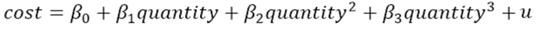
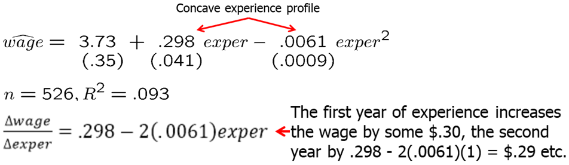
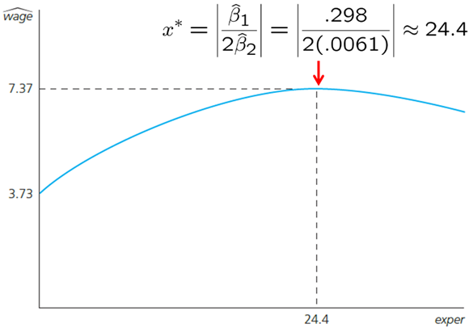
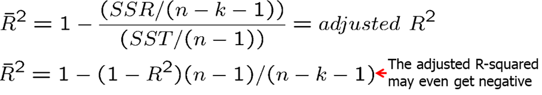
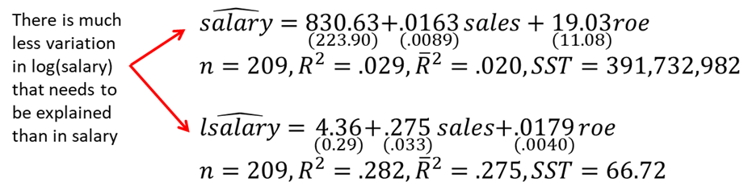

<style>
p.comment {
background-color: #e8e8e8;
padding: 10px;
border: 0px solid black;
margin-left: 25px;
border-radius: 5px;
}
</style>

##### Chapter 6: The Multiple Regression Analysis: Further Issues

We sometimes are interested in changing the units of our variables, say from feet to meters or pounds to kilograms. Unsurprisingly, when variables are re-scaled, the coefficients, standard errors, confidence intervals, t statistics and F statistics change in ways that preserve all measured effects and testing outcomes. However, data scaling can be done for cosmetic purposes: to make the estimated coefficients easier to read and interpret. For example, if the unit of measurement is very large and the estimated coefficient is very small, it may be convenient to rescale data to reduce the number of zeros after the decimal point.

In some cases, it is easier to interpret the results not in actual test scores or whatever numbers it is measured by in standard deviations. To do that, we need to standardize a variable. A variable is standardized in the sample by subtracting off its mean and dividing by its standard deviation. We simply compute the z-score for every variable in the sample. When, we run the regression using the z-scores. Estimated coefficients obtained from a regression using standardized variables are called standardized coefficients or beta coefficients. These coefficients meaning can be explained as follows: if X1 increases by one standard deviation, then Y changes by b1^hat standard deviations. When all variables are standardized, we can compare the beta coefficient magnitudes. It can also be useful to standardize variables when for example there is large variation in one independent variable but little variation in another independent variable.

Besides work with data, we need to be able to understand the differences between different functional forms.
First, the logarithmic functional forms provide a convenient percentage (log-level) and elasticity (log-log) interpretation. Slope coefficients of logged variables are invariant to rescalings. Also, taking natural logarithms often mitigates the outlier problems and helps secure normality and homoskedasticity. Logs are often used working with dollar amounts such as wage or income. 

When you shouldn't use logs? We usually do not use log for variables reporting percentage rates. Whenever variables are measured in time units such as years, we cannot use logs. We also cannot take natural logs of zero or negative values. If the values are very small, we should probably stay away from logs as they can increase the variation as log around small values creates large differences.

Note that when one uses a logarithmic dependent variable, variation in our independent variables explain the variation in the logarithmic dependent variable while we are interested how they affect variation in our dependent variable, not its log. We need to not forget to use the exponent correctly to reverse the log operation. We will need to use an additional variable a0 will have to be estimated and used as shown at the end of this chapter.

Also, when using log-level form, to get the exact percentage change that $y$ is affected after $x$ increases by 1 unit, we can use the following formula:

$$ \% \Delta \hat y = 100 [\exp(\hat \beta_2 \Delta x_1)-1] \quad \rightarrow \quad \% \Delta \hat y = 100[\exp(\hat \beta_2) - 1] \text{ when } \Delta x_1 = 1  $$

Quadratic form is another very popular function form that is able to capture nonlinear effects. You can measure either increasing or decreasing returns to education, or the return to experience. We may expect that the first few years of experience will have a larger effect on your wage than a few additional years when you already amassed a lot of experience.

When the slopes of the level variable of interest and its squared are of different sign, we may be interested in computing the turning point. It estimates when the overall effect on the explained variable switches the sign. However, it does not mean that turning point is useful. In some cases, we may find that an increase in education beyond some point may reduce the wage. Before we conclude that we should check how many sample observations lie to the right of the turning point: likely none to a few. We may have a specification issue.

If both slope coefficients are of the same sign, than there is no such turning point, and the increase (if both positive) or the decrease (if both negative) in the dependent variable keeps getting larger as the independent variable keeps increasing at higher level.

One can try even higher polynomials, for example, we can run a regression using experience, experience-squared and/or experience-cubed. Similarly, a firm may find that their cost function is best described by a higher polynomial. A more careful analysis should be done before making a decision to use such a form.



Let's work out the wage example again using both experience and experience squared as regressors. Our regression model is:
$$wage = \beta_0 + \beta_1*exper + \beta_2*(exper)^2$$

In R, write the following code:
```{r, message=FALSE, warning=FALSE, cache=TRUE}
data(wage1, package='wooldridge')
attach(wage1)
reg1=lm(wage~exper+expersq)
plot(wage~exper)
x=seq(from=1, to=51, by=1)
pred=predict(reg1, data.frame(exper=x, expersq=x^2), interval = "confidence")
lines(x, pred[,1])
which(max(pred[,1])==pred[,1])
maxvalue=abs(reg1$coefficients[2]/2/reg1$coefficients[3])
```

The results are shown below. Using the formula to find the maximum value of a quadratic function, we can find that we predict the maximum wage is reached when experience is 24.4. However, this is very unlikely to be true. It is more likely that we have a specification issue, we are missing some key explanatory variables.





In some cases, the partial effect of one variable may depend on the level of the other variable. For example, the return to experience may be different for someone with college degree and without, or the number of bedrooms has a different effect when the square footage of the house is larger. In these cases, we use interaction terms. We basically state that number of bedrooms has a different effect depending on square footage. We need to be careful when interpreting results in such cases.

Let's consider an example in which we use an interaction term between square feet and number of bedrooms. The full regression model looks like this:
$$price = \beta_0 + \beta_1*sqrft + \beta_2*bdrms + \beta_3*sqrft*bdrms + \beta_4*bthrms$$
Say, we are interested in the effect of number of bedrooms on the price of a house. We see that the change in price due to change in 1 bedroom depends on the square footage of the house. We may choose to use a specific value, for example, the mean square footage, to get a point estimate. In this case, we will call this average partial effect (APE) of bedrooms on the price.


Often, it is useful to reparametrize the model so that the slope coefficients on the original variables have an interesting meaning. For example, instead of simply using interaction term between $x_1$ and $x_2$, we can use an interaction term $(x_1-\mu_1)(\x_2-\mu_2)$ where $\mu_1$ is the mean of $x_1$ and $\mu_2$ is the mean of $x_2$. Now, the non-interactive terms have a simple interpretation. $\delta_2$ now measures the effect of $x_2$ on $y$ when variables take their mean values. It is much easier to interpret directly (without doing any additional math operations) and we get the standard errors for partial effects at the mean values. If necessary, we can center the interaction term not at their means but any other interesting values.

In models with quadratics, interactions, and other nonlinear functional forms, the partial effect depends on the values of one or more explanatory variables. However, we often want a single value to describe the relationship between the dependent variable and each explanatory variable. One popular summary measure is the average partial effect (APE), sometimes called average marginal effect. To get APE, we use the sample average of the variables in the estimated partial effect formula.

For example, if we measure the partial effect of education to be
$\beta_1+\beta_2*(experience)$, then $APE=\beta_1+\beta_2*(mean(experience))$

Nothing about the classical linear model assumptions requires that R-squared be above a a certain value. A high R-squared does not imply that there is a causal interpretation. A low R-squared does not preclude precise estimation of partial effects. Choosing a set of explanatory variables based on the size of resulting R-squared can lead to nonsensical models.

The problem with R-squared is that R-squared never decreases when we add additional explanatory variables. Adjusted, R-squared, on the other hand imposes a penalty for adding additional independent variables. The adjusted R-squared increases if, and only if, the t-statistic of a newly added regressor is greater than one in absolute value. Adjusted R-squared is also usually reported in most econometric software.



Comparing R-squared is not correct if the number of explanatory variables is not the same. However, we can compare the adjusted R-squared because it takes into account the difference in degrees of freedom (it penalizes us for adding more explanatory variables).

Comparing R-square or adjusted R-squared is incorrect when we are using dependent variables that differ in their definition. For example, if we use the same independent variables to explain salary and log(salary), R-squared and adjusted R-squared should not be compared. Model with log(salary) has much less variation that needs to be explained. We expect both R-squared and adjusted R-squared to be significantly lower when we use log(salary) instead of salary.



Previously, we have discussed that if we omit a relevant independent variable, we may have omitted variable bias. However, that does not mean we should try to control for everything we have data on. Controlling for too many factors may be a problem in regression analysis as well. In some cases, certain variables should not be held fixed. For example, in a regression of traffic fatalities on state beer taxes (and other factors) one should not directly control for beer consumption. If one included beer consumption, then there is no link between fatalities and taxes. Similarly, in a regression of family health expenditures on pesticide usage among farmers one should not control for doctor visits. Health expenditures already include doctor visits. If we included doctor visits as an independent variable, then we would be measuring the pesticide use on health expenditures other than doctors visits. 

Different regressions may serve different purposes. In a regression of house prices on house characteristics, one would only include price assessments if the purpose of the regression is to study their validity; otherwise one would not include them.

We discussed earlier that adding regressors may exacerbate multicollinearity problems. On the other hand, adding regressors reduces the error variance. Variables that are uncorrelated with other regressors should be added because they reduce error variance without increasing multicollinearity. However, such uncorrelated variables may be hard to find. As you will see, most variables are correlated in some way. Adding variables to your regression model must be well thought out.

Often, we want to measure the uncertainty of our predicted values and we can use confidence interval for that. For example, say we are interested in predicting college GPA for specific given information.

```{r, message=FALSE, warning=FALSE, cache=TRUE}
data(gpa2, package='wooldridge')
reg = lm(colgpa~sat+hsperc+hsize+I(hsize^2),data=gpa2)
cvalues1 = data.frame(sat=1200, hsperc=30, hsize=5) # Generate data for predictions
p1=predict(reg, cvalues1); p1 # Point estimate of prediction
p2=predict(reg, cvalues1, interval = "confidence"); p2 # Point estimate and 95% confidence interval
satrange=seq(from=500, to=1600, by=1)
cvalues2 = data.frame(sat=satrange, hsperc=30, hsize=5) # Generate new data
predGPA=predict(reg, cvalues2, interval = "confidence")
plot(predGPA[,1]~satrange, type="l")
lines(predGPA[,2]~satrange, lty=2)
lines(predGPA[,3]~satrange, lty=2)
plot(reg$residuals~gpa2$sat)
```

After executing p1, we see that the predicted college GPA for someone who has scored 1200 on SAT, was in 30th percentile in high school, and is from a household of 5, is 2.70.

What if we want to get 95\% confidence interval for that value? p2 computes the point estimate and the lower bound (2.66) and upper bound (2.74) for the predicted GPA.

Running the rest of the code plots the regression line given the information on high school percentile and household size. We see that the confidence interval increases as we go away from the mean values.

Residual analysis is another tool that we can use to better understand how good are our predictions. The difference between the actual observations and the predicted values are residuals. To continue our last example, just add the following line to see the residuals plotted against the SAT scores.

Predicting the dependent variable when we use non-level form of the dependent variable in the regression model is not direct, although still quite simple. While it would seem that it is enough to simply un-log (using the exponent), there is a small adjustment that needs to be done.

$\hat y = \hat \alpha_0 \exp(\widehat{\log y})$ where $\alpha_0=n^{-1}\sum_{i=1}^n \exp(\hat u_i) $

See CEO salary example below.
```{r, message=FALSE, warning=FALSE, cache=TRUE}
data(ceosal2, package='wooldridge')
reg1=lm(log(salary)~log(sales)+log(mktval)+ceoten, data=ceosal2)
a0=1/length(fitted(reg1)) * sum(exp(reg1$residuals))
sales_range=seq(from=min(ceosal2$sales),to=max(ceosal2$sales),by=200)
cvalues = data.frame(sales=sales_range, mktval=mean(ceosal2$mktval), ceoten=mean(ceosal2$ceoten)) 
logpred=predict(reg1, cvalues, interval = "confidence")
PredictedSalary=a0*exp(logpred)
plot(PredictedSalary[,1]~sales_range, type="l")
lines(PredictedSalary[,2]~sales_range, type="l", lty=2)
lines(PredictedSalary[,3]~sales_range, type="l", lty=2)
```


**Homework Problems**

<p class="comment"> Computer Exercise C1.\
Use the data in **kielmc**, only for the year 1981, to answer the following questions. The data are for houses that sold during 1981 in North Andover, Massachusetts; 1981 was the year construction began on a local garbage incinerator.\
1. To study the effects of the incinerator location on housing price, consider the simple regression model:$$ log(price) = \beta_0 + \beta_1*log(dist) + u $$
where price is housing price in dollars and dist is distance from the house to the incinerator measured in feet. Interpreting this equation causally, what sign do you expect for $\beta_1$ if the presence of the incinerator depresses housing prices? Estimate this equation and interpret the results.\
2. To the simple regression model in part 1, add the variables $log(intst)$, $log(area)$, $log(land)$, $rooms$, $baths$, and $age$, where $intst$ is distance from the home to the interstate, $area$ is square footage of the house, $land$ is the lot size in square feet, $rooms$ is total number of rooms, $baths$ is number of bathrooms, and $age$ is age of the house in years. Now, what do you conclude about the effects of the incinerator? Explain why part 1 and part 2 give conflicting results.\
3. Add $[log(intst)]^2$ to the model from part 2. Now what happens? What do you conclude about the importance of functional form?\
4. Is the square of $log(dist)$ significant when you add it to the model from part 3?
</p>

<p class="comment"> Computer Exercise C2.\
Use the data in **wage1** for this exercise.\
Use OLS to estimate the equation
$$log(wage) = \beta_0 + \beta_1*educ + \beta_2*exper + \beta_3*exper^2 + u$$
and report the results using the usual format.
1. Is $exper^2$ statistically significant at the 1\% level?\
2. Using the approximation $\% \Delta wage = 100(\beta_2 + 2\beta_3exper) \Delta exper$\
3. find the approximate return to the fifth year of experience. What is the approximate return to the twentieth year of experience.\
4. At what value of exper does additional experience actually lower predicted $log(wage)$? How many people have more experience in this sample?
</p>

<p class="comment"> Computer Exercise C9.\
The data set **nbasal** contains salary information and career statistics for 269 players in the National Basketball Association (NBA).\
1. Estimate a model relating points-per-game ($points$) to years in the league ($exper$), $age$, and years played in college ($coll$). Include a quadratic in exper; the other variables should appear in level form. Report the results in the usual way.\
2. Holding college years and age fixed, at what value of experience does the next year of experience actually reduce points-per-game? Does this make sense?\
3. Why do you think $coll$ has a negative and statistically significant coefficient? (Hint: NBA players can be drafted before finishing their college careers and even directly out of high school.)\
4. Add a quadratic in age to the equation. Is it needed? What does this appear to imply about the effects of age, once experience and education are controlled for?\
5. Now regress $log(wage)$ on $points$, $exper$, $exper^2$, $age$, and $coll$. Report the results in the usual format.\
6.Test whether age and coll are jointly significant in the regression from part 5. What does this imply about whether age and education have separate effects on wage, once productivity and seniority are accounted for?
</p>

<p class="comment"> Computer Exercise C11.\
Use **apple** to verify some of the claims made in Section 6.3.\
1. Run the regression $ecolbs$ on $ecoprc$, $regprc$ and report the results in the usual form, including the R-squared and adjusted R-squared. Interpret the coefficients on the price variables and comment on their signs and magnitudes.\
2. Are the price variables statistically significant? Report the p-values for the individual t-tests.\
3. What is the range of fitted values for $ecolbs$? What fraction of the sample reports $ecolbs=0$? Comment.\
4. Do you think the price variables together do a good job of explaining variation in $ecolbs$? Explain.\
5. Add the variables $faminc$, $hhsize$ (household size), $educ$, and $age$ to the regression from part 1. Find the p-value for their joint significance. What do you conclude?\
6. Run separate simple regressions of $ecolbs$ on $ecoprc$ and then $ecolbs$ on $regprc$. How do the simple regression coefficients compare with the multiple regression from part 1? Find the correlation coefficient between $ecoprc$ and $regprc$ to help explain your findings.
</p>

**References**

Wooldridge, J. (2019). Introductory econometrics: a modern approach. Boston, MA: Cengage.

Heiss, F. (2016). Using R for introductory econometrics. Düsseldorf: Florian Heiss,CreateSpace.

---
