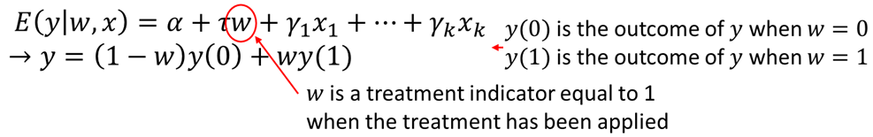
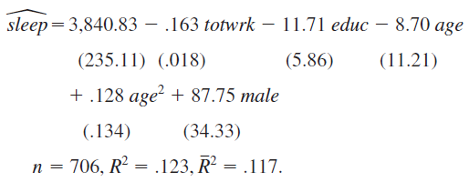

<style>
p.comment {
background-color: #e8e8e8;
padding: 10px;
border: 0px solid black;
margin-left: 25px;
border-radius: 5px;
}
</style>

##### Chapter 7: The Multiple Regression Analysis with Qualitative Information

Qualitative factors often come in a form of binary information: a person is male or female, a person has or doesn't have a car, a state administers capital punishment or it does not, and so on... This kind of information can be captured with a binary variable (zero-one variable). In econometrics, binary variables are usually known as dummy variables. We can use this type of variables both as dependent and independent variables but for now, we will mostly use them as explanatory variables.

With a dummy variable, the value of 1 must be assigned to one of the two possibilities or outcomes. For example, either female=1 and male=0, or we could have male=1 and female=0. In our regression model, we can only use one: we cannot use both male and female as separate explanatory variables due to perfect collinearity (this is sometimes called dummy variable trap). In other words, we need to select one groups as the benchmark (assigned binary variable value of 0) and estimate the difference between that benchmark group and the group of interest (with the binary variable value of 1).

The simplest case is adding a dummy variable as an explanatory variable. For example, you consider the following hourly wage determination model. We postulate that there is a difference between male and female wages (discrimination against women).

$$wage = \beta_0 + \beta_1*educ + \beta_2*female + u$$

```{r, message=FALSE, warning=FALSE, cache=TRUE}
data(wage1, package='wooldridge')
reg1=lm(wage~educ+female, data=wage1)
summary(reg1)
x=seq(from=min(wage1$educ), to=max(wage1$educ), by=1)
val_m = data.frame(educ=x, female=0)
pred_m=predict(reg1, val_m, interval = "confidence")
val_f = data.frame(educ=x, female=1)
pred_f=predict(reg1, val_f, interval = "confidence")
plot(wage1$wage~wage1$educ)
lines(x, pred_f[,1], pch=18, col="blue", type="b", lty=2)
lines(x, pred_m[,1], pch=19, col="red", type="b")
legend(0, 25, legend=c("Male", "Female"),col=c("red", "blue"), lty=1:2, cex=1.5)
```

See the summary of the regression results and the plot below. In this case, we simply move the intercept for females down by the estimated amount. This estimated difference is the difference in mean wage between male and females with the same education. We find that women with the same education earn 2.27 dollars less than men! Recall that these are wages from 1976! 

Let's add more explanatory variables:
$$wage = \beta_0 + \beta_1*educ + \beta_2*female + \beta_3*exper + \beta_4*tenure + u $$

Use the following code in R.
```{r, message=FALSE, warning=FALSE, cache=TRUE}
data(wage1, package='wooldridge')
reg2=lm(wage~educ+female+exper+tenure, data=wage1)
summary(reg2)
x=seq(from=min(wage1$educ), to=max(wage1$educ), by=1)
val_m2 = data.frame(educ=x, female=0, exper=mean(wage1$exper), tenure=mean(wage1$tenure))
pred_m2=predict(reg2, val_m2, interval = "confidence")
val_f2 = data.frame(educ=x, female=1, exper=mean(wage1$exper), tenure=mean(wage1$tenure))
pred_f2=predict(reg2, val_f2, interval = "confidence")
plot(wage1$wage~wage1$educ)
lines(x, pred_f2[,1], pch=18, col="blue", type="b", lty=2)
lines(x, pred_m2[,1], pch=19, col="red", type="b")
legend(0, 25, legend=c("Male", "Female"),col=c("red", "blue"), lty=1:2, cex=1.5)
```

We will see that as we are able to control more factors, the wage gap gets smaller, however, it is still relatively large.

We have already discussed that usually it is more appropriate to use log(wages) and that we may likely have nonlinear (quadratic) relationships. Let's consider a more complicated model adding squared terms of experience and tenure and using log of wage:
$$log(wage) = b_0 + b_1*educ + b_2*female + b_3*exper + b_4*tenure + b_5*exper^2+ b_6*tenure^2 + u$$
Use the following commands in R.
```{r, message=FALSE, warning=FALSE, cache=TRUE}
data(wage1, package='wooldridge')
reg3=lm(log(wage)~educ+female+exper+tenure+expersq+tenursq, data=wage1)
summary(reg3)
Exact_diff=100*(exp(reg3$coefficients[3])-1)
```

The summary is displayed below. We see that, with the same level of education, experience and tenure, women are found to earn 29.65\% less than men (found by looking at $b_2$). However, this number is an approximation. The exact difference is found using $100*[\exp(b_2)-1]$. We find that woman's wage on average is 25.66\% below a comparable man's wage.

Of course, we can consider many other relevant dummy variables for our model. For example, a dummy variable for married, or dummy variable for belonging to a union and so on.

Ordinal variables are categorical variables in which the order of categories matter. For example, a firm's, state's or country's bonds are rated by one of the rating agencies in which order, of course, matters. Say we simplify the ratings to five groups from worst (0=wors) to best (4=best). We have two alternatives: we can either include this ordinal variable as one regressor or create a dummy variable for each group.

Hamermesh and Biddle (1994) used physical attractiveness in a wage equation. The authors put everyone in three groups: below average, average and above average physical attractiveness. They estimated a separate equation for men and women. While we have less variables, we can get similar results using similar variables. In R, execute the following code:

```{r, message=FALSE, warning=FALSE, cache=TRUE}
data(beauty, package='wooldridge');
df =beauty;
dff=df[df$female==1,]
dfm=df[df$female==0,]
reg4f=lm(log(wage)~belavg+abvavg+educ+exper+expersq+married+black,data=dff)
reg4m=lm(log(wage)~belavg+abvavg+educ+exper+expersq+married+black,data=dfm)
reg4=lm(log(wage)~belavg+abvavg+educ+exper+expersq+married+black+female,data=df)
reg4alt=lm(log(wage)~looks+educ+exper+expersq+married+black+female,data=df)
library(stargazer);
stargazer(list(reg4m,reg4f,reg4,reg4alt),type="text",keep.stat=c("n","rsq")) #need to install "stargazer" first: install.packages("stargazer")
```

Across all three regressions we find what we expected. Lower wages are associated with below average looking people (how subjective is that?). Even though the sign for above average looks is positive (as expected), the effect is not significant. The last regression uses one categorical variable for looks (from 1 to 5). We find that better subjective looks are associated with higher wages. However, as seen in regressions 1 through 3, the "looks" effect is not constant through the category bins.

We can also interact dummies with either other dummies or quantitative variables. For example, we can have an interactive term between two binary variables: female*married.
Model:
$$log(wage) = beta_0 + beta_1*female + beta_2*married + beta_3*female*married + ... $$
In this case, female=0 and married=0 corresponds to single men (the base group) with intercept $\beta_0$, $female=0$ and $married=1$ corresponds to married men (intercept becomes $\beta_0+\beta_2$), $female=1$ and $married=1$ corresponds to married females giving us the intercept: $\beta_0+\beta_1+\beta_2+\beta_3$.

If we interact a binary variable with a quantitative variable, we allow for difference in slopes. For example, let's look at the wage example using **wage1** data set. A model with interaction term between female and education can be written as:

$$ log(wage)=b_0+b1*female+b2*female*tenure+b3*educ+b4*exper+b5*expersq+b6*tenure+b7*tenursq $$

To run the regression above and create an informative plot, execute the following commands.

```{r, message=FALSE, warning=FALSE, cache=TRUE}
data(wage1, package='wooldridge')
reg5=lm(log(wage)~female+female*tenure+educ+exper+expersq+tenure+tenursq, data=wage1)
summary(reg5)
a0=1/length(fitted(reg5)) * sum(exp(reg5$residuals))
x=seq(from=min(wage1$tenure), to=max(wage1$tenure), by=1)
val_m = data.frame(tenure=x,exper=mean(wage1$exper), expersq=mean(wage1$expersq), educ=mean(wage1$educ),tenursq=mean(wage1$tenursq), female=0)
log_pred_m=predict(reg5, val_m, interval = "confidence")
pred_m=a0*exp(log_pred_m)
val_f = data.frame(tenure=x,exper=mean(wage1$exper), expersq=mean(wage1$expersq), educ=mean(wage1$educ),tenursq=mean(wage1$tenursq), female=1)
log_pred_f=predict(reg5, val_f, interval = "confidence")
pred_f=a0*exp(log_pred_f)
plot(wage~tenure, data=wage1[which(wage1$female==1),], col="red")
points(wage~tenure, data=wage1[which(wage1$female==0),], col="blue")
lines(x, pred_f[,1], pch=18, col="red", type="l")
lines(x, pred_m[,1], pch=19, col="blue", type="l")
legend(25.6, 22.5, legend=c("Female", "Male"),col=c("red", "blue"), lty=1, cex=1)
```

The results of the regression and the plot is shown below. We see that the return to tenure is not the same for men and women even after we hold for experience, education. Regression results indicate that men's wage with tenure, holding other factors constant, increases more.

We may want to test whether the same regression model describes the dependent variables for two groups. For example, we can check if the regression model describing wages for men and women is different. Say, originally, you were interested to test the following model:
$$log(wage) = b_0 + b_1*exper + b_2*expersq$$

Now, we must allow for intercept and all the slopes to be different (fem=female):
$$log(wage) = b_0 + d_0*fem + beta_1*exper + d1*exper*fem + beta_2*expersq + d_2*expersq*fem$$
Then, we will run the F test comparing the unrestricted with restricted model.

In R, execute the following.
```{r, message=FALSE, warning=FALSE, cache=TRUE}
data(wage1, package='wooldridge');
reg6a=lm(log(wage)~exper+expersq, data=wage1);
reg6b=lm(log(wage)~female+exper+female*exper+expersq+female*expersq, data=wage1);
summary(reg6a)
summary(reg6b)
library(car);
linearHypothesis(reg6b, c("female=0","female:exper=0","female:expersq=0"))
```

We can reject the null hypothesis that the wage follows the same model both for men and women. It seems that the model is different for the two groups.

So far, we have only considered the binary variable as an independent variable. However, we can use the same techniques to explain the qualitative variable. The multiple linear regression model with a binary dependent variable is called the linear probability model (LPM) because the response probability is linear in the parameters. (In Chapter 17 we will discuss additional models for binary dependent variables) In short, in the linear probability model the coefficients describe the effect of the explanatory variables on the probability that $y=1$.

For example, we are interested in finding the probability of being in the labor force among women. We postulate the following model:
$$inlf = b0+b1*nwifeinc+b2*educ+b3*exper+b4*exper^2+b5*age+b6*kidslt6+b7*kidsge6+u$$
inlf = particular woman in labor force (if yes, =1, if no, =0)\
nwifeinc = other sources of income including husband's income\
kidslt6 = number of kids under 6 years of age\
kidsge6 = number of kids between 6 and 18 years old\

In R, we can run the following.
```{r, message=FALSE, warning=FALSE, cache=TRUE}
data(mroz, package='wooldridge')
reg7=lm(inlf~nwifeinc+educ+exper+expersq+age+kidslt6+kidsge6, data=mroz)
summary(reg7)
x=seq(from=min(mroz$educ), to=max(mroz$educ), by=1)
val = data.frame(nwifeinc=mean(mroz$nwifeinc),educ=x, exper=mean(mroz$exper), expersq=mean(mroz$expersq), age=mean(mroz$age), kidslt6=mean(mroz$kidslt6), kidsge6=mean(mroz$kidsge6))
predicted=predict(reg7, val, interval = "confidence")
plot(predicted[,1]~x,type="l")
lines(x,rep(0.5,length(x)), lty=2)
```

We find that if the number of kids under 6 years old increases by one, the probability that the woman works falls by 26.2%.Similarly, everything else held constant, another year of education increases the probability of labor force participation by 3.4%. If you are interested in the statistical significance, keep in mind that the standard errors are generally not valid as they are reported and need to be adjusted. We can plot the probability that a woman is working given the number of years in education and other variables fixed at their mean.

Under certain possible values, the probability of a woman to be in the labor force is negative which is troubling as probabilities must lie between 0 and 1. In other cases, the predicted probability may be above 1. Among other the disadvantages of LPM,  marginal probability effects sometimes logically impossible, it is necessarily heteroskedastic requiring to compute heteroskedasticity consistent standard errors.

However, still many researchers use this model because it is very easy to estimate and the interpretation is straightforward. Moreover, the estimated effects and predictions are often reasonably good in practice.

When evaluating and effectiveness of a program, we may use a binary treatment variable, w, indicating whether the participant or firm received the treatment, w=1, or not, w=0. If the program participation is completely random, we may not need many controls, however, in reality, most participation in various government programs is not random. Thus, we need to add various individual characteristics to correct the self-selection problem. For example, children eligible for a program like Head Start participate based on parental decisions. We thus need to control for things like family background and structure to get closer to random assignment into the treatment (participates in Head Start) and control (does not participate) groups.



Let's assume you are interested in some program evaluation. You write down a simple equation:
$$ y = \alpha + \tau w + u$$ 

However, most likely the program participation is not random. Therefore, you need to include appropriate covariates or regressors to control for the fact that participation is not random. Regression adjustment is done by including suitable covariates:


The coefficient on w, what we are interested in, is called the regression adjusted estimator.

We can allow the treatment effect to vary across observations and instead estimate the average treatment effect (ATE). The estimated coefficient on w will be the ATE. The regression that allows individual treatment effects to vary is known as the unrestricted regression adjustment (URA). By contrast, a restricted regression adjustment (RRA) forces the treatment effect to be identical across individuals.


Alternatively, you can set two equations, one control and one treatment:


Now, for every unit in the sample, we predict y(1) and y(0) regardless of whether the unit is in the control or treatment groups. Then, we use the predicted values to compute the average treatment effect as:


Though this yields the same ATE as running the regression with interaction terms, computing standard error can be tricky.

One must be careful when interpreting regression results with discrete dependent variables. For example, often demographers are interested in the effects of education on fertility, with special attention to trying to determine whether the education has a causal effect on fertility. Let's assume the following models:

$$children = \beta_0 + \beta_1*age - \beta_2*educ + u $$

$$children = \beta_0 + \beta_1*age - \beta_2*educ + \beta_3*electric + u $$

We can estimate this using the following R code.
```{r, message=FALSE, warning=FALSE, cache=TRUE}
data(fertil2,package='wooldridge');
reg8=lm(children~age+educ, data=fertil2);
reg9=lm(children~age+educ+electric, data=fertil2);
summary(reg8)
summary(reg9)
```

The coefficient for $educ$ in the first regression, is -0.090 which means that we estimate that average fertility falls by 0.09 children given one more year of education. You can imagine if there were a 100 women in a group, and they obtained another year of education, we estimate that there will be nine fewer children among them.

In the second regression, we find that comparing 100 women with electricity at home and without - at the same age and with the same education - we estimate the former to have 36 fewer children.


**Homework Problems**

<p class="comment"> Problem 1.\
Using the data in **sleep75** (see also Problem 3 in Chapter 3), we obtain the estimated equation show below this problem.\
The variable sleep is total minutes per week spent sleeping at night, totwrk is total weekly minutes spent working, educ and age are measured in years, and male is a gender dummy.\
1. All other factors being equal, is there evidence that men sleep more than women? How strong is the evidence?\
2. Is there a statistically significant tradeoff between working and sleeping? What is the estimated tradeoff?\
3. What other regression do you need to run to test the null hypothesis that, holding other factors fixed, age has no effect on sleeping?
</p>


<p class="comment"> Computer Exercise C2.\
Use the data in **wage1** for this exercise.\
Use OLS to estimate the equation
$$log(wage) = \beta_0 + \beta_1*educ + \beta_2*exper + \beta_3*exper^2 + u$$
and report the results using the usual format.
1. Is $exper^2$ statistically significant at the 1\% level?\
2. Using the approximation $\% \Delta wage = 100(\beta_2 + 2\beta_3exper) \Delta exper$\
3. find the approximate return to the fifth year of experience. What is the approximate return to the twentieth year of experience.\
4. At what value of exper does additional experience actually lower predicted $log(wage)$? How many people have more experience in this sample?
</p>

<p class="comment"> Computer Exercise C9.\
The data set **nbasal** contains salary information and career statistics for 269 players in the National Basketball Association (NBA).\
1. Estimate a model relating points-per-game ($points$) to years in the league ($exper$), $age$, and years played in college ($coll$). Include a quadratic in exper; the other variables should appear in level form. Report the results in the usual way.\
2. Holding college years and age fixed, at what value of experience does the next year of experience actually reduce points-per-game? Does this make sense?\
3. Why do you think $coll$ has a negative and statistically significant coefficient? (Hint: NBA players can be drafted before finishing their college careers and even directly out of high school.)\
4. Add a quadratic in age to the equation. Is it needed? What does this appear to imply about the effects of age, once experience and education are controlled for?
5. Now regress $log(wage)$ on $points$, $exper$, $exper^2$, $age$, and $coll$. Report the results in the usual format.\
6.Test whether age and coll are jointly significant in the regression from part 5. What does this imply about whether age and education have separate effects on wage, once productivity and seniority are accounted for?
</p>

<p class="comment"> Computer Exercise C11.\
Use **apple** to verify some of the claims made in Section 6.3.\
1. Run the regression $ecolbs$ on $ecoprc$, $regprc$ and report the results in the usual form, including the R-squared and adjusted R-squared. Interpret the coefficients on the price variables and comment on their signs and magnitudes.\
2. Are the price variables statistically significant? Report the p-values for the individual t-tests.\
3. What is the range of fitted values for $ecolbs$? What fraction of the sample reports $ecolbs=0$? Comment.\
4. Do you think the price variables together do a good job of explaining variation in $ecolbs$? Explain.\
5. Add the variables $faminc$, $hhsize$ (household size), $educ$, and $age$ to the regression from part 1. Find the p-value for their joint significance. What do you conclude?\
6. Run separate simple regressions of $ecolbs$ on $ecoprc$ and then $ecolbs$ on $regprc$. How do the simple regression coefficients compare with the multiple regression from part 1? Find the correlation coefficient between $ecoprc$ and $regprc$ to help explain your findings.
</p>

**References**

Wooldridge, J. (2019). Introductory econometrics: a modern approach. Boston, MA: Cengage.

Heiss, F. (2016). Using R for introductory econometrics. Düsseldorf: Florian Heiss,CreateSpace.

---
