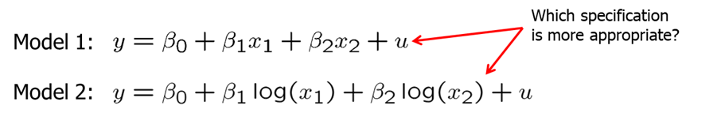
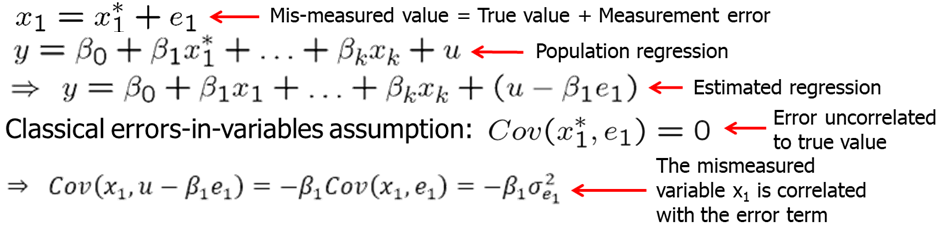

<style>
p.comment {
background-color: #e8e8e8;
padding: 10px;
border: 0px solid black;
margin-left: 25px;
border-radius: 5px;
}
</style>

##### Chapter 9: More on Specification and Data Issues

A multiple regression model suffers from functional form misspecification when it does not properly account for the relationship between the dependent and the observed explanatory variables. For example, if there are decreasing returns to education or experience but we omit the squared term, we misspecify the functional form. In general, we will not get unbiased estimators of any of the other parameters if we omit one relevant variable.

One can always test whether explanatory should appear as squares or higher order terms by testing whether such terms can be excluded. Some tests have been proposed to detect general form misspecification. One of such tests is regression specification error test (RESET). The idea of RESET is to include squares and possibly higher order fitted values in the regression (similarly to the reduced White test). To implement RESET, we need to decide how many functions of the fitted values to include. For example, an expanded regression with squared and cubed terms is:

$$ y=\beta_0 + \beta_1 x_1 + ... + \beta_k x_k +\delta_1 \hat y^2 +\delta_2 \hat y^3 + error$$   

We test for the exclusion of the $\hat y$ terms. If they cannot be excluded, this is evidence for omitted higher order terms and interactions, i.e. for misspecification of functional form.

For example, let's look at two housing pricing equations:

$$price = beta_0 + beta_1*lotsize + beta_2*sqrft + beta_3*bdrms + u$$

$$log(price) = beta_0 + beta_1*log(lotsize) + beta_2*log(sqrft) + beta_3*bdrms + u$$

For R, you can use the following code.

```{r, message=FALSE, warning=FALSE, cache=TRUE}
data(hprice1, package='wooldridge')
library(car);
library(lmtest);
reg1 = lm(price ~ lotsize+sqrft+bdrms, data=hprice1)
reg2 = lm(log(price) ~ log(lotsize)+log(sqrft)+bdrms, data=hprice1)
resettest(reg1)# RESET test for reg1
resettest(reg2)# RESET test for reg2
#Alternative approach:
RESETreg <- lm(price ~ lotsize+sqrft+bdrms+I(fitted(reg1)^2)+ I(fitted(reg1)^3), data=hprice1)
# RESET test. H0: all coeffs including "fitted" are=0 
linearHypothesis(RESETreg, matchCoefs(RESETreg,"fitted")) 
```

The RESET test for regression 1 indicates evidence for misspecification while the same RESET test for regression 2 shows less evidence for misspecificaiton (at least 5\% significance level, we would fail to reject the null hypothesis).

The drawback of the RESET test is that it does not suggest what to do if there is misspecification. RESET provides little guidance as to where misspecification comes from. One may include higher order terms, which implies complicated interactions and higher order terms of all explanatory variables.

When discussing functional forms, we often consider whether an independent variable should enter the model as a level or a log. However, such non-nested model testing is not simple. Assume you are considering these two models.



One method is to define a general model that contains both previous models.

$$ y = \beta_0 + \beta_1 x_1 + \beta_2 x_2 + \beta_3 \log(x_1) + \beta_4 \log (x_2) + u$$

However, a clear winner may not necessarily emerge. Also, we cannot compare models if the definition of the dependent variable is not the same. For example, we cannot compare level of $y$ or $log(y)$ models directly.

Another difficult problem arises when our model excludes a key variable due to data unavailability. If the data on key variable is lacking, one way to resolve it is to use a proxy variable for the omitted variable. Loosely speaking, a proxy variable is something that is related to the unobserved variable that we would like to control in our analysis. For example, one could use IQ as a proxy for natural ability. While we know that IQ and ability is not the same, we may think that they are sufficiently correlated. Moreover, the proxy variable must not be correlated with the error term. If the error and the proxy were correlated, the proxy would actually have to be included in the population regression function. The proxy variable is a "good" proxy for the omitted variable if using other variables in addition will not help to predict the omitted variable. 

Let's look at the wage example. We know that ability is a determinant of wage but measurement for ability is at best approximate. Some researchers have used IQ score as a proxy for ability (how good is it as a proxy is a separate discussion). In R, execute the following.

```{r, message=FALSE, warning=FALSE, cache=TRUE}
data(wage2, package='wooldridge')
library(stargazer);
reg3=lm(log(wage)~educ+exper+tenure+married+south+urban+black,data=wage2)
reg4=lm(log(wage)~educ+exper+tenure+married+south+urban+black+IQ,data=wage2)
reg5=lm(log(wage)~educ+exper+tenure+married+south+urban+black+IQ+(educ*IQ),data=wage2)
stargazer(reg3,reg4,reg5, type="text",keep.stat=c("n","rsq"))
```

We are interested to see what happens to returns to education when we include IQ to the log(wage) equation. We see that when IQ is not included, return to education is 6.5\% which we expect to be too high. After including IQ, return to education falls to 5.4\%. Lastly, introducing an interaction term between education and IQ complicates the model. Now, both education and $IQ*education$ are insignificant. We would prefer the second model to the first or the third.

For IQ to be a good proxy in the above example, IQ score must not be a direct wage determinant, and most of the variation in ability should be explainable by variation in IQ score. Even if IQ score imperfectly soaks up the variation caused by ability, including it will at least reduce the bias in the measured return to education.

In some cases we suspect that one or more independent variables is correlated with an omitted variable, but we have not idea how to obtain a proxy for that omitted variable. In such cases, we can include a lagged dependent variable which accounts for historical factors that cause current differences in the dependent variable. 

For example, crime rate in the current period may depend on unemployment and expenditures on law enforcement and many other things, so we can include the lagged value of crime rate. In R, try the following.

```{r, message=FALSE, warning=FALSE, cache=TRUE}
data(crime2, package='wooldridge')
lm(formula = lcrmrte ~ unem + llawexpc, data = crime2)
lm(formula = lcrmrte ~ unem + llawexpc + lcrmrt_1, data = crime2)
```

Including the past crime rate will at least partly control for the many omitted factors that also determine the crime rate in a given year. Another way to interpret this equation is that one compares cities which had the same crime rate last year; this avoids comparing cities that differ very much in unobserved crime factors.

Sometimes the dependent variable we observe does not perfectly represent the variable of interest. We can say that we have a measurement error, if, for example, in survey families under-report their savings or income. If the measurement error is independent of each explanatory variable, OLS estimators are valid. However, if we have people with higher incomes under-reporting their savings, then OLS estimators will be biased.

Now let's look what happens when we have measurement error in the explanatory variable. Let's assume that $x_1^*$ is the true value and $x_1$ is what we measure.



If we look at the error term in the estimated regression, we see that it is ($u-\beta_1*e_1$). Classical errors-in-variables assumption states that the measurement error is uncorrelated with the true unobserved explanatory variable. Under the classical errors-in-variables assumption, OLS is biased and inconsistent because the mismeasured variable is endogenous. One can show that the inconsistency is of the following form:


The effect of the mismeasured variable suffers from attenuation bias, i.e. the magnitude of the effect will be attenuated towards zero. In addition, the effects of the other explanatory variables will be biased.

Researchers very often deal with the problem of missing data. Sometimes information on certain key variables is not collected, people do not respond to all questions. Missing data is a special case of sample selection (= nonrandom sampling) as the observations with missing information cannot be used. If the sample selection is based on independent variables there is no problem as a regression conditions on the independent variables. In general, sample selection is no problem if it is uncorrelated with the error term of a regression (= exogenous sample selection). Sample selection is a problem, if it is based on the dependent variable or on the error term (= endogenous sample selection).

If the sample was nonrandom in the way that certain age groups, income groups, or household sizes were over- or undersampled, this is not a problem for the regression because it examines the savings for subgroups defined by income, age, and hh-size. The distribution of subgroups does not matter. If the sample is nonrandom in the way individuals refuse to take part in the sample survey if their wealth is particularly high or low, this will bias the regression results because these individuals may be systematically different from those who do not refuse to take part in the sample survey.

In some applications, especially, with small data sets, OLS estimates are sensitive to tge inclusion of one or several observations. An observation is influential if dropping it from the analysis changes the key OLS estimates.

Extreme values and outliers may be a particular problem for OLS because the method is based on squaring deviations. If outliers are the result of mistakes that occurred when keying in the data, one should just discard the affected observations. If outliers are the result of the data generating process, the decision whether to discard the outliers is not so easy.

Let's consider infant mortality rates across US rates in 1990. See the R code below to try the example yourself. We run one equation for all 50 US states and District of Columbia (DC) and one without DC which is an outlier here.

```{r, message=FALSE, warning=FALSE, cache=TRUE}
data(infmrt, package='wooldridge')
library(stargazer);
reg6=lm(infmort~log(pcinc)+log(physic)+log(popul), data=subset(infmrt, year==1990))
reg7=lm(infmort~log(pcinc)+log(physic)+log(popul), data=subset(infmrt, DC==0 & year==1990))
stargazer(reg6, reg7, type="text",keep.stat = c("n","rsq"))
```

Comparing the two regression results shows that an outlier has a large effect on the slope coefficients. Moreover, the signs switched to what we expected them to be in the second regression. We would probably continue our analysis without DC.


**Homework Problems**

<p class="comment"> Computer Exercise C3.\
Use the data from **jtrain** for this exercise.\
1. Consider the simple regression model
$$log(scrap) = b0 + b1*grant + u$$
where scrap is the firm scrap rate and grant is a dummy variable indicating whether a firm received a job training grant. Can you think of some reasons why the unobserved factors in u might be correlated with grant?\
2. Estimate the simple regression model using the data for 1988. (You should have 54 observations.) Does receiving a job training grant significantly lower a firm's scrap rate?\
3. Now, add as an explanatory variable $log(scrap87)$. How does this change the estimated effect of grant? Interpret the coefficient on grant. Is it statistically significant at the 5% level against the one-sided alternative $H_1: b_1 < 0$?\
4. Test the null hypothesis that the parameter on $log(scrap87)$ is one against the two-sided alternative. Report the p-value for the test. \
5. Repeat parts 3 and 4, using heteroskedasticity-robust standard errors, and briefly discuss any notable differences.
</p>

<p class="comment"> Computer Exercise C4.\
Use the data for the year 1990 in **infmrt** for this exercise.\
$$infmort = b0 + b1*log(pcinc) + b2*log(physic) + b3*log(popul) + u$$
1. Reestimate the equation above (equation 9.43), but now include a dummy variable for the observation on the District of Columbia (called $DC$). Interpret the coefficient on DC and comment on its size and significance.\
2. Compare the estimates and standard errors from part 1 with those from equation (9.44). What do you conclude about including a dummy variable for a single observation?
</p>

<p class="comment"> Computer Exercise C13. \
Use the data in **ceosal2** to answer this question.\
1. Estimate the model
$$lsalary = b0 + b1*lsales + b2*lmktval + b3*ceoten + b4*ceoten^2 + u$$
by OLS using all of the observations, where $lsalary$, $lsales$, and $lmktval$ are all natural logarithms. Report the results in the usual form with the usual OLS standard errors. (You may verify that the heteroskedasticity-robust standard errors are similar.)\
2. In the regression from part 1 obtain the studentized residuals; call these $stri$. How many studentized residuals are above 1.96 in absolute value? If the studentized residuals were independent draws from a standard normal distribution, about how many would you expect to be above two in absolute value with 177 draws?\
3. Reestimate the equation in part 1 by OLS using only the observations with $|stri| \leq 1$. 96. How do the coefficients compare with those in part 1?
</p>

**References**

Wooldridge, J. (2019). Introductory econometrics: a modern approach. Boston, MA: Cengage.

Heiss, F. (2016). Using R for introductory econometrics. Düsseldorf: Florian Heiss,CreateSpace.

---
