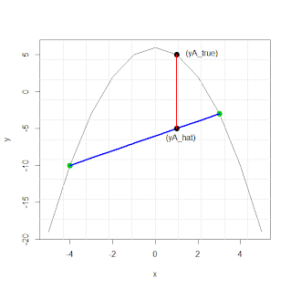

This extremely simple one-liner linearly interpolates between any two given points. The approximation is very simple and thus may not be very accurate, especially when the distance between the two points is large. However, due to its efficiency, it may be useful in a number of situations. See the images below to see a visual of how it works.




Matlab function [[download](interpol/linearinterpolation.m)]

<div class="content"><pre class="codeinput"><span class="keyword">function</span>[yA]=linearinterpolation(x1,y1,x2,y2,A)
<span class="comment">%Function requires two points (x1,x2),
%and evaluated values at those points (y1,y2), and point A
%between x1 and x2 for which you want to approximate y(A).</span>
yA=y1+(A-x1)*((y2-y1)/(x2-x1));
</pre>

R function [[download](interpol/linearinterpolation.R)]
```{r, eval=FALSE}
linearinterpolation <- function(x1,y1,x2,y2,A) {
  #Function requires two points (x1,x2) and evaluated values at those points (y1,y2),
  #and point A between x1 and x2 for which you want to approximate yA.
  yA=y1+(A-x1)*((y2-y1)/(x2-x1));
}
```

Python function [[download](interpol/linearinterpolation.py)]
```{python, eval=FALSE}
def linearinterpolation(x1,y1,x2,y2,A):
  yA=y1+(A-x1)*((y2-y1)/(x2-x1))
  return yA

```


<style type="text/css">
pre.codeinput { padding:10px; border:1px solid #d3d3d3; background:#f7f7f7; }
pre.codeoutput { padding:10px 11px; margin:0px 0px 20px; color:#4c4c4c; }
pre.error { color:red; }
@media print { pre.codeinput, pre.codeoutput { word-wrap:break-word; width:100%; } }
span.keyword { color:#0000FF }
span.comment { color:#228B22 }
span.string { color:#A020F0 }
span.untermstring { color:#B20000 }
span.syscmd { color:#B28C00 }
</style>