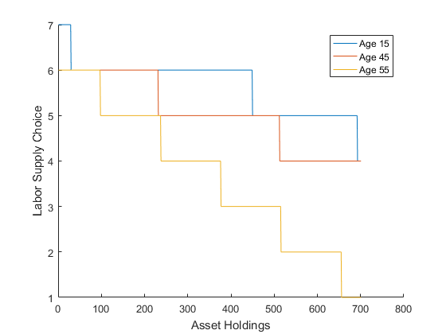
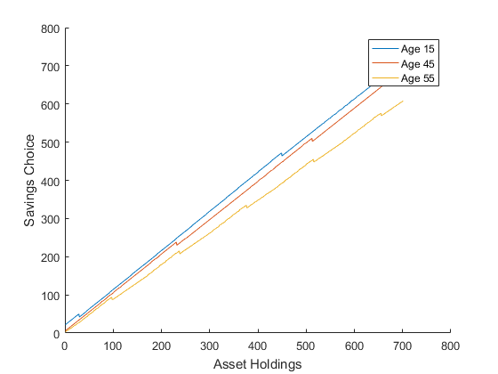
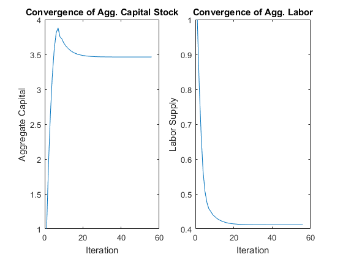

Assume an economy in which same number agents are born every period and live exactly 60 periods. In every period, agents make consumption/saving and labor supply decisions that maximize their utility. The solution is found using value function iterations over discretized grids.

Matlab function [[download](olg/olg_kn_60.m)]

<pre class="codeinput">clearvars
<span class="keyword">global</span> A alpha delta eta gamma
<span class="comment">%Production parameters</span>
A=1; alpha=0.5; delta=0.1;
<span class="comment">%Agent and utility parameters</span>
AGE=60; beta=0.95; eta=2; gamma=0.5;
<span class="comment">%Discretized grids</span>
kgrid=[0:0.01:7]'; ngrid=[0:0.1:0.9]';
smooth=0.8; eps1=0.00001; eps2=0.00001;
<span class="comment">%Initialization</span>
k1max=zeros(length(kgrid),AGE);
nmax=zeros(length(kgrid),AGE);
V=zeros(length(kgrid),length(ngrid));
dif=1; loop=1;
<span class="comment">%Initial Guesses</span>
K(loop)=1; N(loop)=1;

<span class="keyword">while</span> dif&gt;eps1
    <span class="comment">%Value function iterations</span>
    [~,w,r]=ProductionFunction(K(loop),N(loop));
    V1=zeros(length(kgrid),1);
    <span class="keyword">for</span> age=AGE:-1:1
        <span class="keyword">for</span> k=1:length(kgrid)
            <span class="keyword">for</span> n=1:length(ngrid)
                c= kgrid(k)*(1+r) + ngrid(n)*w - kgrid ;
                c= (c).*(c&gt;0);
                V(:,n)=UtilityFunction(c+eps2,ngrid(n))+beta*V1;
            <span class="keyword">end</span>
            [k1max(k,age),nmax(k,age)]=find(V==max(max(V)));
            Vmax(k,1)=V(k1max(k,age),nmax(k,age));
        <span class="keyword">end</span>
        V1=Vmax;
    <span class="keyword">end</span>
    k0=1;
    <span class="keyword">for</span> i=1:AGE
        k_opt(i)=k0;
        n_opt(i)=nmax(k0,i);
        k1_opt(i)=k1max(k0,i);
        k0=k1_opt(i);
    <span class="keyword">end</span>
    K1(loop)=sum(kgrid(k_opt))/AGE;
    N1(loop)=sum(ngrid(n_opt))/AGE;
    dif(loop)=abs(K1(loop)-K(loop));
    loop=loop+1;
    K(loop)=K(loop-1)*smooth+K1(loop-1)*(1-smooth);
    N(loop)=N(loop-1)*smooth+N1(loop-1)*(1-smooth);
<span class="keyword">end</span>

figure; hold <span class="string">on</span>; plot(nmax(:,15)); plot(nmax(:,45)); plot(nmax(:,55));
xlabel(<span class="string">'Asset Holdings'</span>);ylabel(<span class="string">'Labor Supply Choice'</span>);
legend(<span class="string">'Age 15'</span>, <span class="string">'Age 45'</span>, <span class="string">'Age 55'</span>);

figure; hold <span class="string">on</span>; plot(k1max(:,15)); plot(k1max(:,45)); plot(k1max(:,55));
xlabel(<span class="string">'Asset Holdings'</span>);ylabel(<span class="string">'Savings Choice'</span>);
legend(<span class="string">'Age 15'</span>, <span class="string">'Age 45'</span>, <span class="string">'Age 55'</span>);

<span class="keyword">function</span>[u]=UtilityFunction(c,n)
<span class="keyword">global</span> eta gamma
u=(((c.^gamma).*(1-n)^(1-gamma)).^(1-eta)-1)./(1-eta);
<span class="keyword">end</span>

<span class="keyword">function</span>[Y,w,r]=ProductionFunction(K,N)
<span class="keyword">global</span> A alpha delta
Y=A*(K^alpha)*(N^(1-alpha));
w=(1-alpha)*A*(K^alpha)*(N^(-alpha));
r=alpha*A*(K^(alpha-1))*(N^(1-alpha))-delta;
<span class="keyword">end</span>
</pre>

{width=33%}
{width=33%}
{width=33%}

<!-- R function [[download]()]
```{r, eval=FALSE}

```

Python function [[download](gss_bivariate.Py)]
```{python, eval=FALSE}

```
-->


<style type="text/css">
pre.codeinput { padding:10px; border:1px solid #d3d3d3; background:#f7f7f7; }
pre.codeoutput { padding:10px 11px; margin:0px 0px 20px; color:#4c4c4c; }
pre.error { color:red; }
@media print { pre.codeinput, pre.codeoutput { word-wrap:break-word; width:100%; } }
span.keyword { color:#0000FF }
span.comment { color:#228B22 }
span.string { color:#A020F0 }
span.untermstring { color:#B20000 }
span.syscmd { color:#B28C00 }
</style>